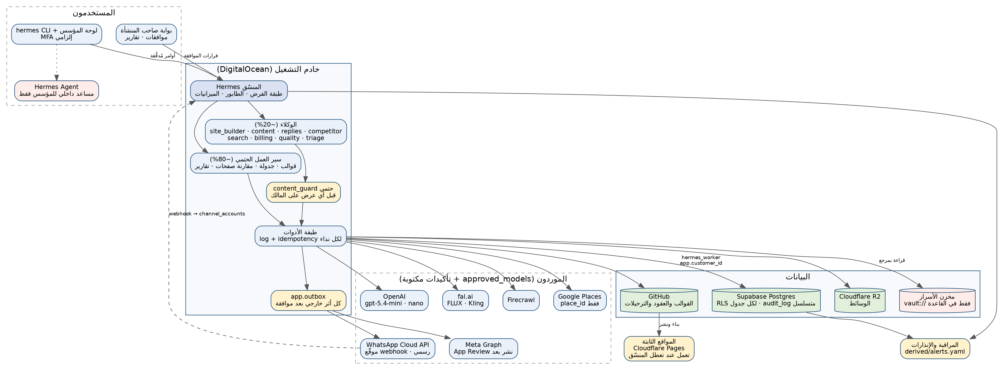
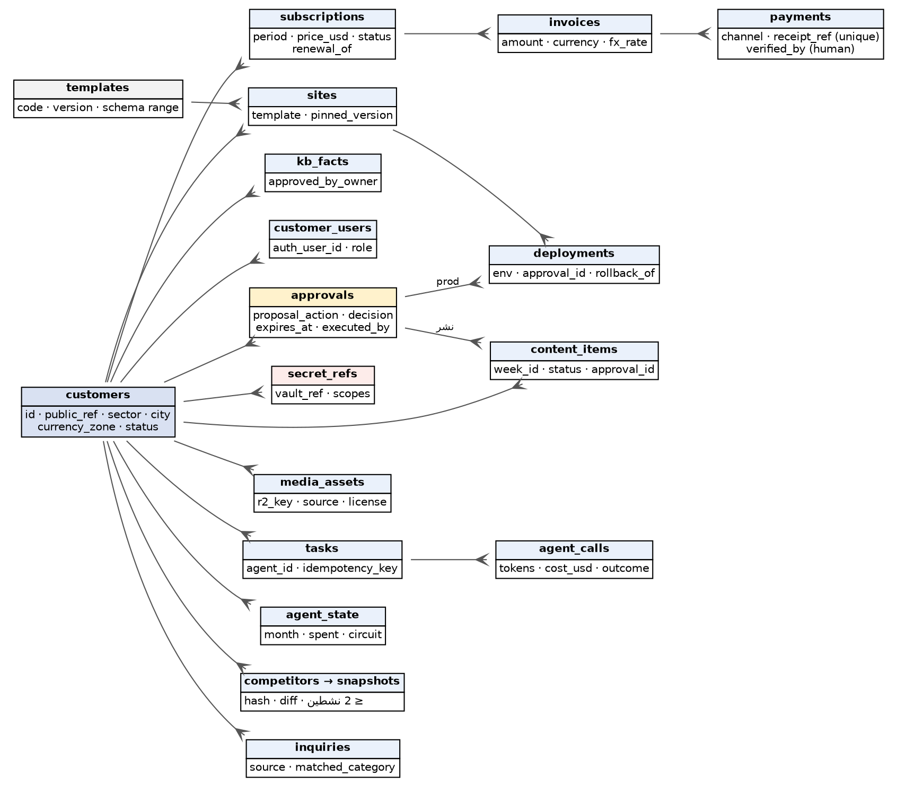
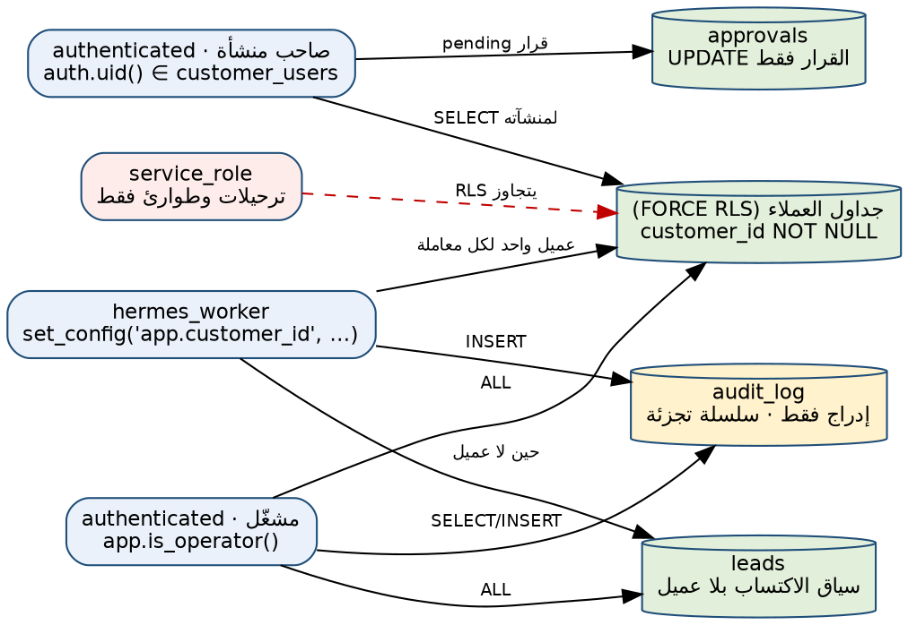
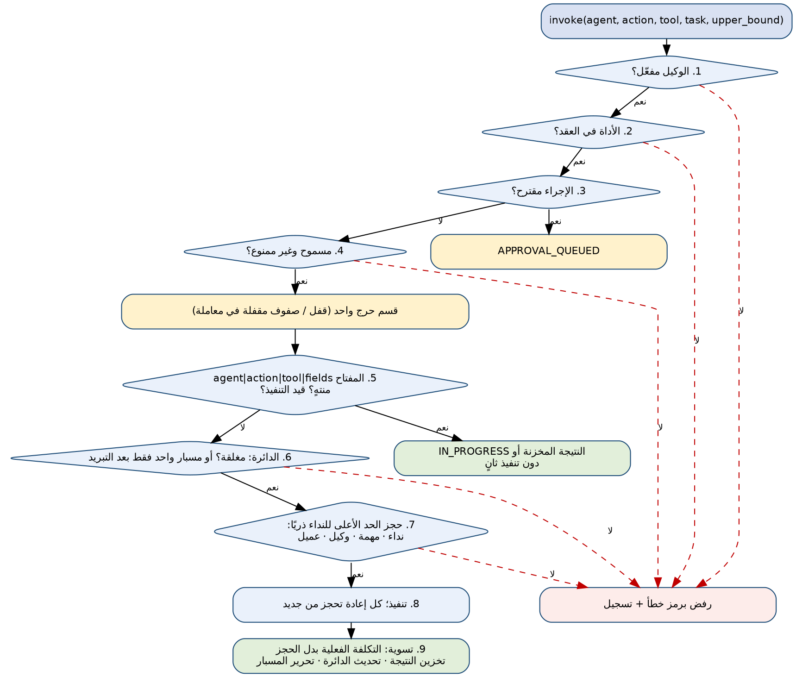
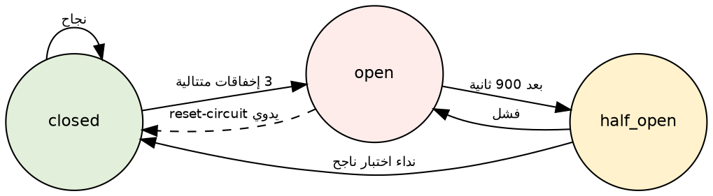
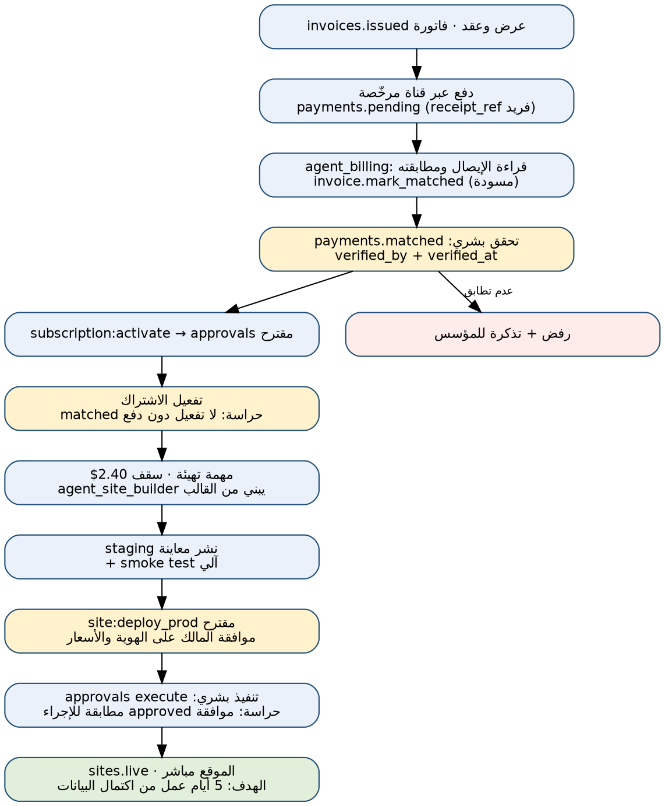
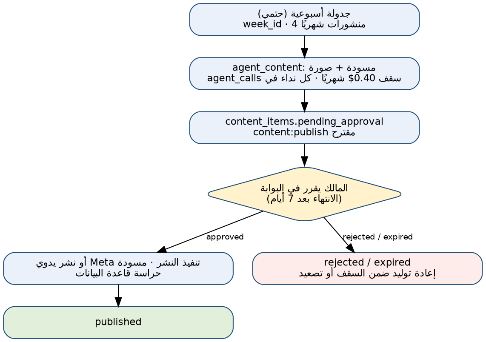
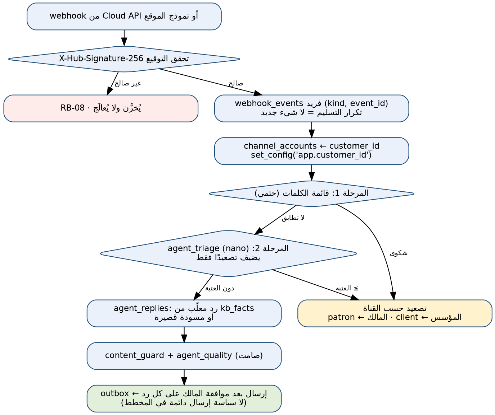
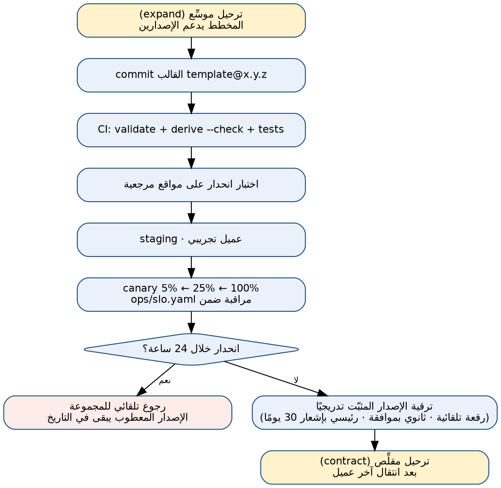
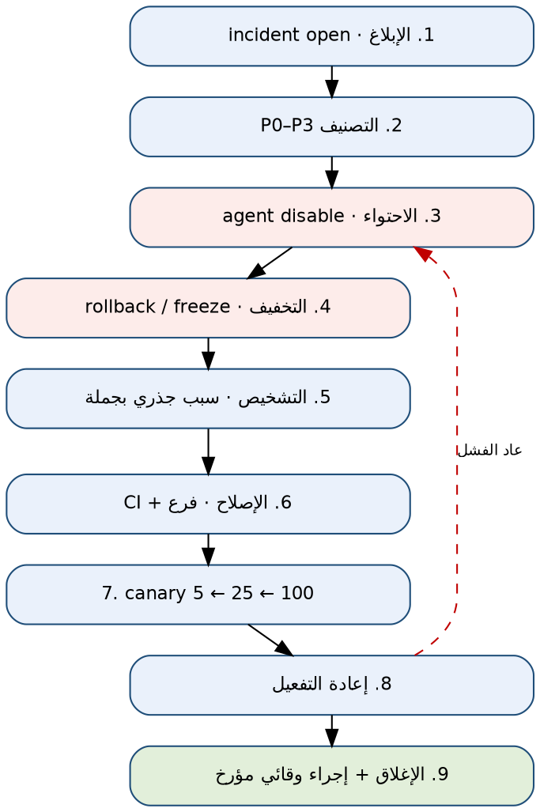

<div dir="rtl">

# هيرمس · الوثيقة الفنية

**منصة تشغيل بالذكاء الاصطناعي للشركات الصغيرة** · الإصدار 1.8 · 30 سبتمبر 2026

> نسخة Markdown مولّدة من المصدر نفسه لنسخة Word/PDF فلا تنحرف عنها. الصور مسارات نسبية تعمل داخل الحزمة hermes-tech.

> **ما هذه الوثيقة:** مواصفة تنفيذية كاملة للمنصة: المعمارية، وبنية المستودع، ونموذج البيانات والعزل بين العملاء، وعقود الوكلاء وطبقة الفرض، والمسارات التشغيلية، وسياسة الشكاوى، والإصدارات والترحيل، والمراقبة والأمن، ودليل الحوادث، وواجهة الأوامر، والتحقق والاختبار.

> **الجديد في 1.1:** مسح مرجعي لمشاريع مشابهة على GitHub وGitee وGitCode وGitLab والمنتديات التقنية (القسم 17)، ودمج ما ثبتت فائدته: قناة واتساب الرسمية بدل البدائل غير الرسمية، وحصر Hermes Agent في دور داخلي، ووكيل جودة ومرحلة فرز ثانية على أرخص نموذج معتمد، وحارس محتوى حتمي، وصندوق صادر وطابور آمن التزامن، وتحسين أداء العزل، ومعيار مراقبة مفتوح، وسياسة سلسلة توريد، ومجموعات تقييم كشفت فجوة حقيقية في رصد الشكاوى.

> **الجديد في 1.2:** استجابة لمراجعة خارجية للإصدار 1.1 (القسم 21): جرد دوال الصلاحيات المرفوعة وسحب صلاحية التنفيذ العامة مع ثلاث حالات عزل جديدة، وقاعدة وحالات اختراق لذاكرة Hermes Agent، ونظام أسرار مسمّى ودوران مقاس، واختبار استعادة مسجّل بإنذار، وتدقيق التبعيات في CI، وقيد مصدر أسماء العملاء المحتملين وفق شروط خرائط Google، ومعايير رسمية لترقية وكيل الجودة، ومعيار لاختيار مزوّد ثانٍ، وسيناريوهات تكلفة واتساب.

> **الجديد في 1.3:** إغلاق الأسئلة المتبقية من المراجِع (القسم 22): قاعدة ذاكرة Hermes Agent صارت ضوابط تقنية خارج الوكيل مع فاحص آلي وباب بيانات بلا نص حر؛ حدود مسبقة لقبول مزوّد ثانٍ يفحصها المتحقق؛ مهمة العزل في CI تشترط ظهور كل إشعارات النجاح؛ بوابة إصدار صارمة لسلسلة التوريد؛ خطة بيانات اختبار القبول وأداة إخفاء الهوية؛ أهداف حمل محسوبة بملفين؛ وسلّم قرارات إن ارتفع سعر واتساب.

> **الجديد في 1.4:** ملاحظات المراجِع على 1.3 (القسم 23): ثمن الذاكرة المؤقتة مسمّى مع استمرارية يكتبها إنسان فقط؛ معجم محكوم للإخفاقات في باب البيانات يغطي كل رمز تطلقه المنصة؛ جدول صريح لما يمر عبر وكيل الخروج مع حجب DNS الخارجي ومراقبة من المضيف؛ مسار إعادة اختبار للمزوّد الثاني بحالة محسوبة؛ وحماية بوابة الإصدار بدليل إعداد وCODEOWNERS.

> **الجديد في 1.8:** إغلاق مراجعة 1.7 على الشيفرة لا على النص (القسم 27). قراءة الترحيل 0009 مقابل نقاط التدقيق التي طلبتها المراجعة كشفت عيوبًا حقيقية من الصنف الذي حذّرت منه: صلاحية عقد الإيجار تُقاس ببداية المعاملة، والعامل يعدّل صف المهمة كله، والإرسال الغامض يُعاد حجزه فور انتهاء عقده، وتوجيه أحداث webhook مذكور في تعليق ولا دالة له، وسطر التدقيق يقبل هوية غير كاتبه، وحارس SSRF يقبل عنوان NAT64 للبيانات الوصفية، والمتحقق يقرأ سياسات أسقطها ترحيل لاحق. أُغلقت في الترحيل 0010 وفي الأدوات. ومعها: مسارات الخدمة الستة المطلوبة قبل التجربة مبنية ومختبَرة (service/)، وسياسة قبول إحصائية واحدة بإصدار وطريقة مسماة وثقة على مسار القبول كله، وحماية بوابة الإصدار بمدققات الأساس ومهمة gate واحدة، وأرقام هذه الوثيقة وجرودها مولّدة يفحصها CI.

> **تصحيح جوهري في 1.7:** مراجعة مستقلة أثبتت أن المبدأ «الإنسان ينفّذ ما له أثر خارجي» كان ادعاءً معماريًا لا ضمانًا تثبته القاعدة: العامل كان يستطيع كتابة قرار «موافق» باسم إنسان، والصندوق الصادر يتحقق من وجود معرّف الموافقة فقط، والموافقة لا ترتبط بالمحتوى، والعامل يختار عميله بنفسه، وتسجيل MFA يُعامل كجلسة MFA، ولا عقد إيجار للمهام. هذه العيوب الستة كانت قائمة حتى 1.6. أُغلقت في الترحيل 0009 (القسم 26).

> **الجديد في 1.7:** طبقة السلطة: العامل يقترح ولا يقرر؛ موافقة المنشأة لمالكها وحده؛ الصندوق الصادر يطابق الهدف وبصمة الحمولة ويستهلك الموافقة مرة؛ عميل العامل من عقد إيجار مهمة يُتحقق منه لا من متغير يختاره؛ مفاتيح ملكية مركبة؛ صلاحية المشغّل بجلسة aal2؛ عقود إيجار للمهام بتسييج؛ سلسلة تدقيق مستقلة عن المنطقة الزمنية. ومعها: قبول إحصائي بحد أعلى 95%، وحارس SSRF، وبيان إصدار ببصمات، ومصفوفة ادعاءات بـ 73 ادعاءً.

> **الجديد في 1.6:** مراجعة 1.5 (القسم 25): عقود إيجار للمفتاح والمسبار حتى لا يجمّد حاملٌ ميت النظام؛ إخفاق نهائي لا يُعاد إلا بقرار مسجل؛ إيقاف الوكيل عند تكرار تجاوز الحجز؛ بروتوكول تسليم مكتوب للطالب؛ حجر صحي للرموز غير المعروفة؛ حدود مطلقة لبيانات إعادة الاختبار؛ ترتيب أقفال مكتوب؛ وبوابة إصدار لا تمر دون تشغيل العزل فعليًا. ومصفوفة تقابل 47 ادعاءً «يجب/لا يجوز» بما يفرضه، بحالة محسوبة: 18 متحقق هنا، و18 في CI فقط، و4 بنيوية، و2 إجرائية، و5 غير مبنية.

> **تصحيح في 1.5:** اختبارات إضافية على الحزمة 1.1 كشفت أربعة عيوب في طبقة الفرض والمرحلة الثانية لم تكشفها فحوصها، وبقيت حتى 1.4: تجاوز السقف بنداءين متزامنين، وتنفيذ الطلب المكرر مرتين، ومفتاح مشترك بين النص والصورة، وتخفيف خطورة الشكوى القانونية. القسم 7 كان يصف ضمانات لا تحققها الشيفرة. أُعيد إنتاج العيوب باختبارات، ووُجد عيبان آخران من الصنف نفسه، وأُغلقت الستة بالشيفرة في tools/ وفي الترحيل 0007 (القسم 24).

**الاستقلال عن الوثيقة المالية:** لا توقعات مالية هنا. الأرقام المالية الوحيدة سقوف تشغيلية تفرضها المنصة (ميزانية كل وكيل وكل عميل)، ومصدرها ملف registry.json.

**الحزمة المرافقة:** hermes-tech.zip تحتوي كل الهياكل المذكورة كملفات قابلة للتنفيذ: المخططات، والعقود، والترحيلات، والأدوات، والاختبارات، والمخططات البيانية.

**أعدّها:** [الاسم والصفة] · للتواصل: [البريد / الهاتف]

### حالة التحقق عند الإصدار

<!-- gen:status -->
| ما فُحص | النتيجة | الطريقة |
| --- | --- | --- |
| مخططات JSON والعقود والفهرس والسياسات | 34 فحصًا ناجحًا من 34 | tools/validate.py · الطبقة 1 |
| قواعد الاتساق المنطقي والسياسة الإحصائية ومعجم الإخفاقات | 136 فحصًا ناجحًا من 136 | tools/validate.py · الطبقة 2 |
| الحالة النهائية لقاعدة البيانات بعد كل الترحيلات (فحص ثابت) | 250 فحصًا ناجحًا من 250 | tools/validate.py · الطبقة 3 · tools/sql_state.py |
| الاختبارات الآلية | 252 اختبارًا | python -m unittest discover -s tests (الجرد في 15.2) |
| حارس المحتوى على المجموعة الذهبية | 10/10 حكمًا مطابقًا | tools/run_evals.py |
| رصد الشكاوى بالكلمات وحدها (مجموعة تطوير 20 شكوى) | استدعاء 13/20 = 65% | tools/run_evals.py · تقرير لا حكم قبول |
| سلسلة التوريد | 0 fail · 0 warn | tools/check_supply_chain.py (15.5 و16) |
| حالات SQL على Postgres فعلي | 52 حالة و63 إشعار نجاح مكتوبة؛ **لم يُنفَّذ أي منها هنا** | CI: run_isolation.sh وثلاثة سكربتات سباق |

المجموع: 420/420 فحصًا ناجحًا في أداة التحقق، و252 اختبارًا. هذا الجدول مولّد (tools/check_spec.py)؛ لا يُعدَّل يدويًا.
<!-- /gen:status -->

### وسوم المصدر

| الوسم | المعنى |
| --- | --- |
| [ح] | حقيقة منشورة لدى مورد. |
| [ت] | قرار تصميم هندسي قابل للمراجعة. |
| [ق] | قرار يحتاج قياسًا أو اختبارًا قبل الاعتماد. |

## المحتويات

1. النطاق والمبادئ
2. المعمارية
3. بنية المستودع
4. نموذج البيانات
5. العزل بين العملاء وأمن قاعدة البيانات
6. عقود الوكلاء
7. طبقة الفرض
8. المسارات التشغيلية
9. سياسة تصعيد الشكاوى
10. الإصدارات والنشر والترحيل
11. المراقبة وأهداف الخدمة
12. الأمن
13. دليل الحوادث
14. واجهة الأوامر hermes
15. الاختبار والتحقق
16. القرارات التقنية المعلّقة
17. المسح المرجعي: مشاريع مشابهة ومكوّنات
18. التحسينات المعتمدة والمرفوضة
19. الأمن: أنماط الحقن وقائمة OWASP لتطبيقات النماذج
20. جوانب لم تكن مغطاة
21. الاستجابة لمراجعة الإصدار 1.1
22. إغلاق الأسئلة المتبقية
23. ملاحظات المراجِع على 1.3
24. عيوب مثبتة في 1.1 وإغلاقها بالشيفرة
25. مراجعة 1.5 ومصفوفة الادعاءات
26. المراجعة المستقلة: طبقة السلطة
27. الاستجابة لمراجعة 1.7: أدلة الإغلاق
28. بعد الإصدار: التشغيل الأول على Postgres حقيقي، وبناء P1

الملاحق: أ) رموز الأخطاء · ب) مسرد المصطلحات · ج) سجل التغييرات 1.0 ← 1.1 · د) سجل التغييرات 1.1 ← 1.2 · هـ) سجل التغييرات 1.2 ← 1.3 · و) سجل التغييرات 1.3 ← 1.4 · ز) سجل التغييرات 1.4 ← 1.5 · ح) سجل التغييرات 1.5 ← 1.6 · ط) سجل التغييرات 1.6 ← 1.7 · ي) سجل التغييرات 1.7 ← 1.8.

## 1. النطاق والمبادئ

> **تسميتان ثابتتان:** «المنسّق» هو خدمة هذه الحزمة متعددة العملاء: العقود وطبقة الفرض والعمال والقاعدة، وهو السلطة التقنية على بيانات العملاء. «Hermes Agent» مشروع Nous Research المفتوح، يعمل مساعدًا داخليًا للمؤسس فقط ولا يصل إلى أي عميل (ADR-0002). اسم المنتج «هيرمس» لا يعني أن الوكيل الشخصي هو سلطة العملاء.

### 1.1 النطاق

تغطي الوثيقة كل ما يلزم لبناء النسخة الأولى من المنصة وتشغيلها: خدمة مواقع ومحتوى ومتابعة منافسين لمنشآت صغيرة، يديرها منسّق يوزّع العمل بين سير عمل حتمي ووكلاء ذكاء اصطناعي، مع موافقات بشرية لكل ما له أثر خارجي. لا تغطي التسعير التجاري ولا التوقعات المالية ولا الجوانب القانونية، وهي في وثائقها المستقلة.

### 1.2 المبادئ الهندسية

1. **الحتمي أولًا:** بناء الموقع من قالب، وجدولة النشر، وحساب فروق صفحات المنافسين، والتقارير أعمال حتمية تُنفَّذ بسير عمل عادي واستدعاء نموذج واحد عند الحاجة. الوكيل للاستثناءات فقط. [ت]
2. **العزل في قاعدة البيانات لا في الكود وحده:** كل جدول عليه أمن على مستوى الصف، ودور العمال لا يرى إلا عميلًا واحدًا في كل معاملة. خطأ في الكود لا يكفي لتسريب بيانات عميل لآخر. [ت]
3. **الإنسان ينفّذ ما له أثر خارجي:** النشر للإنتاج، وإرسال الرد، وتفعيل الاشتراك، وتأكيد الدفع مقترحات يكتبها الوكيل وينفّذها إنسان، وتفرض قاعدة البيانات ذلك بحراسات لا يتجاوزها التطبيق. [ت]
4. **صفر ثقة لمحتوى الإنترنت:** نص الصفحات والرسائل بيانات لا تعليمات؛ لا يغيّر صلاحية ولا يطلب سرًا ولا يشغّل أمرًا. [ت]
5. **كل نداء مقيَّد ومسجَّل:** سقف بالدولار لكل نداء ومهمة ووكيل وعميل، وسجل لكل نداء بالرموز والتكلفة والنتيجة، ومفتاح لعدم التكرار. [ت]
6. **المواقع مستقلة عن المنسّق:** المواقع ثابتة على Cloudflare وتبقى تعمل عند تعطل أي جزء آخر. [ت]
7. **مصدر حقيقة واحد:** العقود والسياسات ملفات في المستودع؛ مصفوفة الصلاحيات وقواعد الإنذار وواجهة القدرات تُولَّد منها آليًا ويرفض CI أي فرق. [ت]

## 2. المعمارية



*الشكل 1 · المكونات وتدفق البيانات (محدَّث في 1.1)*

### 2.1 المكونات

| المكوّن | المسؤولية | التقنية | عند التعطل |
| --- | --- | --- | --- |
| بوابة صاحب المنشأة | الموافقة على المقترحات، والتقارير، وتحديث المعلومات المعتمدة | واجهة ويب + Supabase Auth | المواقع تعمل؛ المقترحات تنتظر |
| لوحة المؤسس وhermes CLI | التشغيل والحوادث والتكلفة والبوابات | ويب + أداة سطر أوامر | الوصول المباشر للقاعدة بدور مشغّل |
| المنسّق | الطابور، والفرض، والميزانيات، وتوزيع العمل | Hermes على خادم DigitalOcean | المهام تتوقف؛ المواقع لا تتأثر |
| سير العمل الحتمي | قوالب، جدولة، فروق صفحات، تقارير | مهام خلفية | إعادة محاولة ثم طابور بشري |
| الوكلاء | ثمانية وكلاء بعقود مغلقة | gpt-5.4-mini للصياغة وgpt-5.4-nano للفرز والتدقيق | قاطع الدائرة ثم طابور بشري |
| حارس المحتوى | قواعد حتمية قبل أي عرض على المالك | tools/content_guard.py | يحجب أو يعلّم؛ لا يتوقف النظام |
| الصندوق الصادر | كل أثر خارجي يُكتب في المعاملة ثم يُرسل | app.outbox | يعاد الإرسال بلا تكرار |
| القنوات الرسمية | واتساب Cloud API وصفحات Meta بحسابات المنشأة | channel_accounts + webhook_events | تنبيهات المالك تتحول للبوابة والبريد |
| Hermes Agent | مساعد تشغيل داخلي للمؤسس فقط | حاوية معزولة بلا مفاتيح عملاء | لا أثر على العملاء |
| طبقة الأدوات | كل أثر خارجي عبرها مع تسجيل ومفتاح عدم تكرار | مكتبة داخلية | الفشل يُسجَّل ويُصعَّد |
| قاعدة البيانات | الحقيقة التشغيلية والعزل والتدقيق | Supabase Postgres 15+ | استعادة نسخة مشفّرة خلال 8 ساعات |
| التخزين والأسرار | الوسائط؛ والمفاتيح بمراجع فقط | Cloudflare R2 · مخزن أسرار | الوسائط المنشورة في المواقع لا تتأثر |
| المواقع | مواقع ثابتة لكل عميل | Cloudflare Pages | مستقلة عن كل ما سبق |

### 2.2 البيئات

| البيئة | الاستخدام | الجمهور |
| --- | --- | --- |
| dev | تطوير القوالب والعقود والأدوات | الفريق التقني |
| staging | معاينة الموقع لكل عميل واختبار الإصدارات | عميل تجريبي واحد + المعاينات |
| prod | الإنتاج | كل العملاء |

### 2.3 توزيع الأعمال: سير عمل أم وكيل؟

| العمل | المنفِّذ | دور النموذج |
| --- | --- | --- |
| بناء الموقع من القالب | سير عمل + agent_site_builder للنصوص | صياغة نصوص الأقسام من المعلومات المعتمدة |
| جدولة المحتوى | سير عمل | لا شيء |
| صياغة المنشور وصورته | agent_content | مسودة نص + توليد صورة |
| فحص المنافسين | سير عمل يحسب الفرق + agent_competitor | تلخيص الفرق المحسوب فقط |
| الرد على الاستفسارات | مطابقة الشكاوى ثم agent_replies | مسودة من kb_facts المعتمدة |
| مطابقة الإيصالات | agent_billing (معطّل حتى 0.1) | تصنيف ومطابقة، لا قرار |
| العملاء المحتملون | agent_search | استخلاص وتصنيف من مصادر مسموحة |
| التقرير الشهري | سير عمل | ملخص قصير عند الحاجة |
| فحص المخرجات قبل عرضها | content_guard ثم agent_quality (صامت) | رصد ادعاء غير مسنود بمقارنته بـ kb_facts |
| رصد الشكاوى المعاد صياغتها | agent_triage بعد قائمة الكلمات | تصنيف ثنائي يضيف تصعيدًا فقط |

## 3. بنية المستودع

<!-- gen:tree -->
```
hermes-tech/
├── contracts/            agent_contract.schema.json · registry(.schema).json · 8 × *.contract.json
├── runtime/              agent_runtime_state · agent_call · ops_summary (schemas) · examples
├── policies/             acceptance_policy.json · acceptance_policy.schema.json · complaint_keywords.json · complaint_keywords.schema.json · content_rules.json · content_rules.schema.json · fetch_policy.json
├── db/migrations/        0001 · 0002 · 0003 · 0004 · 0005 · 0006 · 0007 · 0008 · 0009 · 0010 · 0011 · 0012 · 0013 · 0014 · 0015 · 0016 · 0017   (17 files)
├── db/local/             0000_supabase_shim.sql   (plain Postgres testing only; creates the plain owner hermes_owner)
├── db/tests/             concurrency_lease.sh · concurrency_outbox.sh · concurrency_reserve.sh · e2e_pilot.py · rls_isolation_test.sql · run_isolation.sh · run_local.sh
├── tools/                acceptance.py · admission.py · anonymize.py · audit_checkpoint.py · build_manifest.py · check_claims.py · check_spec.py · check_supply_chain.py · complaints.py · content_guard.py · derive.py · enforce.py · export_ops_summary.py · gate_guard.py · run_evals.py · safe_fetch.py · sql_state.py · stats.py · triage.py · validate.py · validate_schema.py
├── service/              __init__.py · app.py · auth.py · competitor.py · crawler.py · dispatcher.py · health.py · jobs.py · outbox_model.py · pg.py · portal.py · redact.py · render.py · structured.py · telemetry.py · webhook.py · worker.py
├── tests/                32 modules (inventory in §15.2)
├── evals/                complaints_seed.jsonl · content_guard_golden.jsonl · model_admission.json
├── docs/                 18 documents · adr/ (11 decisions)
├── derived/              policy_matrix.md · agent_capabilities.json · alerts.yaml   (generated)
├── ops/                  runbook · incident_template · slo.yaml · otel_genai_mapping.yaml · restore_drill.md
│                         redteam/ · load/k6_webhook.js · hermes_agent/ (compose · squid · check_container · host_watch)
├── cli/                  hermes_cli_spec.md
├── diagrams/             *.dot sources + *.png
├── reports/              validation · test · eval · supply_chain · claims · spec reports
├── VERSION · MANIFEST.json · README.md
└── .github/              workflows/validate.yml · CODEOWNERS
```
<!-- /gen:tree -->

| المجلد | المحتوى والقاعدة | من يعدّله |
| --- | --- | --- |
| contracts/ | مصدر الحقيقة لكل وكيل. أي تعديل يمر بـ validate.py وderive.py. | الفريق التقني بمراجعة |
| policies/ | قواعد الشكاوى. لا تُفعَّل نسخة جديدة قبل اختبار القبول. | المؤسس + التقني |
| db/migrations/ | ترحيلات مرقّمة لا تُعدَّل بعد تطبيقها؛ التغيير بترحيل جديد. | الفريق التقني |
| tools · tests | الأدوات المرجعية واختباراتها؛ tools/ جزء من بوابة الإصدار ويُحكم تغييره بمدققات الأساس (1.8). | الفريق التقني |
| service/ | مسارات الخدمة التي تمس العالم الخارجي: كل منها المسار الوحيد لغرضه، واختبار يفشل إن ظهر مسار ثانٍ (1.8). | الفريق التقني |
| derived/ | مولَّد فقط. CI يرفض أي فرق عن المصدر. | لا أحد يدويًا |
| ops · cli | دليل الحوادث وأهداف الخدمة ومواصفة الأوامر. | المؤسس + التقني |

## 4. نموذج البيانات

المخطط في المساحة app على Supabase Postgres 15 أو أحدث. كل جدول يخص عميلًا يحمل customer_id غير فارغ.

<!-- gen:migrations -->
الترحيلات 17 ملفات تُطبَّق بالترتيب ولا يُعدَّل أحدها بعد تطبيقه:

- `0001_core` — الأنواع والجداول والقيود
- `0002_rls` — الأدوار ودوال الهوية وأمن الصف
- `0003_guards_audit` — الحراسات التي لا يتجاوزها التطبيق وسلسلة التدقيق
- `0004_measurement_views` — عروض القياس التي تغذّي بوابات القرار
- `0005_v11_channels_quality_queue` — القنوات وwebhook والجودة والطابور والصندوق الصادر (1.1)
- `0006_v12_hardening` — سحب EXECUTE العام، وقيد مصدر الأسماء، والاستعادة والتدوير (1.2)
- `0007_v15_atomic_budget_idempotency` — الحجز الذري للميزانية وعدم التكرار والمسبار (1.5)
- `0008_v16_leases_terminal_pause` — عقود الإيجار والإخفاق النهائي والإيقاف (1.6)
- `0009_v17_authority` — طبقة السلطة: الاقتراح والقرار والاستهلاك وعميل العامل من عقد الإيجار (1.7)
- `0010_v18_closure` — إغلاق مراجعة 1.7: ساعة الحائط، آلة حالات التسليم، توجيه webhook، تدقيق الآثار، المحو الدوري (1.8)
- `0011_monitor_signals` — دور المراقبة: دالة واحدة تعيد أرقامًا لا صفوفًا لمراقب خارجي (تأخر المحو، صفوف تنتظر إنسانًا)
- `0012_monitor_epoch` — موعد المحو المتوقع في دالة المراقبة: من آخر نجاح أو من بدء المراقبة، فلا إنذار كاذب قبل أول تشغيل
- `0013_rls_customer_indexes` — فهارس customer_id للجداول التي تصفّي سياساتها به، وفحص كتالوج يمنع جدولًا جديدًا بلا فهرس
- `0014_outbox_effect_once` — الأثر بلا موافقة يُدرج مرة واحدة لكل هدف: المهمة المعادة تستعيد صفها ولا ترسل تنبيهًا ثانيًا
- `0015_outbox_resend_task` — «أعد الإرسال» من المشغّل يُدرج مهمته في المعاملة نفسها، فلا يبقى صف معلقًا بلا من يرسله
- `0016_claim_task_kinds` — العامل لا يستلم إلا أنواع المهام التي يعرفها، فالنسخة القديمة أثناء النشر تترك الأنواع الجديدة
- `0017_competitor_facts` — حقائق المنافس المنظمة وبصمة نص الصفحة في اللقطة، ودور مهمة الفحص اليومي بسقف شهري تفرضه القاعدة
<!-- /gen:migrations -->



*الشكل 2 · الكيانات الرئيسية والعلاقات (مبسّط)*

### 4.1 الجداول

| الجدول | الغرض | القيود الأساسية | خاص بعميل |
| --- | --- | --- | --- |
| customers | جذر العميل: القطاع والمدينة ومنطقة العملة والحالة | public_ref بصيغة cust_xxxx؛ منطقة عملة إلزامية | المفتاح نفسه |
| customer_users | مستخدمو البوابة لكل منشأة | فريد (عميل، مستخدم) | نعم |
| operators | المؤسس والفريق | لا مشغّل نشط دون توثيق متعدد العوامل | لا |
| subscriptions | الاشتراكات والتجديدات | اشتراك نشط واحد لكل عميل؛ لا تفعيل دون دفع matched (حراسة) | نعم |
| invoices | الفواتير بعملتها وسعر الصرف | سعر صرف إلزامي لغير الدولار | نعم |
| payments | المدفوعات الواردة | إيصال فريد لكل قناة؛ matched يتطلب تحققًا بشريًا | نعم |
| templates | القوالب وإصداراتها ومدى توافق المخطط | صيغة إصدار دلالية | لا (قراءة للجميع) |
| sites | موقع واحد لكل عميل وإصداره المثبّت | مفتاح أجنبي إلى (قالب، إصدار) | نعم |
| deployments | كل نشر للمعاينة أو الإنتاج | الإنتاج يتطلب موافقة approved مطابقة (حراسة) | نعم |
| media_assets | الوسائط في R2 | الوسائط المرخّصة تتطلب ملاحظة ترخيص | نعم |
| content_items | المنشورات والتقارير | لا نشر دون موافقة approved (حراسة) | نعم |
| kb_facts | المعلومات المعتمدة للردود | علم اعتماد المالك وتاريخ صلاحية | نعم |
| approvals | المقترحات وقراراتها وتنفيذها | انتهاء بعد 7 أيام؛ لا تنفيذ دون approved | نعم |
| tasks | مهام المنسّق | مفتاح عدم تكرار فريد؛ عميل فارغ = اكتساب | نعم أو اكتساب |
| agent_calls | سجل كل نداء | إدراج فقط لأدوار التطبيق | نعم أو اكتساب |
| agent_state | الإنفاق وحالة الدائرة لكل وكيل وعميل وشهر | مفتاح مركّب | نعم |
| competitors / competitor_snapshots | المنافسون ولقطات صفحاتهم | منافسان نشطان كحد أقصى (حراسة)؛ «تعذّر التحقق» حالة صريحة | نعم |
| inquiries | الاستفسارات الواردة ومصدرها | النص يُحذف بعد 30 يومًا | نعم |
| support_tickets | تذاكر صاحب المنشأة لفريق هيرمس | الفئة والخطورة | نعم |
| time_entries | دقائق العمل البشري حسب النشاط | بين 1 و600 دقيقة للإدخال | مشغّلون فقط |
| leads | المنشآت المحتملة | place_id فقط من Places؛ لا تواصل دون مرجع موافقة | اكتساب |
| secret_refs | مراجع الأسرار لا قيمها | vault:// إلزامي | نعم |
| incidents | الحوادث | لا إغلاق دون سبب جذري وإجراء وقائي | مشغّلون فقط |
| gate_measurements | قياسات بوابات القرار | قيمة رقمية أو نصية | مشغّلون فقط |
| audit_log | سجل التدقيق | إدراج فقط؛ سلسلة تجزئة SHA-256 | قراءة حسب الدور |
| channel_accounts (1.1) | هويات القنوات الرسمية لكل منشأة: موجّه webhook إلى العميل | هوية خارجية واحدة لمالك واحد؛ لا تفعيل دون تحقق | نعم |
| webhook_events (1.1) | كل حدث وارد بتوقيعه | فريد لكل حدث مزوّد؛ غير الموقّع لا يُعالَج | نعم أو قبل التوجيه |
| quality_flags (1.1) | أعلام حارس المحتوى ووكيل الجودة | لا حسم دون من حسم ومتى | نعم |
| outbox (1.1) | الآثار الخارجية المعلّقة | النشر والإرسال والنشر للإنتاج تتطلب موافقة | نعم أو اكتساب |
| eval_runs (1.1) | نتائج مجموعات التقييم لكل commit | معرّف commit صالح | مشغّلون فقط |

### 4.2 الحراسات التي لا يتجاوزها التطبيق

| الحراسة | ما تمنعه |
| --- | --- |
| content_publish_guard | نشر محتوى دون موافقة approved على content:publish لنفس العميل |
| prod_deploy_guard | نشر للإنتاج دون موافقة approved على site:deploy_prod (الرجوع مستثنى) |
| subscription_activate_guard | تفعيل اشتراك دون دفعة matched على فاتورته |
| competitor_limit_guard | أكثر من منافسَين نشطَين لعميل |
| audit_chain / audit_no_update | تعديل أو حذف أي سطر في سجل التدقيق، وكسر السلسلة دون كشف |
| قيود CHECK | دفعة matched دون محقق، ومشغّل نشط دون توثيق متعدد، وحادث مغلق دون سبب جذري |
| قيد outbox (1.1) | إرسال رد أو نشر محتوى أو نشر للإنتاج دون موافقة، حتى لو كتبه وكيل مخترق |
| قيد webhook_events (1.1) | معالجة حدث بتوقيع غير صالح، وتكرار معالجة الحدث نفسه |
| app.claim_task (1.1) | سحب مهمة مرتين أو من عميل آخر؛ يعمل بـ FOR UPDATE SKIP LOCKED داخل نطاق العميل |
| approvals_before_write (1.7، 1.8) | قرار العامل، أو قرار موافقة منشأة بغير مالكها، أو تغيير الحمولة، أو الاستهلاك إلا من محفّز الصندوق الصادر (تحقق الملكية منذ 1.8 لا متغير جلسة) |
| outbox_before_write (1.7، 1.8) | أثر بلا موافقة مطابقة الهدف والبصمة، واستهلاك الموافقة مرتين، وإعادة حجز إرسال غامض، ورفع الفحص البشري إلا بمشغّل aal2 بقرار مسجل |
| دوال عقد الإيجار (1.7، 1.8) | عمل عامل بلا عقد حي بساعة الحائط، وإنهاء مهمة أو النبض عليها بعد انتهاء العقد أو الاسترداد، وتعديل صف المهمة مباشرة |
| webhook_route (1.8) | اختيار المستدعي لعميل الحدث: التوجيه من هوية القناة المخاطَبة في channel_accounts |
| audit_effect (1.8) | أثر بلا سطر تدقيق في معاملته، وسطر تدقيق بهوية غير كاتبه |

دالة التحقق من الموافقة تعمل بصلاحيات المستدعي (security invoker)، فلا ترى إلا موافقات العميل المحدد في المعاملة، وترفض عدم تطابق العميل أو الإجراء. آلة حالات الصندوق الصادر كاملة في docs/delivery_protocol.md و7.2ج.

### 4.3 عروض القياس

| العرض | يغذّي |
| --- | --- |
| v_ai_cost_30d | تكلفة الذكاء الاصطناعي والرموز لكل عميل خلال 30 يومًا |
| v_inquiry_sources_30d | حصة كل مصدر استفسار |
| v_human_minutes_monthly | الدقائق البشرية المتكررة ودقائق التهيئة شهريًا |
| v_approval_latency | وسيط زمن موافقة المالك والمقترحات المنتهية |
| v_collection_channels | تركّز التحصيل حسب القناة |

كل العروض security_invoker، فتخضع لأمن الصف الخاص بمن يستعلم. أضاف 1.1 العرض v_agent_monthly_report (نسبة النجاح والتكلفة وزمن P95 لكل وكيل شهريًا) للتقارير فقط، لا لتبديل آلي للنماذج.

### 4.4 الاحتفاظ

| البيانات | المدة |
| --- | --- |
| نص الاستفسار (inquiries.body) | 30 يومًا ثم يُفرَّغ يوميًا بالدالة app.purge_inquiry_bodies تحت الدور hermes_jobs الذي يمحو النص ولا يقرؤه؛ كل تشغيل يُسجَّل في retention_runs، والعرض v_retention_status ينذر بعد يومين بلا تشغيل ناجح أو بنص تجاوز 31 يومًا (1.8) |
| سجل النداءات | 365 يومًا، و730 للبحث والتحصيل (من العقود) |
| سجل التدقيق | دائم؛ لا حذف |
| لقطات المنافسين | البصمة والملخص، والحقائق المنظمة المستخرجة (الأصناف والأسعار والساعات والتقييم، ≤ 64 كيلوبايت) وبصمة النص المرئي؛ لا الصفحة ولا نصها (0017، 28.11). الحقائق ليست الصفحة: هي ما ينشره المنافس نفسه لمحركات البحث، ولازمة لحساب الفرق التالي |

## 5. العزل بين العملاء وأمن قاعدة البيانات



*الشكل 3 · الأدوار ومجال وصول كل منها*

### 5.1 الأدوار

| الدور | من يستخدمه | مجال الوصول |
| --- | --- | --- |
| authenticated (مالك) | أصحاب المنشآت عبر البوابة | قراءة بيانات منشآته، وقرار المقترحات المعلقة فقط |
| authenticated (مشغّل) | المؤسس والفريق بعد التوثيق المتعدد | كل الجداول عبر الدالة app.is_operator |
| hermes_worker | المنسّق والوكلاء وسير العمل | عميل واحد من عقد إيجار المهمة التي سحبها (1.7)؛ بلا عقد: لا شيء؛ عقد بلا عميل: الاكتساب فقط |
| hermes_ingest | معالج webhook (service/webhook.py) | إدراج حدث موقّع فقط، بلا عمود العميل؛ القاعدة توجّهه من القناة المخاطَبة وتنشئ مهمته (1.8) |
| hermes_jobs | المهام الدورية (service/jobs.py) | محو نص الاستفسارات الأقدم من 30 يومًا دون قراءته، وتسجيل التشغيل (1.8) |
| hermes_owner | مالك المخطط في CI والتجريب المحلي | مالك عادي بلا superuser ولا bypassrls، حتى يكون لـ FORCE أثر أثناء الاختبار كما في الإنتاج (1.8) |
| service_role | الترحيلات والطوارئ | يتجاوز أمن الصف؛ لا يستخدمه أي وكيل |

### 5.2 نمط السياسة

```
-- v1.7: a worker's tenant comes ONLY from its live task lease (0009). It claims a task, then binds:
--   select * from app.claim_task('agent_content', 'worker-7');   -- returns task_id, token, fencing, customer_id
--   select app.bind_task(:task_id, :token);                        -- app.worker_customer_id() now verifies the lease
-- Setting app.customer_id by hand grants nothing.

alter table app.kb_facts enable row level security;
alter table app.kb_facts force  row level security;
create policy kb_facts_owner_select on app.kb_facts for select to authenticated
  using (customer_id in (select app.current_user_customer_ids()));
create policy kb_facts_operator_all on app.kb_facts for all to authenticated
  using (app.is_operator()) with check (app.is_operator());
create policy kb_facts_worker_rw on app.kb_facts for all to hermes_worker
  using (customer_id = app.worker_customer_id())
  with check (customer_id = app.worker_customer_id());
```

### 5.2أ أداء السياسات (1.1)

وفق دليل Supabase لأداء أمن الصف: كل دالة ثابتة في السياسة تُغلَّف بصيغة (select fn()) فيقيّمها المخطِّط مرة لكل استعلام لا لكل صف، ولكل عمود customer_id فهرس. يتحقق validate.py من عدم وجود استدعاء غير مغلَّف في أي سياسة، واختبار طفرة يثبت أنه يكشفه.

### 5.3 استثناءات الإجبار ودوال الصلاحيات المرفوعة

<!-- gen:force -->
أمن الصف مُجبَر (FORCE) على كل جداول app عدا 7: `approvals`، `audit_log`، `customer_users`، `operators`، `outbox_topics`، `task_leases`، `tasks`. سبب كل استثناء وما يعوّضه في docs/security_definer_inventory.md؛ المتحقق يطابق القائمة مع الحالة النهائية للترحيلات، والحالة 46 تطابقها مع الكتالوج الفعلي.

دوال SECURITY DEFINER بعد كل الترحيلات (16): `app.audit_chain()`، `app.audit_effect()`، `app.audit_head()`، `app.audit_verify()`، `app.bind_task()`، `app.claim_task()`، `app.complete_task()`، `app.current_user_customer_ids()`، `app.extend_task_lease()`، `app.health_signals()`، `app.is_operator()`، `app.jwt_aal()`، `app.outbox_before_write()`، `app.requeue_task()`، `app.worker_context()`، `app.worker_customer_id()`. لكل منها في الجرد ما تقرؤه وتكتبه ولماذا تحتاج صلاحيات المالك ومن ينفّذها والاختبار الذي يغطيها.
<!-- /gen:force -->

كل دالة definer تثبّت search_path، وصلاحية EXECUTE مسحوبة من PUBLIC على كل دوال المخطط app (الترحيل 0006) مع منح صريح لكل دور. ومخطط app لا يُكشف في PostgREST. الاستثناء لا يكون ثغرة إلا إن اتصل التطبيق بصفة مالك الجداول؛ لذلك تُطبَّق الترحيلات في CI بدور مالك عادي (1.8). [ت]

### 5.4 سجل التدقيق المتسلسل

كل سطر يحمل تجزئة SHA-256 للسطر السابق وحقوله، ويُحسب في محفّز تحت قفل استشاري. التعديل والحذف ممنوعان بمحفّز وبسحب الصلاحيات. الدالة app.audit_verify تعيد رقم أول سطر مكسور إن وُجد، وتُشغَّل في كل حادث تسريب وشهريًا.

### 5.5 اختبار العزل والكتالوج

<!-- gen:sql_cases -->
1. `worker scoped to A cannot read B`
2. `worker scoped to A cannot write into B`
3. `worker with no tenant set sees no tenant rows`
4. `owner of A sees only A`
5. `publish without approval is rejected`
6. `audit log is append-only`
7. `outbox refuses an external effect without an approval`
8. `an unsigned webhook event can be stored but never marked processed; duplicates are rejected`
9. `the dispatcher hands out one task per claim with a lease; the lease, not the worker, decides the tenant`
10. `security definer helpers are not callable by the worker role`
11. `the definer helper returns only the caller's own tenants`
12. `a lead name read from Google Maps content cannot be stored without a non-Google source`
13. `budget: check and reserve are one step; a reservation that would cross the agent cap is refused (R1)`
14. `idempotency: claim once, duplicate sees IN_PROGRESS, failed key re-claimable, finished key returns its result (R2)`
15. `a half-open circuit admits one probe (R5)`
16. `a key without agent|action|tool scope is rejected (R3)`
17. `a dead key holder is taken over only after its lease; a terminal failure is never re-claimed (N2, N3)`
18. `a probe whose holder died expires; a live probe blocks (N1)`
19. `a second overshoot within 24 h pauses the agent, and reserve_budget then refuses (N5)`
20. `production deploy without an approved approval is rejected (claim C4.2)`
21. `activation without a matched payment is rejected; a matched payment needs a verifier (C4.3, C4.6)`
22. `a third active competitor is rejected (C4.4)`
23. `audit_verify detects tampering even by a role able to bypass the trigger (C5.8)`
24. `the per-task cap holds in the database too (C7.5)`
25. `a worker that sets app.customer_id itself, without a lease, sees nothing (P1-04)`
26. `binding with a wrong token fails (P1-04)`
27. `an unbound worker cannot reach acquisition rows (P1-04)`
28. `leases: heartbeat, takeover after expiry, fencing refuses the stale worker, dead letter (P1-09)`
29. `the worker can only propose: no decision on insert, no update at all (P1-01)`
30. `operator authority needs an aal2 session; operators cannot approve for a business (P1-05, P1-01)`
31. `outbox verifies and consumes a matching approval; the payload freezes (P1-02); 32 in the same block`
32. `published content is bound to its consumed approval and immutable (P1-03)`
33. `prod deploy covers exactly the approved artifact; rollback restores an approved one, by an aal2 operator (P1-03)`
34. `only an owner marks a fact approved; any edit resets it (P1-01)`
35. `the audit verdict does not depend on the session time zone`
36. `a link from one tenant's row to another tenant's parent is impossible (P1-04 composite keys)`
37. `a reply proposal must be decidable inside the WhatsApp service window`
38. `a lease that expires during a transaction stops granting its tenant at once (L1: clock time, not transaction start)`
39. `an expired or recovered holder can neither complete, heartbeat, re-queue nor bind; tasks change only through lease functions (L2, T1)`
40. `a redelivered request returns the existing outbox row; another payload for a consumed approval is refused (O3)`
41. `dispatch: an expired, unconfirmed send is never re-claimed; only an aal2 operator clears the human check (O1, O2)`
42. `webhook ingest: the tenant comes from the addressed channel identity, never from the caller; the worker sets processed_at only (W1)`
43. `effects are audited inside their own transaction, with the real actor; audit rows cannot impersonate (A1; review A15, first half)`
44. `an approval is consumed only by the outbox trigger: a session setting no longer opens the door (C1)`
45. `inquiry bodies are purged after 30 days by the job role, which never reads a body (C4.7)`
49. `an effect without an approval is enqueued once per target: a re-run task gets its row back, never a second`
50. `an operator settles an outbox row that waits for a human: only with aal2, only with a reason, only once; a`
51. `a worker claims only the kinds it names; no list claims every kind, as before (0016)`
52. `the competitor job (hermes_jobs): reads active competitors and their snapshots, writes a snapshot only for the`
46. `the FINAL catalog after all migrations matches the published inventory (grants and policies accumulate)`
47. `the external monitor gets numbers, never rows: its role holds EXECUTE on one function and nothing else, and`
48. `every table whose policies filter by customer_id has an index leading with customer_id (0013)`

الملف db/tests/rls_isolation_test.sql ينفّذ 52 حالة داخل معاملة تُلغى في النهاية، ويطلب run_isolation.sh ظهور 63 إشعار نجاح (بعض الحالات تطلق أكثر من إشعار)، بعد تطبيق كل الترحيلات بدور مالك عادي. العناوين بلغة الملف نفسه لأنها الحالات كما تُنفَّذ.
<!-- /gen:sql_cases -->

## 6. عقود الوكلاء

العقد ملف JSON يحمّله المنسّق ويفرضه قبل كل نداء. المخطط contracts/agent_contract.schema.json يرفض أي حقل غير معرّف، ومنه الحقل القديم requires_human_approval الذي حلّت محله proposals.

### 6.1 حقول المخطط

| الحقل | المحتوى |
| --- | --- |
| agent_id · version | معرّف ثابت بصيغة agent_xxx · ترقيم دلالي |
| purpose | جملة واحدة حتى 200 حرف: ما يفعله وما لا يفعله |
| model | primary وfallback (قد يكون null = طابور بشري) ومعاملات temperature وmax_output_tokens وseed |
| tools[] | name بصيغة domain.verb · scope · side_effects · unit_cost_usd اختياري · rate_limit |
| permissions | allow · deny · proposals (إجراءات يقترحها الوكيل وينفّذها إنسان) |
| budget | budget_class (monthly_active / onboarding / acquisition) · per_call_usd · per_task_usd · class_cap_usd · hard_stop · alert_threshold_pct |
| retry | max_attempts · backoff · initial/max delay · retryable_errors |
| escalation | عند الفشل المتكرر وتجاوز الميزانية والمحتوى غير الآمن · قناة الإشعار |
| audit | log_level · retention_days · pii_redaction · fields_logged |
| runtime | التزامن لكل عميل · المهلة · الأولوية · max_input_tokens · max_steps · حقول مفتاح عدم التكرار |
| feature_flags | أعلام منطقية أو رقمية خاصة بالوكيل |

### 6.2 قواعد الاتساق التي يفرضها المتحقق

1. لا إجراء في proposals يغطيه deny (وإلا مات مسار الموافقة)، ولا إجراء في proposals مسموح مباشرة.
2. allow وdeny لا يتداخلان، مع احتساب أنماط مثل billing:*.
3. لا أداة بأثر مالي في أي عقد.
4. كل نموذج أساسي أو بديل مدرج في registry.approved_models بسعره ومصدره.
5. per_call ≤ per_task ≤ class_cap.
6. أسوأ تكلفة نداء (أقصى رموز إدخال وإخراج بسعر النموذج + أغلى أداة) ≤ per_call_usd.
7. مجموع سقوف الوكلاء الشهرية ≤ سقف الذكاء الاصطناعي لكل عميل نشط (1.13$).
8. سقف التهيئة ≤ حد التهيئة في الفهرس، وسقف الاكتساب ≤ مجمع الاكتساب الشهري.
9. مفتاح عدم التكرار يتضمن customer_id للوكلاء الشهريين، ولا يتضمنه لوكيل الاكتساب.
10. سياق الوكلاء الشهريين ≤ 16 ألف رمز؛ حتى 64 ألفًا لوكيل التهيئة فقط.
11. حجب البيانات الشخصية مفعّل في كل العقود؛ وفحوص المنافسين ≤ حد الباقة؛ ووكيل التحصيل معطّل حتى البوابة 0.1.

### 6.3 الوكلاء

| الوكيل | مفعّل | فئة الميزانية | نداء / مهمة / سقف ($) | سياق | المقترحات |
| --- | --- | --- | --- | --- | --- |
| agent_site_builder | نعم | onboarding | 0.3 / 2.4 / 2.4 | 64000 | site:deploy_prod |
| agent_content | نعم | monthly_active | 0.08 / 0.4 / 0.4 | 16000 | content:publish |
| agent_replies | نعم | monthly_active | 0.02 / 0.05 / 0.2 | 16000 | reply:send |
| agent_competitor | نعم | monthly_active | 0.03 / 0.1 / 0.35 | 16000 | — |
| agent_search | نعم | acquisition | 0.02 / 0.2 / 30 | 16000 | message:send، lead:export |
| agent_billing | لا | monthly_active | 0.01 / 0.02 / 0.05 | 6000 | invoice:mark_paid، subscription:activate |
| agent_quality | نعم | monthly_active | 0.005 / 0.02 / 0.1 | 16000 | — |
| agent_triage | نعم | monthly_active | 0.001 / 0.001 / 0.02 | 2000 | — |

أسوأ تكلفة نداء محسوبة من العقد وأسعار الفهرس مقابل سقف النداء:

| الوكيل | أسوأ تكلفة ≤ سقف النداء ($) |
| --- | --- |
| agent_site_builder | 0.0849 ≤ 0.3 |
| agent_content | 0.0462 ≤ 0.08 |
| agent_replies | 0.0143 ≤ 0.02 |
| agent_competitor | 0.0166 ≤ 0.03 |
| agent_search | 0.0166 ≤ 0.02 |
| agent_billing | 0.0057 ≤ 0.01 |
| agent_quality | 0.0038 ≤ 0.005 |
| agent_triage | 0.0005 ≤ 0.001 |

#### مثال كامل: agent_replies

```
{
  "agent_id": "agent_replies",
  "version": "1.0.0",
  "purpose": "<Arabic text: see below>",
  "model": {
    "primary": "gpt-5.4-mini",
    "fallback": null,
    "params": {"temperature": 0.3, "max_output_tokens": 512}
  },
  "tools": [
    {"name": "kb.search", "scope": "read", "side_effects": "none"},
    {"name": "reply.draft", "scope": "write_draft", "side_effects": "internal"},
    {"name": "queue.classify", "scope": "read", "side_effects": "none"}
  ],
  "permissions": {
    "allow": ["kb:read", "reply:draft"],
    "deny": ["billing:*", "payment:*", "customer:delete", "meta:publish", "price:quote"],
    "proposals": ["reply:send"]
  },
  "budget": {
    "budget_class": "monthly_active",
    "per_call_usd": 0.02,
    "per_task_usd": 0.05,
    "class_cap_usd": 0.2,
    "hard_stop": true,
    "alert_threshold_pct": 80
  },
  "retry": {
    "max_attempts": 1,
    "backoff": "none",
    "initial_delay_ms": 500,
    "max_delay_ms": 500,
    "retryable_errors": ["timeout", "network"]
  },
  "escalation": {
    "on_repeated_failure": "human_queue",
    "on_budget_exceeded": "pause_agent",
    "on_unsafe_content": "human_queue",
    "notification_channel": "founder_slack"
  },
  "audit": {
    "log_level": "verbose",
    "retention_days": 365,
    "pii_redaction": true,
    "fields_logged": ["ts", "task_id", "customer_id", "agent_id", "tool", "model", "tokens_in", "tokens_out", "cost_usd", "duration_ms", "outcome", "error_code", "idempotency_key"]
  },
  "runtime": {
    "max_concurrent_per_customer": 4,
    "timeout_seconds": 60,
    "queue_priority": "high",
    "max_input_tokens": 16000,
    "max_steps": 3,
    "idempotency_key_fields": ["customer_id", "message_id"]
  },
  "feature_flags": {
    "auto_escalate_complaints": true,
    "block_price_quotes": true,
    "replies_per_month": 10
  }
}
```

**قيمة purpose في الملف:** اقتراح ردود قصيرة من قاعدة معارف معتمدة؛ لا يرسل، ولا يعالج شكاوى، ولا يذكر أسعارًا غير معتمدة.

### 6.4 الفهرس

```
{
  "approved_models": {
    "gpt-5.4-mini": {"vendor": "openai", "input_usd_per_mtok": 0.75, "output_usd_per_mtok": 4.5, "source": "[ح] developers.openai.com/api/docs/models/gpt-5.4-mini"},
    "gpt-5.4-nano": {"vendor": "openai", "input_usd_per_mtok": 0.2, "output_usd_per_mtok": 1.25, "source": "[ح] developers.openai.com/api/docs/pricing (Aug 2026)"}
  },
  "limits": {
    "ai_cap_per_active_customer_month_usd": 1.13,
    "onboarding_cap_per_new_customer_usd": 2.4,
    "acquisition_pool_month_usd": 30,
    "max_parallel_agents": 4,
    "circuit_failure_threshold": 3,
    "circuit_cooldown_seconds": 900
  },
  "package_limits": {
    "posts_per_month": 4,
    "replies_per_month": 10,
    "competitor_checks_per_month": 10,
    "owner_messages_per_month": 4,
    "edit_minutes_per_month": 15,
    "site_pages_max": 5
  }
}
```

الحد acquisition_pool_month_usd = 30 قيمة ابتدائية [ق] تُضبط بعد قياس تكلفة Places الفعلية، إذ لا يحدد العقد تكلفة وحدة لها حتى تُقرأ فاتورة. أي نموذج إضافي (نموذج بديل مثلًا) يُضاف هنا بسعره ومصدره بعد تأكيد المورد كتابيًا.

### 6.5 حالة التشغيل وسجل النداءات

agent_runtime_state (مخزن في app.agent_state) يحفظ لكل عميل وشهر إنفاق كل وكيل وعدد نداءاته وآخر نتيجة والإخفاقات المتتالية وحالة الدائرة ووقت فتحها، وإجمالي إنفاق الذكاء الاصطناعي مقابل السقف. كل سطر في سجل النداءات يطابق runtime/agent_call.schema.json:

```
{"ts": "2026-09-29T09:05:44.123Z", "task_id": "t_8f2a", "customer_id": "cust_0421", "agent_id": "agent_content", "tool": "llm.generate", "model": "gpt-5.4-mini", "tokens_in": 1840, "tokens_out": 412, "cost_usd": 0.0032, "duration_ms": 3102, "outcome": "success", "error_code": null, "idempotency_key": "agent_content|content:draft|llm.generate|cust_0421|2026-W39|a91c07e2"}
```

### 6.6 مصفوفة الصلاحيات (مولّدة)

| الإجراء | site | content | replies | competitor | search | billing | quality | triage |
| --- | --- | --- | --- | --- | --- | --- | --- | --- |
| assets:write_draft |  | A |  |  |  |  |  |  |
| auth:* |  |  |  | D |  |  |  |  |
| billing:* | D | D | D | D | D |  | D | D |
| content:draft |  | A |  |  |  |  |  |  |
| content:edit |  |  |  |  |  |  | D |  |
| content:image_generate |  | A |  |  |  |  |  |  |
| content:publish |  | P |  |  |  |  | D |  |
| content:read |  |  |  |  |  |  | A |  |
| contract:read |  |  |  |  |  | A |  |  |
| customer:delete | D |  | D |  |  | D | D | D |
| customer:read_private |  | D |  | D | D |  |  |  |
| flag:raise |  |  |  |  |  |  | A |  |
| git:commit | A |  |  |  |  |  |  |  |
| guard:check |  |  |  |  |  |  | A |  |
| invoice:mark_draft |  |  |  |  |  | A |  |  |
| invoice:mark_paid |  |  |  |  |  | P |  |  |
| kb:read |  |  | A |  |  |  | A |  |
| lead:draft |  |  |  |  | A |  |  |  |
| lead:export |  |  |  |  | P |  |  |  |
| lead:verify |  |  |  |  | A |  |  |  |
| message:send |  |  |  |  | P |  |  |  |
| meta:publish |  |  | D | D |  |  |  |  |
| payment:* | D | D | D | D | D |  | D | D |
| payment:discount |  |  |  |  |  | D |  |  |
| payment:refund |  |  |  |  |  | D |  |  |
| payment:transfer |  |  |  |  |  | D |  |  |
| pii:read |  |  |  |  | D |  |  |  |
| price:quote |  |  | D |  |  |  |  |  |
| public:read |  |  |  | A | A |  |  |  |
| queue:classify |  |  |  |  |  |  |  | A |
| receipt:read |  |  |  |  |  | A |  |  |
| reply:draft |  |  | A |  |  |  |  | D |
| reply:send |  |  | P |  |  |  | D | D |
| report:draft |  |  |  | A |  |  |  |  |
| secrets:read | D |  |  |  |  | D | D |  |
| site:build | A |  |  |  |  |  |  |  |
| site:deploy_prod | P | D |  |  |  |  |  |  |
| site:deploy_staging | A |  |  |  |  |  |  |  |
| site:read | A |  |  |  |  |  |  |  |
| subscription:activate |  |  |  |  |  | P |  |  |

*A = مسموح · D = ممنوع · P = مقترح ينفّذه إنسان · فارغ = غير مسموح افتراضيًا. المصدر derived/policy_matrix.md.*

## 7. طبقة الفرض

كل نداء لوكيل، بما فيه نداءات المؤسس اليدوية، يمر بدالة واحدة وبترتيب ثابت. التنفيذ المرجعي في tools/enforce.py ومغطى باختبارات test_enforcement وtest_regressions_v15 وtest_concurrency_properties. الخطوات 5 إلى 7 قسم حرج واحد: في المرجع قفل واحد، وفي الإنتاج دوال الترحيل 0007 بأقفال صفوف.



*الشكل 4 · ترتيب الفحص في كل نداء (مصحَّح في 1.5)*

### 7.1 قاطع الدائرة



*الشكل 5 · حالات قاطع الدائرة*

تنفتح الدائرة بعد 3 إخفاقات متتالية لوكيل عند عميل. بعد 900 ثانية تنتقل إلى half_open ويُقبل نداء اختبار واحد بلا إعادة محاولة، تحجزه علامة probe_in_flight داخل القسم الحرج، فأي نداء متزامن آخر يُرفض بـ CIRCUIT_OPEN. نجاحه يغلقها، وفشله يعيد فتحها. الإعادة اليدوية بأمر agent reset-circuit مسجّلة في التدقيق.

### 7.2 عدم التكرار وإعادة المحاولة

مفتاح عدم التكرار صيغته agent|action|tool|fields: الوكيل والإجراء والأداة ثم حقول العقد، فأثران مختلفان في مهمة واحدة (نص وصورة) لا يشتركان في مفتاح. يُطالَب بالمفتاح قبل التنفيذ بحالة «قيد التنفيذ»: المكرر المتزامن يعود بـ IN_PROGRESS دون تنفيذ، والمنتهي يعيد نتيجته المخزنة، والفاشل يُحرَّر فتجوز إعادته لاحقًا. إعادة المحاولة فقط للأخطاء المعلنة في retryable_errors وبعدد محدود، وكل إعادة تحجز ميزانيتها من جديد.

### 7.2أ الحجز بدل الفحص (1.5)

الميزانية تُحجز قبل التنفيذ بالحد الأعلى للنداء (رموز الإدخال المعدودة وأقصى رموز الإخراج بسعر القائمة وتكلفة الأداة؛ الدالة call_upper_bound)، مقابل أربعة سقوف معًا: النداء والمهمة والوكيل والعميل. الفحص والحجز خطوة واحدة، فلا يمر نداءان متزامنان على الهامش نفسه. بعد التنفيذ تحل التكلفة الفعلية محل الحجز؛ وإن زادت عليه (حد أعلى خاطئ) يُسجَّل RESERVATION_EXCEEDED ويُنذَر به. سقف المهمة per_task_usd صار يُفرض لأول مرة.

### 7.2ب عقود الإيجار والإخفاق النهائي والإيقاف (1.6)

كل مطالبة قد تعيش أطول من صاحبها لها عقد إيجار: مفتاح «قيد التنفيذ» (المهلة × المحاولات + 60 ثانية) ثم يجوز لعامل آخر استلامه، ومسبار الدائرة (المهلة + 60 ثانية، أقصر من التبريد). الإخفاق العابر يحرر المفتاح؛ النهائي يبقيه FAILED حتى يحرره مشغّل بسبب مسجل في التدقيق. التجاوز الفعلي للحجز يُحتسب على السقف، والتجاوز الثاني لوكيل خلال 24 ساعة يوقفه حتى قرار مشغّل، لأنه يعني أن الحد الأعلى نفسه خاطئ (سعر تغيّر، عدّ رموز، أداة متغيرة التكلفة). الحد الأعلى يضيف 10% إلى رموز الإدخال المعدودة. ما يفعله الطالب بكل نتيجة في docs/delivery_protocol.md، وترتيب الأقفال العام في docs/lock_order.md.

### 7.2ج العابر والنهائي في التسليم: آلة حالات الصندوق الصادر (1.8)

إعادة المحاولة آمنة للقراءة وغير آمنة للإرسال: الرد الذي لا يُعرف هل وصل لا يُعاد، لأن إعادته قد تعني رسالتين للعميل. الموزّع (service/dispatcher.py) يصنّف كل إخفاق بمكان حدوثه، والقاعدة تفرض النتيجة (0010):

| النتيجة | متى | ما يحدث |
| --- | --- | --- |
| sent | ردّ المزوّد بقبول ومعرّف للأثر (wamid، معرّف النشر) | الصف نهائي؛ الموافقة استُهلكت عند الإدراج |
| failed_before_send | ثبت أن الطلب لم يغادر: DNS، رفض الاتصال، مصافحة TLS، تحقق محلي، أو 429 | يُحرَّر الحجز ويُعاد لاحقًا، حتى 5 محاولات ثم فحص بشري |
| failed_permanent | رفض المزوّد برمز 4xx (عدا 408 و429) | نهائي بسببه؛ لا إعادة |
| ambiguous | مهلة بعد كتابة الطلب، 5xx، 408، قبول بلا معرّف، أي استثناء غير مصنّف، أو انقطاع العملية | فحص بشري: لا إعادة تلقائية أبدًا؛ المصالحة بدليل المزوّد (reconcile_outbox_sent) أو قرار مشغّل aal2 بسبب (resolve_outbox: confirmed_sent أو resend أو abandon) |

الحجز المنتهي بلا نتيجة لموضوع لا يزيل المزوّد تكراره يصير غامضًا عند أول محاولة حجز جديدة، ولا يُعاد حجزه (كانت 1.7 تعيده فورًا وتنتظر عشر دقائق قبل تعليمه). وحده site.deploy_prod، الذي يطابق فيه المزوّد بصمة الأثر، يُعاد حجزه بعد الانتهاء. الطلب المكرر للأثر المعتمد نفسه يعود إلى صفه بدل أن يحتاج موافقة جديدة. التفاصيل في docs/delivery_protocol.md.

### 7.3 مقطع من التنفيذ المرجعي

```
key = f"{agent_id}|{action}|{tool}|{fields}"          # R3: scoped by effect
with self._lock:                                          # one critical section
    prev = self.idem.get(key)
    if prev is not None:
        return prev                                       # R2: finished result or IN_PROGRESS
    if ag.circuit in ("open", "half_open"):
        if ag.probe_in_flight or not cooled:
            raise Denied("CIRCUIT_OPEN")                  # R5: one probe only
        ag.circuit, ag.probe_in_flight = "half_open", True
    ts = self._reserve(c, task, st, ag, upper_bound, tool, key)   # R1/R6: call, task, agent, customer
    self.idem[key] = {"status": "IN_PROGRESS"}
result, cost = execute()                                  # outside the lock
with self._lock:
    self._settle(c, st, ag, ts, upper_bound, cost)        # actual replaces reservation
```

### 7.4 رموز الأخطاء

معجم واحد في docs/error_codes.yaml يولّد قاموس باب البيانات والملحق أ، والمتحقق يفشل إن أطلقت المنصة رمزًا ليس فيه (1.8: كانت رموز حارس SSRF خارج القاموس منذ 1.7). الجدول الكامل في الملحق أ.

## 8. المسارات التشغيلية

### 8.1 من الدفع إلى الموقع المباشر



*الشكل 6 · التفعيل والتهيئة والنشر*

التحقق البشري من الدفع شرط لا يتجاوزه أحد: قيد CHECK يمنع حالة matched دون محقق ووقت، ومحفّز يمنع تفعيل الاشتراك دون دفعة matched. وكيل التحصيل يقترح المطابقة فقط، ويبقى معطّلًا حتى تنجح البوابة 0.1.

### 8.2 المحتوى والموافقة



*الشكل 7 · دورة المنشور*

المقترح ينتهي بعد 7 أيام دون قرار. زمن الموافقة يُقاس من v_approval_latency. النشر عبر Meta يبدأ مسودات حتى تكتمل أذونات المنصة؛ البديل نشر يدوي بعد الموافقة. [ق]

### 8.3 الرسائل والردود (محدَّث في 1.1)



*الشكل 8 · من webhook موقّع إلى رد أو تصعيد*

الإجابات الحساسة المتكررة (ساعات العمل، الموقع، طرق الدفع المعتمدة) تُرسل ردودًا معلّبة من kb_facts المعتمدة لا نصًا مولّدًا، وهو نمط مأخوذ من Parlant. التوقيع X-Hub-Signature-256 يُتحقق منه قبل أي معالجة، ومعرّف الحدث الفريد يجعل إعادة التسليم آمنة.

### 8.4 فحص المنافسين

سير العمل يجلب الصفحة العامة (مع احترام robots.txt وحظر صفحات الدخول)، ويحسب بصمة المحتوى والفرق محليًا، ثم يمرّر الفرق وحده إلى agent_competitor للتلخيص ضمن 16 ألف رمز. إن تعذّر الجلب تُسجَّل اللقطة بحالة unverifiable ويظهر في التقرير «تعذّر التحقق». الحد: 10 فحوص شهريًا ومنافسان نشطان.

### 8.5 الاكتساب

agent_search يعمل دون عميل محدد (app.customer_id فارغ)، ويكتب في leads فقط. من Places يُخزَّن place_id وحده مع مصدر وتاريخ تحقق [ح]. التواصل وتصدير القوائم مقترحات بشرية، ولا تنتقل حالة الجهة إلى contacted دون مرجع موافقة.

## 9. سياسة تصعيد الشكاوى

الملف policies/complaint_keywords.json ومخططه، والمحرك tools/complaints.py. أي رسالة تطابق قاعدة لا يولّد لها الوكيل ردًا.

### 9.1 التطبيع

إزالة التشكيل والتطويل، وتوحيد الألف (أ إ آ ٱ ← ا)، والتاء المربوطة (ة ← ه)، والألف المقصورة (ى ← ي)، وتحويل علامات الترقيم إلى مسافات. تُطبَّع الكلمات المفتاحية بالقواعد نفسها.

### 9.2 المطابقة

1. **حدود الكلمة:** تُطابق الكلمة من بداية كلمة وحتى نهايتها، فلا تطابق «نصب» داخل «منصب».
2. **السوابق العربية:** يُسمح قبل الكلمة بحرف عطف (و، ف) ثم «لل» أو حرف جر (ب، ل، ك) مع «ال» أو دونها؛ ويُحذف «ال» من بداية الكلمة المفتاحية لأن السابقة تعالجه. فتطابق «الفاتورة غلط» في «وبالفاتورة غلط» و«للفاتورة غلط».
3. **الاستثناءات:** تُحيّد مقطعها فقط؛ «السعر مناسب بس الفاتورة غلط» تبقى شكوى تسعير.
4. **استفسارات المالك:** كلمات مثل «خصم» و«بكم» ليست شكاوى؛ في قناة الزبائن تُحوَّل لصاحب المنشأة لأن الوكيل ممنوع من ذكر الأسعار.

### 9.3 التوجيه حسب القناة

| القناة | المصدر | high | critical |
| --- | --- | --- | --- |
| patron | زبائن المنشأة عبر نموذج الموقع أو الصفحة أو واتساب المنشأة | owner_whatsapp، owner_portal | owner_whatsapp، owner_portal، founder_slack (legal وsafety فقط تُنسخ للمؤسس) |
| client | صاحب المنشأة إلى فريق هيرمس | founder_slack | founder_sms، founder_slack |

### 9.4 الفئات

| الفئة | الخطورة | المهلة (د) | أمثلة من الكلمات | صيغ يمنية |
| --- | --- | --- | --- | --- |
| pricing | high | 30 | غلط في السعر، سعر خاطئ، زودتوا السعر، الفاتورة غلط، دفعت أكثر، دفعت مرتين… | اشتي زلطي، رجعوا زلطي، الزلط ما وصلت، حاسبتوني غلط |
| quality | high | 60 | الموقع ما يفتح، الموقع واقف، الموقع بطيء، الصور غلط، المحتوى غير صحيح، غلط في المعلومات… | ليش ما نزل المنشور، مش عاجبني، ما حد يرد، الموقع مش شغال |
| legal | critical | 15 | محامي، قضية، دعوى، شكوى رسمية، مخالفة، غرامة… | بشتكيكم، بارفع عليكم، النيابة |
| safety | critical | 15 | اختراق، هاك، مسروق، كلمة السر، الحساب اتقفل، دخل عليّ أحد… | حد دخل على الحساب، مش انا اللي نشرت |
| refund | high | 30 | ألغِ الاشتراك، إلغاء الاشتراك، أوقفوا الخدمة، فسخ العقد، استرداد كامل، استرداد جزئي… | ما اشتيش الخدمة، وقفوا الاشتراك، خسرت زلطي |

*[ق] الصيغ اليمنية أولية وتُستكمل من رسائل حقيقية في التجربة.*

### 9.5 اختبار القبول قبل أي إرسال دون موافقة لكل رد

قاعدة واحدة بإصدار في policies/acceptance_policy.json (2.0.0)، ويستهلكها وحدها قبول المزوّد الثاني (tools/admission.py) وبوابة الإرسال الدائم (run_evals.py --gate standing-send) والمتحقق والمصفوفة (1.8). لا نسخة ثانية للحدود في أي ملف آخر، والمتحقق يفشل إن ظهرت.

1. **الطريقة:** حد أعلى أحادي دقيق لمعدل الفقد (Clopper-Pearson). ليس الطرف الأعلى لفاصل ثنائي بثقة 95%، فذاك يساوي حدًا أحاديًا بثقة 97.5%.
2. **الثقة على المسار لا على المحاولة:** للإصدار الواحد محاولتان على الأكثر، وثقة 95% تخص المسار كله، فكل محاولة تُقاس بثقة 97.5% (بونفيروني، صحيح دون افتراض استقلال المحاولتين). محاولة ثالثة تجعل السجل غير صالح: الإصدار الجديد مرشح جديد.
3. **الحدود:** 200 رسالة على الأقل، منها 60 شكوى (صفر فقد في 60 يعطي 5.96%؛ نظام معدل فقده 6% بالضبط ينجح بصفر فقد في إحدى محاولتين باحتمال 4.8%)، حد أعلى ≤ 6%، صفر فقد في legal وsafety، دقة ≥ 0.9، إنذارات كاذبة ≤ 10 في كل 100 رسالة غير شكوى. فقد واحد غير حرج يحتاج 91 شكوى على الأقل.
4. **لا شرط «صفر فقد إجمالي»:** أُسقط في 1.8 لأنه كان يناقض الحد الإحصائي في المصفوفة (C9.4 مقابل A19). مثال المراجعة، فقد واحد غير حرج من 100، يعطي 5.45% فيمر في كل المستهلكين.
5. **الفئات الصغيرة:** صفر فقد في 5 شكاوى قانونية شرط على العينة لا ضمان للفئة: عند ثقة المحاولة لا يحد معدل فقدها بأقل من 52%. حدود كل فئة تُعرض في التقرير ولا تُستخدم بوابة.
6. **بيانات التطوير:** مجموعة evals/complaints_seed.jsonl وما يُضبط عليه لا تكون محاولة قبول أبدًا (مذكورة في السياسة ويرفضها admission.py).

رفع الحد الأدنى من 50 إلى 60 قرار يحتاج موافقة المالك (27.4)؛ البديل مكتوب هناك بثمنه. الاختبارات الآلية الحالية تغطي التطبيع والحدود والسوابق والاستثناءات والتوجيه، ولا تغني عن اختبار القبول بالرسائل الحقيقية.

### 9.6 المرحلة الثانية: ما كشفه التقييم الأولي (1.1)

مجموعة أولية من 40 رسالة (20 شكوى، منها صيغ معاد صياغتها بلا الكلمات المفتاحية، و20 غير شكوى بينها حالات مخادعة مثل «منصب» و«السعر مناسب») أعطت لقائمة الكلمات وحدها استدعاءً قدره 13/20 = 65% بدقة 100% وصفر إنذار كاذب. أي أن القائمة دقيقة لكنها تفوّت شكاوى الجودة المعاد صياغتها، وشكوى انتحال بصيغة الفعل:

• [quality] الأكل وصل بارد والطلب ناقص

• [quality] طلبت من ساعتين وما وصل شي

• [quality] لقيت شعرة في الأكل مقرف

• [quality] الموظف كلمني بأسلوب سيء

• [quality] المعلومات في الموقع غلط رقم التلفون قديم

• [legal] في واحد ينتحل اسم المطعم في فيسبوك

• [quality] الصور اللي نزلتوها مش صورنا

القرار: لا يُعتمد التوسيع اليدوي للقائمة لإغلاق هذه الحالات تحديدًا، لأنه يفصّل القائمة على مجموعة الاختبار نفسها. البديل مرحلتان:

1. **المرحلة 1:** قائمة الكلمات كما هي (قابلة للتفسير، دقيقة).
2. **المرحلة 2:** agent_triage على gpt-5.4-nano يصنّف ما لم تطابقه القائمة، ويصعّد إن تجاوزت الثقة 30%. تضيف تصعيدًا فقط ولا تلغي تطابقًا ولا تكتب ردًا (tools/triage.py مع اختبار يثبت ذلك).
3. **الصرف:** التحليل الصرفي من CAMeL Tools (ترخيص MIT) لالتقاط صيغ مثل ينتحل/انتحال بدل إضافة كل صيغة يدويًا [ق].
4. **القياس:** العتبة وسلوك المرحلة الثانية يُقاسان في اختبار القبول على 200 رسالة حقيقية قبل أي سياسة إرسال دون موافقة لكل رد؛ الاختبار الآلي بمصنّف مثالي يثبت أن البنية تصل إلى صفر فقدان، لا أن النموذج الحقيقي يصل إليه. العتبة تُضبط على مجموعة تطوير منفصلة، والنتائج تُفصَّل بالفئة والقناة واللهجة.

## 10. الإصدارات والنشر والترحيل



*الشكل 9 · إصدار قالب مع ترحيل متوافق للخلف*

### 10.1 الترقيم والتثبيت

| المستوى | متى | الأثر على العميل |
| --- | --- | --- |
| رقعة | إصلاح تنسيق أو خطأ إملائي | تُجهَّز تلقائيًا في staging مع مقترح نشر؛ الإنتاج بموافقة المالك كأي نشر، وتفرضه الحراسة (1.7) |
| ثانوي | قسم جديد أو تحسين | اختيارية بموافقة |
| رئيسي | تغيير هيكلي | ترحيل مجدول بإشعار قبل 30 يومًا |

لكل موقع إصدار مثبّت في sites.pinned_version، وكل نشر يُسجَّل في deployments مع بصمة المحتوى. الإصدار المعطوب يُعلَّم yanked ولا يُحذف.

### 10.2 الترحيلات

لأن العملاء على إصدارات مختلفة، لا تُرقّى قاعدة البيانات والقوالب معًا. النمط: ترحيل موسِّع يجعل المخطط يعمل مع الإصدارين (أعمدة جديدة اختيارية، لا حذف)، ثم ترقية القوالب تدريجيًا، ثم ترحيل مقلِّص بعد انتقال آخر عميل. مدى التوافق مسجّل في templates.min_schema وmax_schema. الترحيلات مرقّمة ولا تُعدَّل بعد تطبيقها. [ت]

### 10.3 الرجوع المستهدف

| الحالة | الإجراء | الهدف |
| --- | --- | --- |
| خطأ في موقع عميل | hermes rollback --customer | أقل من 15 دقيقة |
| خطأ في مجموعة | إيقاف canary ثم hermes rollback --group | أقل من 30 دقيقة |
| خطأ في البيانات | استعادة نسخة مشفّرة | أقل من 8 ساعات |

الرجوع مستثنى من شرط الموافقة في حراسة الإنتاج لأنه يعيد حالة سبق اعتمادها، ويُسجَّل بحقل rollback_of.

## 11. المراقبة وأهداف الخدمة

### 11.1 الأهداف (ops/slo.yaml)

| المؤشر | الهدف | إنذار (P2) | حرج (P1) |
| --- | --- | --- | --- |
| site_build_p50_seconds | 90 | 120 | 300 |
| site_build_p95_seconds | 240 | 360 | 600 |
| agent_reply_p95_seconds | 4 | 8 | 15 |
| build_failure_rate | 0.02 | 0.05 | 0.10 |
| queue_depth_p95 | 50 | 200 | 500 |
| db_utilisation | 0.60 | 0.70 | 0.85 |
| variable_cost_per_customer_usd | 2.50 | 3.50 | 5.00 |
| container_restarts_24h | 0 | 3 | 10 |
| secrets_rotation_overdue | 0 | 0 | 3 |
| days_since_restore_drill | 30 | 35 | 60 |
| hermes_agent_egress_denied_24h | 0 | 0 | 5 |
| inbound_to_triage_p95_seconds | 60 | 120 | 300 |
| queue_drain_minutes_after_peak | 10 | 20 | 45 |

الأهداف داخلية لا وعود للعملاء. ما يُعلن للعميل: الموقع خلال 5 أيام عمل من اكتمال البيانات، والتعديل البسيط خلال يوم عمل، واستئناف الخدمة خلال 24 ساعة كهدف لا تعويض.

### 11.2 الإنذارات

derived/alerts.yaml يُولَّد من الأهداف ومن العقود: قاعدتا إنذار وحرج لكل مؤشر، وإنذار ميزانية لكل وكيل عند نسبة alert_threshold_pct، وإنذار P1 عند فتح دائرة أي وكيل. كل قاعدة تشير إلى قسمها في دليل الحوادث.

### 11.3 لوحة المؤسس

1. **الصحة:** الطابور، ونسبة الفشل، والحاويات، والذاكرة، واستهلاك القاعدة.
2. **الأداء:** P50 وP95 للبناء والنشر والرد خلال 24 ساعة و7 أيام.
3. **التكلفة:** لكل عميل ومهمة ووكيل من v_ai_cost_30d.
4. **الجودة:** أول قبول، وإعادة العمل، وزمن الموافقة، والشكاوى، ومصادر الاستفسارات.

### 11.4 عتبات التوسعة

| المؤشر | الإجراء |
| --- | --- |
| طابور ممتلئ أكثر من 3 أيام أسبوعيًا | عامل إضافي أو خادم إضافي |
| استهلاك القاعدة فوق 70% | ترقية الخطة |
| بطء البناء أكثر من يوم عمل | توزيع المهام |
| إنفاق الذكاء الاصطناعي فوق 60% من السقف عمومًا | تحسين الطلبات أو نموذج بديل معتمد |

## 12. الأمن

### 12.1 الأسرار والمفاتيح

جداول التطبيق لا تحمل قيمة أي سر (1.7: القيم في Supabase Vault مشفّرة داخل القاعدة، والضبط الحاسم هو من يستطيع فكّها: دالة واحدة لدور الخدمة)؛ secret_refs يحمل مرجع vault:// ونطاقات الصلاحية وتاريخ التدوير فقط. حسابات المنصات يملكها العميل بصلاحيات محدودة. وكيل واحد لا يحمل مفاتيح أكثر من عميل: العامل يقرأ مرجع العميل المحدد في معاملته فقط. الإلغاء والتدوير بأمري secrets revoke وrotate. النظام مسمّى في 1.2 (ADR-0010): أسرار العملاء في Supabase Vault بمرجع vault://supabase/…، وأسرار المنصة في ملف مشفّر على الخادم يُفك إلى ذاكرة الخدمة فقط. الدوران كل 90 يومًا يُقاس بالعرض v_secrets_rotation_due ويطلق إنذارًا عند أول سر متأخر.

### 12.2 الهوية والوصول

لا مشغّل نشط دون توثيق متعدد العوامل (قيد CHECK)، وسلطة المشغّل تشترط جلسة aal2 لا مجرد تسجيل التوثيق (1.7)؛ حسم الإرسال الغامض ورجوع النشر وموافقات المنصة كلها بجلسة aal2 وسبب مسجل (1.8). المالك لا يملك إلا القراءة وقرار مقترحات منشآته. لا صلاحية حذف لأي دور تطبيقي. دور service_role للطوارئ فقط ويُسجَّل استخدامه يدويًا في الحادث.

### 12.3 حقن التعليمات

1. محتوى الصفحات والرسائل يُمرَّر للنموذج بيانات داخل حدود واضحة، ولا يُنفَّذ منه أي أمر.
2. أدوات كل وكيل مغلقة بالعقد؛ طلب أداة غير معلنة يُرفض قبل التنفيذ.
3. كل أثر خارجي مقترح ينفّذه إنسان، فحتى الحقن الناجح لا ينشر ولا يرسل ولا يحوّل.
4. سقف الخطوات 8 وسقف السياق يمنعان الحلقات والتضخم.

### 12.4 البيانات الشخصية

حجب البيانات الشخصية في كل سجل (service/redact.py، 1.8) بطبقتين: حقول المحتوى بالاسم (body وtext وpayload وغيرها) تُستبدل بطولها، ثم أنماط الهواتف بالأرقام العربية والهندية والبريد والروابط والأرقام الطويلة والرموز. القاعدة للمطوّر: سجّل المعرّفات والرموز لا النصوص؛ الطبقة الثانية تلتقط الخطأ. المراقبة تصدّر بقائمة سماح لا قائمة منع (service/telemetry.py): سمات otel_genai_mapping وحدها، بلا أحداث محتوى، وأي قيمة مسموحة تبدو بيانًا شخصيًا تُحذف. وكيل البحث ممنوع من قراءة البيانات الشخصية ومن تخزين غير place_id من Places. نص الاستفسارات يُمحى بعد 30 يومًا (4.4). متطلبات حماية البيانات المحلية وإقامتها تُحسم في الاستشارة القانونية. [ق]

### 12.5 النسخ والاستعادة

نسخ يومية مشفّرة خارج خادم التشغيل، واختبار استعادة شهري يُسجَّل في app.restore_drills (نجاحه محسوب آليًا: عدد الصفوف، سلامة سلسلة التدقيق، اختبار العزل، مدة ≤ 8 ساعات) ويطلق إنذارًا بعد 35 يومًا دون اختبار ناجح (ops/restore_drill.md). الهدف: فقد بيانات لا يزيد عن 24 ساعة، واستعادة خلال 8 ساعات. سجل الحوادث والنسخ خارج خادم Hermes.

### 12.6 الموردون

لا يستخدم عقد إلا نموذجًا مدرجًا في approved_models، ويفشل التحقق وCI غير ذلك. إضافة مورد تتطلب تأكيدًا مكتوبًا بالسماح بالاستخدام والدفع من اليمن وبإعادة استخدام المخرجات، ثم إدراجه بسعره ومصدره. [ق]

## 13. دليل الحوادث



*الشكل 10 · الخطوات التسع*

| المستوى | التعريف | القناة | الاستجابة | الإخطار |
| --- | --- | --- | --- | --- |
| P0 | خدمة متوقفة، تسريب، خسارة مالية | SMS + Slack | فوري | المؤسس فورًا؛ العملاء بعد تحديد النطاق خلال 24 ساعة |
| P1 | دائرة مفتوحة، طابور > 500، فشل > 10% | SMS + Slack | 15 دقيقة | المؤسس |
| P2 | إعادة محاولات، طابور 200–500، فشل 5–10% | Slack | ساعة | المؤسس |
| P3 | بطء، إنذار تكلفة، سعة | Slack | يوم عمل | — |

| الدليل | المؤشر | جوهر الإجراء |
| --- | --- | --- |
| RB-01 | دائرة مفتوحة | قراءة آخر الإخفاقات، إصلاح السبب، إعادة الضبط أو انتظار half_open |
| RB-02 | طابور > 500 | تحديد الوكيل، إيقاف الحملة، عامل موازٍ ضمن حدود التزامن |
| RB-03 | تكلفة عميل > 3.50$ | تفصيل حسب الوكيل وخفض المصدر؛ عند 5$ لشهرين إيقاف التوسع |
| RB-04 | تسريب | تجميد، إلغاء وتدوير، إنهاء جلسات، حفظ أدلة، audit_verify، ثم الإخطار |
| RB-05 | مورد متوقف | بديل معتمد أو تعطيل الوكلاء المعتمدين عليه فقط |

النص الكامل بالأوامر وخطوات التحقق والرجوع في ops/runbook.md، وقالب الإدخال في ops/incident_template.md، ويُسجَّل كل حادث في app.incidents.

## 14. واجهة الأوامر hermes

كل أمر يتطلب جلسة مشغّل بتوثيق متعدد، ويمر بطبقة الفرض، ويكتب حدثًا في سجل التدقيق. رموز الخروج: 0 نجاح، 2 مدخلات غير صالحة، 3 مرفوض بالصلاحية، 4 غير موجود، 5 تعارض حالة، 10 خطأ خادم.

| الأمر | الأثر | الدور | حدث التدقيق |
| --- | --- | --- | --- |
| agent status [--agent ID] [--customer CUST] | حالة الدائرة والإنفاق والنداءات | ops | — |
| agent health | ملخص صحة كل الوكلاء | ops | — |
| agent disable --agent ID [--customer CUST] --reason INC | إيقاف وكيل عمومًا أو لعميل | ops | agent.disabled |
| agent enable --agent ID [--customer CUST] | إعادة التفعيل | ops | agent.enabled |
| agent reset-circuit --agent ID [--customer CUST] | إغلاق الدائرة يدويًا | tech | agent.circuit_reset |
| calls [--agent] [--customer] [--since 24h] [--outcome X\|!X] [--limit N] | قراءة سجل النداءات | ops | — |
| cost [--customer] [--since 30d] [--group-by customer\|agent] [--breakdown agent] | تقارير التكلفة | ops | — |
| queue breakdown | عمق الطابور حسب الوكيل والأولوية | ops | — |
| campaign pause / resume --campaign ID | إيقاف حملة جماعية أو استئنافها | ops | campaign.paused |
| worker add / remove --role ROLE | تغيير عدد العمال | tech | worker.scaled |
| deploy --ref REF --canary 5\|25\|100 | نشر المنسّق أو القوالب تدريجيًا | tech | deploy.started |
| rollback --customer CUST --to VERSION أو --group GROUP --to VERSION | رجوع موقع أو مجموعة | tech | site.rolled_back |
| freeze / unfreeze --customer CUST | إيقاف كل الوكلاء لعميل | ops | customer.frozen |
| secrets revoke --customer CUST --all | إلغاء مفاتيح العميل في مخزن الأسرار | founder | secrets.revoked |
| secrets rotate --global | تدوير الأسرار العامة | founder | secrets.rotated |
| sessions terminate --customer CUST | إنهاء جلسات البوابة | ops | sessions.terminated |
| logs export --customer CUST --since 72h --to PATH | حفظ الأدلة | founder | logs.exported |
| approvals list [--customer] [--pending] | عرض المقترحات | ops | — |
| approvals execute --id APPROVAL | تنفيذ مقترح موافق عليه (نشر، إرسال، تفعيل) | ops | approval.executed |
| channels list [--customer CUST] | عرض قنوات العميل الرسمية وحالتها | ops | — |
| channels verify --id CHANNEL | تأكيد قناة بعد تحقق Meta وتفعيلها | ops | channel.verified |
| flags list [--customer] [--open] | عرض أعلام content_guard وagent_quality | ops | — |
| flags resolve --id FLAG --status confirmed\|dismissed | حسم علم جودة | ops | flag.resolved |
| evals run --suite complaints\|content [--strict] | تشغيل مجموعات التقييم وتسجيلها في app.eval_runs | tech | eval.recorded |
| incident open / update / close --severity --category / ID --field value / ID | إدارة الحادث في app.incidents | ops | incident.* |
| gates record --gate ID --value X --source S | تسجيل قياس بوابة في app.gate_measurements | founder | gate.recorded |

## 15. الاختبار والتحقق

### 15.1 أداة التحقق

<!-- gen:validator -->
| الطبقة | ما تفحصه | العدد |
| --- | --- | --- |
| المخططات | العقود والفهرس وحالة التشغيل وسجل النداءات والسياسات | 34 |
| المنطق | قواعد 6.2، وسياسة الشكاوى، وسياسة القبول الواحدة، ومعجم الإخفاقات | 136 |
| SQL | الحالة النهائية بعد كل الترحيلات: أمن الصف وFORCE والسياسات والمنح والدوال، والحراسات | 250 |
| **المجموع** | فاشل: 0 | **420** |
<!-- /gen:validator -->

طبقة SQL منذ 1.8 تقرأ الحالة النهائية بعد تطبيق كل الترحيلات بالترتيب (tools/sql_state.py): السياسة التي أسقطها ترحيل لاحق غير موجودة، والسحب على مستوى الجدول يزيل منح الأعمدة، و«create or replace» يستبدل. في 1.7 كانت تفحص نص الترحيلات مجتمعة، فنجح فحص كان يشترط نص سياسة حذفها 0009.

تستخدم الأداة مكتبة jsonschema إن وُجدت، وإلا مدققًا مدمجًا يغطي كل الكلمات المستخدمة في المخططات، فتعمل دون اعتماديات.

<!-- gen:tests -->
| المجموعة | ما تغطيه | العدد |
| --- | --- | --- |
| test_admission | قبول المزوّد الثاني والسياسة الإحصائية الواحدة: المسار، حد المحاولات، بيانات التطوير، مثال المراجعة | 17 |
| test_anonymize | إخفاء الهواتف بصيغها والبريد والروابط والأرقام قبل التصنيف | 4 |
| test_audit_checkpoint | نقاط تحقق التدقيق الخارجية: إعادة بناء السلسلة، صفوف محذوفة، سطر مزوّر، رأس يتراجع | 5 |
| test_claims | مصفوفة الادعاءات: مرجع مكسور، فجوة بلا قرار، حجب الإصدار، الحالة محسوبة لا مكتوبة | 6 |
| test_complaints | التطبيع، حدود الكلمات، السوابق، الاستثناءات، التوجيه حسب القناة، اللهجة اليمنية | 12 |
| test_concurrency_properties | خصائص التزامن بخيوط كثيرة: لا تجاوز لسقف ولا تنفيذ مكرر | 5 |
| test_content_guard | الأسعار بالأرقام العربية والهندية، الادعاءات الصحية، الوعود، الهواتف، الروابط المقنّعة، الإساءة | 10 |
| test_derived | الملفات المشتقة مطابقة لمصدرها | 1 |
| test_enforcement | كل رموز الرفض، المقترحات، سقف الوكيل مقابل سقف العميل، عدم التكرار، إعادة المحاولة، قاطع الدائرة | 15 |
| test_gate_guard | بوابة الإصدار: مدققات الأساس تحكم على إضعاف مدقق، ومهمة gate لا تقبل المتخطى والملغى | 4 |
| test_ops_summary | باب بيانات Hermes Agent: لا اسم ولا هاتف ولا نص مدسوس؛ الرمز المجهول يُحجر | 7 |
| test_regressions_v15 | عيوب 1.1: التزامن والتكرار والمفاتيح والمرحلة الثانية والمسبار وسقف المهمة | 7 |
| test_regressions_v16 | مراجعة 1.5: عقود الإيجار، الإخفاق النهائي، الإيقاف، التجاوز المحتسب، الخطأ غير المعروف | 7 |
| test_regressions_v17 | M1–M3: الميزانية بالشهر، الحجز بالحد المحسوب، الإيقاف عند خرق سقف النداء | 3 |
| test_run_evals_exit | حارس المحتوى يوقف CI دائمًا؛ الشكاوى تقرير إلا مع --gate standing-send | 3 |
| test_safe_fetch | حارس SSRF: البيانات الوصفية والشبكات الخاصة وIPv6 الحامل لـ IPv4 وإعادة التوجيه | 7 |
| test_service_boundaries | مسار واحد لكل ضمان: الزاحف وحده يفتح اتصالًا، لا إدراج HTML خام، لا حلقة إعادة في الموزّع | 5 |
| test_service_competitor | فحص المنافسين اليومي: المستحقّون، والحالات الثلاث (حقائق، بلا بيانات منظمة، محجوب)، والفرق المحسوب | 9 |
| test_service_crawler | الزاحف: العنوان المثبّت، إعادة الحل لكل قفزة، الوكيل الوسيط من البيئة، robots وصفحات الدخول والحجم | 15 |
| test_service_dispatcher | الموزّع: الغامض لا يُعاد، قبل الإرسال يُحرَّر، الرفض نهائي، مطابقة رموز الآلة للترحيل 0010 | 14 |
| test_service_graph_live | مرسل Graph الحقيقي: مغلق دون إعداد صريح، المضيف الوحيد graph.facebook.com عبر المسار المثبّت، والنتيجة الملتبسة لا تُعاد آليًا | 7 |
| test_service_portal | بوابة المالك: رمز الجلسة يُتحقق بصرامة، الإجراء مربوط بالجلسة (CSRF والأصل)، لا سكربت، كل قيمة مُهرَّبة | 18 |
| test_service_redact | حجب السجلات: الهواتف بالأرقام العربية، حقول المحتوى، الرموز، نص الاستثناءات | 6 |
| test_service_render | القوالب: التهريب، روابط javascript: بكل تمويه، مواضع القالب الخطرة | 6 |
| test_service_structured | حقائق المنافس المنظمة (JSON-LD): إعادة التصميم لا تغيّر شيئًا، تغيّر السعر يُكتشف ويُقال بالعربية، والمدخل العدائي محدود | 9 |
| test_service_telemetry | المراقبة: قائمة سماح للسمات، لا أحداث محتوى، لا بيانات شخصية في القيم المسموحة | 8 |
| test_service_webhook | معالج webhook: HMAC على البايتات الخام قبل التحليل، 401 بلا تخزين، إعادة التسليم نجاح، القناة المخاطَبة | 9 |
| test_service_worker | حلقة العامل (P1): الشكوى وسؤال السعر يُصعَّدان، والرد من حقيقة اعتمدها المالك ويجتاز الحارس فقط | 9 |
| test_spec_consistency | المواصفة: كل قسم مولّد مطابق لمصدره، والإصدار متسق | 2 |
| test_supply_chain | غياب CODEOWNERS فشل، pull_request_target فشل، والتعليقات لا تُعدّ إجراءات | 4 |
| test_triage | المرحلة الثانية تضيف ولا تلغي، العتبة، استفسارات المالك | 5 |
| test_validator_negative | اختبارات طفرات: يُدخل كل عيب وُجد في المراجعات ويتأكد أن المتحقق يرفضه | 13 |
| **المجموع** | يُحسب من اكتشاف الاختبارات لا يُكتب | **252** |
<!-- /gen:tests -->

### 15.3 العيوب التي تمنعها اختبارات الطفرات

1. إجراء في deny وفي المقترحات معًا (مسار موافقة ميت).
2. نموذج غير مدرج في الفهرس (خارج الموازنة وتأكيدات الموردين).
3. سقف نداء أقل من أسوأ تكلفة نداء.
4. مجموع سقوف الوكلاء فوق سقف العميل.
5. فحوص منافسين فوق حد الباقة.
6. جدول دون إجبار أمن الصف.
7. الحقل القديم requires_human_approval.
8. دالة definer غير مسجلة في الجرد (1.2).
9. عدم سحب EXECUTE من PUBLIC (1.2).
10. نموذج بديل في عقد دون سجل قبول بالقياس (1.3).

كشفت هذه الاختبارات ثلاثة عيوب في الأدوات نفسها وأُصلحت: انهيار المتحقق عند نموذج غير مدرج بدل الإبلاغ عنه، وانهياره أمام عقد لا يطابق المخطط بدل تقرير أخطائه، وعدم مطابقة كلمة مسبوقة بـ«وب» في محرك الشكاوى.

.github/workflows/validate.yml بصلاحية قراءة فقط، وخمس مهام (1.8):

1. **contracts-and-policy** عند كل دفع وطلب دمج: أدوات CI من requirements-ci.txt وpip-audit بفشل عند أي ثغرة معروفة، ثم validate وderive والاختبارات والتقييم وسلسلة التوريد والمصفوفة واتساق المواصفة والبيان.
2. **database:** Postgres 15، المحاكاة، ثم كل الترحيلات بدور مالك عادي hermes_owner (بلا superuser ولا bypassrls؛ في 1.7 كانت بدور superuser فلا أثر لـ FORCE)، ثم ملف العزل بشرط ظهور كل إشعارات النجاح، وثلاثة سكربتات سباق بجلستين: الحجز على آخر هامش، والتسليم المكرر لأثر واحد، وانتهاء العقد داخل معاملة جارية.
3. **workflow-guard:** يأخذ برنامجه من commit الأساس، وإن مسّ التغيير أي مسار في البوابة (tools/ وpolicies/ وevals/ وdb/tests/ والمصفوفة والجرود وCI) يشغّل مدققات الأساس على بيانات التغيير. من أضعف مدققًا حكم عليه المدقق الذي أضعفه؛ اختبار يحاكي ذلك بإضعاف check_claims.
4. **release-gate** على وسوم v*: سلسلة التوريد بصرامة وcheck_claims --release.
5. **gate:** الفحص المطلوب الوحيد في حماية الفرع. يعمل دائمًا (if: always()) ويفشل ما لم تنجح كل مهمة مطلوبة على هذا commit؛ المتخطاة والملغاة لا تُقرأ نجاحًا، والوسم يحتاج بوابة الإصدار. اختبار ينفّذ منطقه على نتائج مصطنعة.

تثبيت الإجراءات بمعرّف commit كامل خطوة إعداد أولى معلّقة تحتاج شبكة [ق].

### 15.5 ما لم يُنفَّذ في بيئة البناء

> **تاريخي (حالة الإصدار):** ترحيلات SQL وحالات العزل والكتالوج وسكربتات السباق لم تُنفَّذ على Postgres فعلي لعدم توفره في بيئة البناء؛ تحقق منها النموذج الثابت للحالة النهائية فقط.

> **الحالة الآن (القسم 28):** نُفّذت كلها على Postgres حقيقي بعد الإصدار، في CI (Postgres 15) مع كل دفع، وفي staging على Railway (Postgres 18)، ومحليًا (Postgres 16)، ومعها اختبار المسار الكامل. التشغيل الأول كشف ثلاثة عيوب لم يكشفها النموذج الثابت، أُصلحت قبل أي بيانات حقيقية. ما زال التشغيل على مشروع Supabase فعلي (لا المحاكاة db/local) شرطًا قبل بيانات حقيقية.

## 16. القرارات التقنية المعلّقة

| القرار | القيمة الحالية | كيف يُحسم |
| --- | --- | --- |
| نموذج بديل لوكلاء الصياغة | لا يوجد (fallback = null ← طابور بشري)؛ nano معتمد للفرز والتدقيق فقط | تأكيد مورد ثانٍ كتابيًا ثم إدراجه في approved_models |
| عتبة المرحلة الثانية للشكاوى | 30% [ق] | اختبار القبول على 200 رسالة حقيقية |
| وكيل الجودة: صامت أم حاجب | صامت 90 يومًا | دقة ≥ 95% على الأعلام المحسومة يدويًا، وتدقيق عشوائي لـ 100 مخرج غير معلَّم على الأقل (1.7) |
| سعر رسالة واتساب لليمن | غير معروف؛ بند 0.20$ يكفي حتى 0.018$ للرسالة (القسم 21.2) | جدول الأسعار الرسمي لسوق اليمن |
| ترخيص صور FLUX.1 [dev] | غير مؤكد للاستخدام التجاري عبر fal | تأكيد مكتوب من fal ضمن مسار الموردين، أو نموذج بترخيص تجاري |
| Meta: App Review والتحقق التجاري | لم يبدأ؛ مسودات ونشر يدوي حتى القبول | بدء التحقق مبكرًا |
<!-- gen:supply -->
| تثبيت إجراءات CI وبصمات التبعيات وCODEOWNERS | 0 تحذيرات و0 فشل:  | docs/setup_guide.md بشبكة وحساب المالك؛ بوابة الإصدار تحوّلها إلى فشل، فلا وسم قبل الصفر |
<!-- /gen:supply -->
| مزوّد نماذج ثانٍ | لا يوجد؛ الطابور البشري بديل في التجربة | حدود evals/model_admission.json قبل المستوى 2 |
| اختبار اختراق Hermes Agent | خمسة ضوابط بفاحص آلي وأربع حالات بكشف كناري؛ لم تُنفّذ | تنفيذها قبل التجربة ثم كل ربع سنة |
| استخدام Places لقوائم تسويق | place_id فقط مخزن؛ الأسماء من مصادر أخرى | رأي قانوني مكتوب [ق] |
| اختبار الحمل | ملفان محسوبان (pilot وscale)، لم يُشغّلا | pilot قبل التجربة، scale قبل المستوى 2 |
| مجمع ميزانية الاكتساب | 30$ شهريًا [ق] | قراءة فاتورة Places الفعلية |
| سقف وكيل المحتوى | 0.40$ [ق] | قياس الرموز في الشهر الأول |
| قائمة الشكاوى | الإصدار 1.3.0 | اختبار القبول وفق policies/acceptance_policy.json |
| الحد الأدنى لشكاوى القبول | 60 (ثقة 95% على المسار) | موافقة المالك، أو العودة إلى 50 بثمنه المكتوب في 27.4 |
| قناة SMS ومناوبة الليل | المؤسس على مدار الساعة | قرار المالك بعد 45 عميلًا |
| إقامة البيانات | مزوّدون سحابيون خارج اليمن | رأي المستشار المحلي |
| تنفيذ SQL على Postgres | نُفّذ بعد الإصدار: CI مع كل دفع وstaging على Railway (القسم 28) | أُغلق؛ الباقي تشغيل على مشروع Supabase فعلي |

## 17. المسح المرجعي: مشاريع مشابهة ومكوّنات

### 17.1 المنهج

بُحث في 30 سبتمبر 2026 على GitHub وGitee وGitCode وGitLab، وفي منتديات تقنية (Reddit، منتديات Meta للمطورين)، وسجلات الثغرات (NVD وOSV)، ووثائق المزوّدين. المعايير: الصلة بمهمة هيرمس، ترخيص يسمح بتشغيل خدمة متعددة العملاء، نشاط حديث، سجل أمني. الجدول الكامل مع ملاحظاته في docs/reference_projects.md.

*نتائج Gitee وGitCode كانت في الغالب مرايا لمشاريع GitHub (MaxKB وParlant وChatGPT-On-CS)، ولم يظهر مشروع مستضاف أصلًا على GitLab يطابق المعايير.*

### 17.2 المشاريع وقرار كل منها

| المشروع | المنصة | الترخيص | ما نأخذه | القرار |
| --- | --- | --- | --- | --- |
| NousResearch/hermes-agent | GitHub | MIT | المنسّق الأساسي للدراسة؛ محوّل WhatsApp Cloud API الرسمي (v0.17.0) | أداة داخلية فقط (ADR-0002) |
| BerriAI/litellm | GitHub | MIT | تجريد المزوّدين، تسجيل التكلفة | اختياري لاحقًا بإصدار مثبّت (ADR-0003) |
| tembo-io/pgmq · Supabase Queues | GitHub | PostgreSQL | طابور دائم داخل Postgres | لاحقًا؛ الآن SKIP LOCKED (ADR-0004) |
| دليل أداء RLS من Supabase | وثائق | — | تغليف الدوال الثابتة بـ select وفهرسة أعمدة السياسة | مُطبَّق في 0002 و0005 |
| chatwoot/chatwoot | GitHub | MIT (النواة) | صندوق وارد موحد، تسليم لإنسان، قنوات رسمية | مرجع؛ خيار صندوق وارد للمالك لاحقًا |
| emcie-co/parlant | GitHub (مرايا Gitee) | Apache-2.0 | إرشادات مشروطة، مسارات، ردود معلّبة صارمة | نمط الردود المعلّبة مُعتمد (ADR-0005) |
| promptfoo/promptfoo | GitHub | MIT (استحوذت عليه OpenAI مارس 2026) | اختبارات انحدار واختبار اختراق للمطالبات | مؤجل بشرط (18.3)؛ غير مستخدم في CI |
| Langfuse + OpenTelemetry GenAI | GitHub/معيار | MIT النواة | مراقبة معيارية gen_ai.* | الربط بالمعيار (ADR-0007) |
| coze-dev/coze-loop · coze-studio | GitHub | Apache-2.0 | دورة حياة التقييم والمراقبة | مرجع للمنهج، غير مُعتمد (Go، أثقل) |
| أنماط تأمين الوكلاء من حقن التعليمات (arXiv 2506.08837) | بحث | — | ستة أنماط معمارية | خريطة لكل وكيل في الوثيقة |
| gitroomhq/postiz-app | GitHub | AGPL (يُتحقق) | محوّلات نشر لعدة منصات بما فيها TikTok | مرجع؛ AGPL يتطلب مراجعة |
| unclecode/crawl4ai | GitHub | Apache-2.0 | زاحف ذاتي الاستضافة بديل لـ Firecrawl | احتياط يقلل الاعتماد على مورد |
| dgtlmoon/changedetection.io | GitHub | يُتحقق | رصد تغيّر الصفحات وإشعاراته | مرجع لفحص المنافسين |
| CAMeL-Lab/camel_tools | GitHub | MIT | تطبيع وتحليل صرفي وتمييز لهجات | لالتقاط الصيغ الصرفية (ينتحل/انتحال) |
| مدوّنات MADAR | NYUAD | CC BY-NC-ND | بيانات لهجات مدن | بحث فقط، لا استخدام تجاري |
| مدوّنة لسان اليمنية؛ مدوّنة مشاعر يمنية (45,862 تعليقًا) | بحث | يُتحقق | لهجة يمنية حقيقية لتوسيع قائمة الشكاوى واختبار القبول | بعد التحقق من الترخيص |
| 1Panel-dev/MaxKB | GitHub/Gitee/GitCode | GPL-3.0 | منصة وكلاء معرفية | غير مُعتمد |
| langgenius/dify · labring/FastGPT | GitHub | Apache معدّل يمنع SaaS متعدد العملاء | — | غير صالح دون ترخيص تجاري |
| n8n | GitHub | Sustainable Use License | — | غير صالح كمحرك موجه للعملاء |
| WhiskeySockets/Baileys | GitHub | غير رسمي | — | مرفوض (CVE-2026-48063، نسخ خبيثة، حظر) |
| Wappa · Wapsell | PyPI/GitHub | Apache-2.0 / يُتحقق | موجّه عملاء لـ Cloud API، تحقق HMAC | مرجع لتصميم `channel_accounts` |
| HiveMtk · ChatGPT-On-CS | GitHub/Gitee | متنوع | تسويق وخدمة عملاء بجسور غير رسمية | أمثلة تحذيرية، غير مُعتمد |

### 17.3 أهم ما غيّره المسح

1. **Hermes Agent وكيل شخصي بمشغّل واحد:** سياسة الأمان في مستودعه تنص على أن العزل بين المستخدمين مسؤولية المضيف وأن مفاتيح الجلسات ليست حدود تفويض. لذلك لا يواجه العملاء مباشرة، ويعمل داخليًا للمؤسس فقط (ADR-0002).
2. **واتساب الرسمي متاح داخل Hermes نفسه:** أضاف الإصدار 0.17.0 محوّلًا لـ WhatsApp Business Cloud API إلى جانب جسر Baileys الذي تحذّر وثائقه من الحظر. وفي Baileys ثغرة حرجة (CVE-2026-48063) تسمح بتزوير رسائل واردة، أي حقن تعليمات، وظهرت نسخ معدّلة خبيثة منه (ADR-0001).
3. **سعر واتساب تغيّر:** وفق إشعارات مزوّدين عن إعلان Meta، تُفوتر رسائل الخدمة من 1 أكتوبر 2026 بسعر سوق المستلم. البند المالي يُعاد من جدول أسعار اليمن.
4. **بوابة النماذج هدف هجوم:** نسختا litellm الخبيثتان في 24 مارس 2026 سرقتا بيانات اعتماد؛ فالفرض يبقى في المنسّق والتبعيات تُثبّت ببصماتها (ADR-0003، ADR-0008).
5. **التوفير الحقيقي نزولًا لا صعودًا:** gpt-5.4-nano أرخص بنحو 73% في الإدخال من mini؛ يُستخدم للفرز والتدقيق، مع ترتيب السياق الثابت أولًا للتخزين المؤقت (ADR-0006).
6. **تراخيص تقيّد البدائل الشائعة:** Dify وFastGPT يمنعان تشغيل SaaS متعدد العملاء دون ترخيص، وn8n يقيّد تقديمه كخدمة؛ وأوزان FLUX.1 [dev] لغير الأغراض التجارية ما لم يوفر المزوّد ترخيصًا.
7. **النشر على Meta يحتاج مسارًا رسميًا:** صلاحيات النشر لصفحات لا تملكها المنصة تتطلب Advanced Access، أي App Review وBusiness Verification، مع تقارير في منتدى Meta عن تحقق يتجاوز عشرة أيام.
8. **موارد للهجة اليمنية:** مدوّنة لسان اليمنية (نحو 1.05 مليون كلمة) ومدوّنة مشاعر يمنية من 45,862 تعليقًا على صفحات شركات الاتصالات، مصدران لتوسيع قائمة الشكاوى واختبار القبول بعد التحقق من الترخيص؛ ومدوّنات MADAR بترخيص غير تجاري.

## 18. التحسينات المعتمدة والمرفوضة

### 18.1 المعتمد في 1.1

| التحسين | ما نُفّذ في الحزمة | المرجع |
| --- | --- | --- |
| قناة واتساب رسمية | channel_accounts وwebhook_events بتوقيع وتفرد؛ RB-06 وRB-08 | ADR-0001 |
| حصر Hermes Agent | لا مسار عميل إليه؛ تعطيل المهارات الذاتية في سياق العملاء | ADR-0002 |
| وكيل الجودة | agent_quality على nano بسقف 0.10$ ووضع صامت | ADR-0005 |
| المرحلة الثانية للشكاوى | agent_triage بسقف 0.02$ وtools/triage.py | 9.6 |
| حارس المحتوى | policies/content_rules.json وtools/content_guard.py | ADR-0005 |
| الصندوق الصادر وسحب المهام | app.outbox وapp.claim_task (SKIP LOCKED) | ADR-0004 |
| أداء العزل | تغليف (select fn()) وفهارس customer_id وفحص آلي | 5.2أ |
| المراقبة المعيارية | ops/otel_genai_mapping.yaml بلا تصدير للنصوص | ADR-0007 |
| سلسلة التوريد | صلاحيات CI للقراءة، فاحص الإجراءات غير المثبّتة، RB-07 | ADR-0008 |
| التقييم | evals/ وtools/run_evals.py وجدول eval_runs | 15 |
| مصفوفة التراخيص | docs/licensing_matrix.md شرط لدخول أي مكوّن | 17 |

أثر السقوف: مجموع سقوف الوكلاء الشهرية أصبح 1.12$ لكل عميل نشط، ضمن حصة 1.13$ دون رفعها. نموذج nano مسجّل في approved_models بسعره ومصدره، ويفشل التحقق إن استخدمه عقد دون تسجيل.

### 18.2 المرفوض ولماذا

| المقترح | السبب |
| --- | --- |
| Baileys أو أي عميل واتساب غير رسمي | خطر حظر رقم المنشأة، وثغرة تزوير رسائل حرجة، ونسخ خبيثة؛ الرقم الاحتياطي لا يعيد رقم المنشأة |
| موجّه يرفع المهام لنماذج أغلى | يرفع التكلفة بأسعار جدوله نفسه؛ التوفير الصحيح نزولًا (ADR-0006) |
| قاعدة متجهات SQLite لكل عميل | المنصة لا تستخدم متجهات بعد؛ ملفات لكل عميل تُخرج العزل من Postgres |
| توليد ستة وكلاء لكل عميل | الوكلاء خدمات مشتركة وخصوصية العميل صف في القاعدة |
| رصد مجموعات واتساب العامة | جمع رسائل وأرقام أشخاص؛ يناقض قواعد agent_search ويحتاج رأيًا قانونيًا |
| Dify أو FastGPT أو n8n نواةً للخدمة | تراخيص تمنع أو تقيّد تشغيلها خدمةً متعددة العملاء |

### 18.3 مؤجَّل مع شرطه

| المكوّن | شرط الدخول |
| --- | --- |
| LiteLLM بوابةً للمزوّدين | حاجة فعلية لمزوّد ثانٍ، وإصدار مثبّت ببصمته، ولا أسرار غير لازمة في بيئته |
| pgmq / Supabase Queues | خروجها من المرحلة التجريبية أو تجاوز سحب المهام حدود الأداء |
| Chatwoot صندوقًا واردًا للمالك | طلب المالكين لصندوق موحد؛ مراجعة ترخيص الميزات المؤسسية |
| Crawl4AI بديلًا لـ Firecrawl | تعذّر مسار الدفع للمورد أو ارتفاع تكلفته |
| promptfoo لاختبارات المرحلة الثانية | توفر مفتاح اختبار ومجموعة القبول الحقيقية |

## 19. الأمن: أنماط الحقن وقائمة OWASP لتطبيقات النماذج

### 19.1 نمط تأمين لكل وكيل

بحث «Design Patterns for Securing LLM Agents against Prompt Injections» (2025) يقترح ستة أنماط تمنع النص غير الموثوق من اختيار الإجراء. تبقى قيم الإجراءات المسموحة قابلة للتأثر، ولذلك تبقى الموافقة البشرية على المقترحات طبقة ثانية لا غنى عنها.

| الوكيل | النمط | التطبيق |
| --- | --- | --- |
| agent_replies | تقليل السياق + اختيار الإجراء | ردود معلّبة من kb_facts؛ الإرسال مقترح؛ لا أسعار |
| agent_competitor | نموذج معزول (Dual LLM) | الفرق يُحسب حتميًا؛ النموذج يلخّص الفرق فقط بلا أدوات ذات أثر |
| agent_content | خطّط ثم نفّذ | تقويم المواضيع ثابت قبل الصياغة؛ النشر مقترح |
| agent_site_builder | شيفرة ثم تنفيذ | قوالب محددة؛ معاينة فقط؛ الإنتاج بموافقة |
| agent_search | Map-Reduce | كل صفحة تُعالج منفردة؛ الكتابة إلى leads مسودة فقط |
| agent_billing | اختيار الإجراء | مطابقة محددة؛ التحقق والتفعيل بشريان |
| agent_quality و agent_triage | مصنّفات قراءة فقط | مخرجها علم أو تصعيد، لا نص يصل لأحد |

### 19.2 قائمة OWASP لتطبيقات النماذج اللغوية (2025)

| الخطر | الضبط في هيرمس |
| --- | --- |
| LLM01 حقن التعليمات | الأنماط أعلاه، المقترحات البشرية، توقيع webhook، حارس الروابط |
| LLM02 كشف معلومات حساسة | أمن الصف، حجب البيانات الشخصية في السجلات، عدم تصدير النصوص للمراقبة، قاعدة أرقام الهواتف |
| LLM03 سلسلة التوريد | ADR-0008، النماذج المعتمدة فقط، تثبيت التبعيات |
| LLM04 تسميم البيانات والنماذج | لا ضبط دقيق؛ kb_facts باعتماد المالك؛ لا مهارات ذاتية في سياق العملاء |
| LLM05 معالجة مخرجات غير سليمة | حارس المحتوى قبل العرض، والصندوق الصادر بموافقة |
| LLM06 صلاحيات مفرطة | عقود مغلقة للأدوات والإجراءات، max_steps ≤ 8 |
| LLM07 تسرب تعليمات النظام | لا أسرار في المطالبات؛ الأسرار بمراجع vault:// فقط |
| LLM08 ضعف المتجهات والتضمين | لا مخزن متجهات مشترك؛ أي استرجاع مقيد بالعميل عبر أمن الصف |
| LLM09 معلومات مضللة | وكيل الجودة مقابل kb_facts، والردود المعلّبة |
| LLM10 استهلاك غير محدود | سقوف النداء والمهمة والوكيل والعميل، قاطع الدائرة، حدود المعدل |

## 20. جوانب لم تكن مغطاة

### 20.1 أُغلقت في 1.1

1. أصالة الأحداث الواردة وإعادة تسليمها.
2. ضمان عدم تنفيذ أثر خارجي دون موافقة حتى من وكيل مخترق (الصندوق الصادر). (تصحيح 1.8: هذا الإغلاق كان جزئيًا. حتى 1.7 تحققت القاعدة من وجود معرّف الموافقة فقط [القسم 26]، وحتى 1.8 كان الإرسال الغامض يُعاد حجزه تلقائيًا [القسم 27]. القائمة تاريخية.)
3. تزامن العمال على الطابور.
4. أداء أمن الصف مع النمو.
5. سلسلة التوريد وسياسة التبعيات.
6. معيار المراقبة ومنع تصدير النصوص.
7. مجموعات التقييم وتسجيل نتائجها.
8. حدود ترخيص كل مكوّن خارجي.
9. حدود الثقة في Hermes Agent.
10. تغيّر تسعير واتساب ومسار موافقة Meta.

### 20.2 ما زال مفتوحًا (أهداف تصميم لم تُنفّذ في الحزمة)

| الجانب | الهدف المقترح | الحالة |
| --- | --- | --- |
| أداء المواقع مع الاتصال الضعيف | وزن الصفحة الأولى ≤ 500 كيلوبايت، صور WebP/AVIF، بلا خطوط خارجية ثقيلة | [ت] يُضاف لاختبار القوالب |
| الظهور المحلي في البحث | بيانات LocalBusiness المنظمة في كل قالب، وربط ملف Google التجاري بموافقة المالك | [ت] |
| حماية نماذج الموقع من الإغراق | Cloudflare Turnstile وحد معدل لكل عنوان | [ت] |
| طلبات حذف البيانات وخروج العميل | تصدير بيانات المنشأة ووسائطها ثم حذف بعد مهلة يحددها المستشار | [ق] قانوني |
| جدول تدوير المفاتيح | كل 90 يومًا، وفورًا بعد أي حادث | كُتب (عرض وإنذار، 1.2)؛ لم يُختبر فعليًا، ولا يثبت إلغاء المفتاح القديم |
| استمرارية بغياب المؤسس | وصول طوارئ مختوم لشخص ثانٍ موثوق مع دليل مكتوب | [ت] |
| إتاحة القوالب | WCAG 2.2 AA، اتجاه RTL صحيح، تباين كافٍ | [ت] |
| الإفصاح عن الصور المولّدة | وسم مصدر كل صورة (موجود في media_assets.source) وسياسة إفصاح للعميل | [ق] |

## 21. الاستجابة لمراجعة الإصدار 1.1

وصلت مراجعة خارجية للإصدار 1.1. تحققتُ من كل ادعاء فيها مقابل الوثيقة والحزمة، ومن ادعاء خرائط Google مقابل وثائق Google نفسها. الحكم والإجراء لكل بند:

| # | ما قالته المراجعة | الحكم | الإجراء في 1.2 |
| --- | --- | --- | --- |
| 1 | المواصفة تشير إلى Hermes Agent v0.8.0 (v2026.4.8) | غير دقيق | المواصفة تشير إلى v0.17.0 (محوّل Cloud API الرسمي) |
| 2 | ذاكرة Hermes Agent قد تسرّب بيانات عبر حقن في جلسة المؤسس | صحيح | قاعدة «لا يجتمع الثلاثة» في ADR-0002 وثماني حالات اختراق (ops/redteam) شرط قبل التجربة |
| 3 | أثر تسعير واتساب غير محسوب | صحيح جزئيًا | سيناريوهات لكل عميل وسعر التعادل (docs/whatsapp_cost_scenarios.md)؛ الأثر السنوي في وثيقة الجدوى |
| 4 | دوال security definer غير موثقة وغير مختبرة | صحيح | جرد موثّق، فحص آلي، سحب EXECUTE من PUBLIC، ثلاث حالات عزل جديدة |
| 5 | لا تدقيق للتبعيات في CI | صحيح | pip-audit إلزامي في CI |
| 5أ | promptfoo مدمج في CI | غير صحيح | مؤجل بشرط (القسم 18.3) |
| 6 | نظام الأسرار غير مسمّى والدوران غير منفّذ | صحيح | ADR-0010، عرض v_secrets_rotation_due وإنذار |
| 7 | اختبار الاستعادة غير إلزامي | غير دقيق | كان في 12.5؛ صار جدولًا وعرضًا وإنذارًا (ops/restore_drill.md) |
| 8 | غياب البديل يوقف النظام بالكامل | مبالغ فيه | البديل الحالي طابور بشري والمواقع لا تتوقف؛ خطر الاعتماد على مزوّد واحد صحيح ← ADR-0009 بمعيار قياس قبل المستوى 2 |
| 9 | حارس المحتوى لا يحدد تعامله مع العربية ولا الادعاءات الطبية | غير صحيح | التطبيع والسوابق والأرقام الهندية وقواعد الادعاءات الطبية والوعود موجودة ومختبرة (10/10) |
| 10 | لا عتبة لتحويل وكيل الجودة إلى حاجب | صحيح جزئيًا | العتبة كانت 95%؛ أصبحت معايير رسمية مفحوصة: 90 يومًا، 200 علم محسوم، دقة 95%. اقتراح المراجعة (التحويل عند تجاوز الأعلام الخاطئة 5%) معكوس المنطق |
| 11 | شروط Google Places | صحيح ومدقَّق | place_id مسموح تخزينه بلا حد مع تحديث سنوي؛ الأسماء لا تُخزَّن من محتوى الخرائط ← قيد name_source؛ الاستخدام التسويقي يبقى [ق] قانوني |
| 12 | مقارنة SalesCatalog وGaIA | لا يمكن التحقق | صف مكرر؛ SQLite رُفض لأسباب العزل (18.2) |
| 13 | ميزانية الاستضافة غير مذكورة | خارج النطاق | موجودة في وثيقة الجدوى (بند المنصة والأدوات 350–800$ شهريًا)؛ المواصفة مستقلة عن الأرقام المالية عمدًا. «Cloudflare Workers 0.015$/GB» غير موجود في المواصفة |
| 14 | لا اختبار على Postgres فعلي في CI | غير دقيق | مهمة Postgres 15 موجودة في CI منذ 1.0؛ الناقص تشغيلها الأول، وهو شرط قبل أي بيانات حقيقية |
| 15 | لا اختبار حمل | صحيح لما قبل التوسّع | سكربت k6 لمسار webhook، شرط قبل المستوى 2 لا في كل تشغيل |
| 16 | «triage حقق 65%» | غير صحيح | 65% نتيجة قائمة الكلمات وحدها؛ المرحلة الثانية لم تُقس بنموذج حقيقي بعد |

### 21.1 ثلاثة تصحيحات على المراجعة نفسها

1. **نسبة 65%:** هي نتيجة قائمة الكلمات وحدها، وهي سبب إضافة المرحلة الثانية؛ المرحلة الثانية لم تُقس بنموذج حقيقي بعد.
2. **Postgres في CI:** المهمة موجودة منذ 1.0؛ الناقص تشغيلها الأول، وهو شرط قبل أي بيانات حقيقية.
3. **عتبة وكيل الجودة:** اقتراح التحويل إلى حاجب عند تجاوز الأعلام الخاطئة 5% معكوس؛ كثرة الأعلام الخاطئة سبب لإبقائه صامتًا. المعيار المعتمد: 90 يومًا و200 علم محسوم ودقة ≥ 95%، ويفحصه المتحقق.

### 21.2 سيناريوهات تكلفة واتساب لكل عميل نشط شهريًا ($)

| السيناريو | الرسائل المفوترة | 0.005 | 0.01 | 0.02 | 0.05 |
| --- | --- | --- | --- | --- | --- |
| أ: كل شيء عبر واتساب | 14 | 0.07 | 0.14 | 0.28 | 0.70 |
| ب: التنبيهات للبوابة والبريد عدا الحرج (ADR-0001) | 11 | 0.055 | 0.11 | 0.22 | 0.55 |
| ج: إن ثبتت 1,000 رسالة خدمة مجانية لكل رقم شهريًا | 1 | 0.005 | 0.01 | 0.02 | 0.05 |

بند الدراسة الحالي 0.20$ يكفي السيناريو ب حتى سعر 0.018$ للرسالة. إن فُوترت رسائل كل منشأة على وسيلة دفعها في Meta فالتكلفة عليها؛ إن تعذّر الدفع من اليمن تدفع هيرمس عبر مزوّد حلول [ق]. ترجمة الأثر السنوي مكانها وثيقة الجدوى.

### 21.3 شروط ما قبل التجربة (مولّدة منذ 1.8)

<!-- gen:conditions -->
قائمة مولّدة من docs/claims.yaml (كل ادعاء قراره fix_before_pilot) وحالته المحسوبة الآن. «في CI فقط» تعني أن الاختبار مكتوب ولم يُشغَّل؛ الشرط الأول مشترك بينها كلها: أول تشغيل ناجح لمهمة database على Postgres فعلي يغطي 56 ادعاءً بجزء إنتاجي ينتظر CI، ومنها كل حالات السلطة والعزل.

| الادعاء | الشرط | الحالة الآن |
| --- | --- | --- |
| C4.7 | نص الاستفسار يُحذف بعد 30 يومًا | في CI فقط |
| C8.3 | معالج webhook يتحقق من توقيع HMAC | متحقق هنا |
| C8.5 | الإرسال الغامض لا يُعاد تلقائيًا للعميل | متحقق هنا + ينتظر CI |
| C12.3 | اختبار استعادة شهري | بنيوي فقط |
| C12.4 | حجب البيانات الشخصية في السجلات | متحقق هنا |
| C12.6 | ضوابط حاوية Hermes Agent | إجرائي |
| A23 | الزاحف الفعلي يستخدم الحارس ويتصل بالعنوان المثبّت | متحقق هنا |
| A24 | نصوص المالك تُهرَّب في القوالب ولا روابط javascript: | متحقق هنا |
| P1 | حلقة العامل تربط المسارات المبنية (السحب والربط والفرض والموزّع والمعالج) وتُشغَّل من طرف إلى طرف على staging | متحقق هنا + ينتظر CI |
| P2 | ملف الحمل pilot ناجح على staging | تشغيل مسجّل |
| P4 | بوابة المالك: يرى المالك ويقرر مقترحات منشآته وحدها بجلسة موثقة، ولا يُرسل رد قبل قراره | متحقق هنا + ينتظر CI |
| P5 | لوحة المشغّل: صف الصندوق الصادر الذي يحتاج إنسانًا يحسمه مشغّل بتحقق ثنائي وسبب مكتوب مرة واحدة، و«أعد الإرسال» يُرسل فعلًا | متحقق هنا + ينتظر CI |
| P6 | فحص المنافسين: لقطة أسبوعية بحالة صريحة (حقائق، بلا بيانات منظمة، محجوب) وملخص محسوب، لعميل المنافس وحده وبسقف شهري | متحقق هنا + ينتظر CI |
| P8 | مرسل Graph الحقيقي: مغلق دون HERMES_GRAPH=live ورمز، إلى graph.facebook.com وحده عبر المسار المثبّت، والإرسال الملتبس لا يُعاد آليًا | متحقق هنا |
| P3 | سعر واتساب لليمن وترخيص صور FLUX التجاري مؤكدان كتابيًا | إجرائي |

خارج المصفوفة ولا يُولَّد: اختبار القبول للشكاوى ليس شرطًا للتجربة بل لأي سياسة إرسال دون موافقة لكل رد (22.2).
<!-- /gen:conditions -->

## 22. إغلاق الأسئلة المتبقية

ردّ المراجِع على 1.2 فقبل التصحيحات، وطرح خمسة أسئلة وثلاث فجوات. الإجابة والتغيير لكل منها:

| السؤال | الإجابة | ما تغيّر في 1.3 |
| --- | --- | --- |
| هل تُفرض قاعدة ذاكرة Hermes تقنيًا أم إجرائيًا؟ | كانت إجرائية مع كشف. أصبحت تقنية خارج الوكيل، فلا يغيرها حقن (تصحيح 1.7: لصق المؤسس بيانات عميل في الواجهة خطأ بشري لا يمنعه شيء تقني): ذاكرة مؤقتة بالبنية، وشبكة داخلية بوكيل خروج واحد، وباب بيانات واحد بلا نص حر، وإعداد مقفل | ops/hermes_agent/، tools/export_ops_summary.py، runtime/ops_summary.schema.json، فحص آلي واختبارات |
| حالات الاختراق الثماني: سكربت أم يدوي؟ | خمس ضوابط يتحقق منها سكربت عند بدء كل جلسة؛ الحالات الأربع الباقية حمولتها يدوية وكشفها آلي عبر رمز كناري وسجل الوكيل الوسيط | check_container.sh، hermes_cases.yaml |
| حدّ ADR-0009؟ | حدود مسبقة: صفر شكوى مفقودة ودقة ≥ 90%، تدقيق ≥ 95%، قبول أول للمسودات ≥ 70% ولا يقل عن الحالي بأكثر من 5 نقاط على 100 مسودة بتقييم أعمى، وزمن P95 ≤ 8 ثوانٍ | evals/model_admission.json؛ المتحقق يرفض أي بديل دون سجل قبول |
| هل شرط Postgres يشمل حالات العزل؟ | كانت مشمولة لأن ملف الاختبار يُنفَّذ بإيقاف عند أول خطأ؛ أصبح الشرط أقوى: يجب ظهور كل إشعارات النجاح، فالحالة المتخطاة تُفشل المهمة | db/tests/run_isolation.sh في CI |
| من أين 200 رسالة حقيقية؟ وما البديل؟ | أرشيف المنشآت التجريبية وموافقتها، ثم رسائل التجربة نفسها؛ ولا يلزم البديل لأن الاختبار ليس شرطًا للتجربة (22.2) | docs/acceptance_data_plan.md، tools/anonymize.py |
| ما حمل k6 المستهدف؟ | بالحساب: ذروة التجربة 0.08 رسالة/ث؛ ملف pilot بـ 2/ث قبل التجربة، وملف scale بـ 20/ث قبل المستوى 2 | docs/load_targets.md وملفان في السكربت |
| تثبيت الإجراءات بعد أول تشغيل إنتاجي؟ | لا. بوابة إصدار على وسوم v* تشغّل فحص سلسلة التوريد بصرامة، فلا وسم إصدار مع أي تحذير | مهمة release-gate في CI |
| إن تجاوز سعر واتساب 0.018$؟ | سلّم ثابت: التنبيهات للبوابة والبريد، ثم «إرسال المالك» من تطبيقه دون تكلفة واجهة، ثم فوترة مباشرة على المنشأة، وتعديل الباقة آخرًا. الرسائل القصيرة لا تصلح بديلًا للردود | docs/whatsapp_cost_scenarios.md |

### 22.1 أين كانت الإجابة الصحيحة غير ما افترضه السؤال

فرض الذاكرة تقنيًا لم يُبنَ على إعدادات داخل Hermes Agent، لأن ما يُضبط من داخل الوكيل يمكن لحقن أن يطلب تغييره، ولأن أسماء إعدادات الذاكرة فيه لم أتحقق منها. الضوابط كلها في الحاوية والشبكة وباب البيانات، وتعمل أيًّا كان سلوك الوكيل.

### 22.2 اختبار القبول ليس شرطًا للتجربة

قيد app.outbox يرفض أي reply.send دون موافقة، ولا يوجد في المخطط مسار سياسة إرسال دائمة. كل رد في التجربة يمر على المالك، فالشكوى الفائتة تصل إليه مسودةً على رسالة شكوى لا ردًا مرسلًا. الاختبار يحرس إدخال سياسة الإرسال الدائمة مستقبلًا، وإدخالها يحتاج ترحيلًا جديدًا. بهذا تُجمع البيانات الحقيقية أثناء التجربة بدل أن يوقفها نقصها. صُحّح أيضًا مخطط الرسائل (الشكل 8) الذي كان يوحي بإمكان «سياسة معتمدة».

### 22.3 ما لم يُنفَّذ في بيئة البناء

> **تنبيه:** الحاوية ووكيل الخروج وفاحص الحاوية وملفا k6 ومهمة Postgres كلها مكتوبة ومفحوصة نحويًا فقط؛ لا Docker ولا Postgres ولا شبكة في بيئة البناء. ما نُفّذ فعلًا: المتحقق والاختبارات والتقييم وفحص سلسلة التوريد.

## 23. ملاحظات المراجِع على 1.3

قبل المراجِع حجتي فرض الذاكرة خارج الوكيل ونقل اختبار القبول، ثم أرسل خمس ملاحظات. أربع منها صحيحة وأغلقتها، والخامسة (حد القبول الصارم) صحيحة في غياب مسار الإعادة لا في الحد نفسه:

| # | الملاحظة | الحكم | الإجراء في 1.4 |
| --- | --- | --- | --- |
| 1 | الذاكرة المؤقتة تلغي سياق المؤسس بين الجلسات | صحيح | الثمن مسمّى في ADR-0002؛ استمرارية يكتبها إنسان فقط: `/notes` للقراءة وملخصات الأشهر السابقة |
| 2 | باب بيانات بلا نص حر لا يسمح بالتشخيص | صحيح | معجم محكوم للإخفاقات (مرجع مستعار، وكيل، رمز من 24 رمزًا مغلقًا، عدد)، والمتحقق يفحص أن المعجم يغطي كل رمز تطلقه المنصة؛ «لماذا» تُقرأ من القاعدة لا من الوكيل |
| 3 | ما الذي يمر عبر وكيل الخروج؟ | صحيح، والقرار كان ضمنيًا | جدول صريح: مزوّد النموذج فقط؛ الإبلاغ عن الأخطاء والبوابات والويب وDNS الخارجي محجوبة؛ الأخطاء تخرج إلى سجل المضيف؛ `host_watch.sh` وإنذار عند أي رفض |
| 3أ | (غير مذكور في الملاحظة) | إضافة | DNS الخارجي قناة تسريب حتى مع حجب HTTP؛ حُجب وأضيف فحصه |
| 4 | «صفر شكوى مفقودة» صارم بلا مسار إعادة | صحيح جزئيًا | الحد باقٍ لأنه حد النظام الحالي نفسه؛ أضيف مسار الإعادة: إخفاق ← إعادة بعد 14 يومًا ببيانات 25% منها جديد، وإخفاقان متتاليان ← رفض ذلك الإصدار؛ الحالة محسوبة لا مكتوبة |
| 5 | البوابة لا تثبّت نفسها | صحيح | دليل إعداد بخطوات صريحة، وتعليق في YAML يمنع التعديل دون إعادة تثبيت، وCODEOWNERS يحمي `/.github/`؛ غيابه صار فشلًا لا تحذيرًا |

### 23.1 ما يمر عبر وكيل الخروج

| الوجهة | القرار | السبب |
| --- | --- | --- |
| واجهة مزوّد النموذج | مسموح | لا يعمل الوكيل دونها؛ ما يُرسل إليها يصلها أصلًا بالتصميم |
| الإبلاغ عن الأخطاء والقياس عن بعد | محجوب | قناة تسريب؛ الأخطاء تخرج إلى stdout ثم سجل المضيف |
| بوابات الرسائل | محجوب | ترسل مخرجات الوكيل إلى عنوان يمكن لحقن أن يغيّره؛ المؤسس يستخدم الواجهة النصية عبر SSH |
| الويب والبحث | محجوب | مصدر محتوى غير موثوق وقناة خروج معًا |
| DNS الخارجي | محجوب | يمكن ترميز البيانات في أسماء النطاقات حتى مع حجب HTTP |

الفشل ليس صامتًا: host_watch.sh على المضيف يعدّ الرفض في سجل الوكيل الوسيط والأخطاء في سجل الحاوية وحالة الصحة، وأي رفض يطلق الإنذار hermes_agent_egress_denied_24h.

### 23.2 لماذا بقي حد «صفر شكوى مفقودة» (استُبدل في 1.7 ثم 1.8)

> **تاريخي:** الحد الحالي في 9.5 وpolicies/acceptance_policy.json: حد إحصائي على مسار القبول وصفر فقد حرج، بلا شرط صفر فقد إجمالي.

هو حد النظام الحالي نفسه في اختبار القبول؛ تخفيفه للبديل يجعل البديل أسوأ من الأصل في أخطر فئة. الصرامة المحتملة على مصنّف احتمالي تُعالج بالمسار لا بالحد: إعادة بعد 14 يومًا ببيانات 25% منها جديد، ورفض الإصدار بعد إخفاقين متتاليين، وكل ذلك محسوب في tools/admission.py لا مكتوب يدويًا.

### 23.3 عيب في أداة كشفه هذا الإصدار

التعليق المضاف إلى YAML لمنع تعديل البوابة ذكر كلمة uses: فعدّه فاحص سلسلة التوريد إجراءً غير مثبّت. صار الفاحص يقرأ مفاتيح YAML فقط، وأضيف اختبار يمنع عودته.

## 24. عيوب مثبتة في 1.1 وإغلاقها بالشيفرة

اختبارات إضافية على الحزمة 1.1 كشفت أربعة عيوب لم تكشفها فحوصها، وبقيت كما هي حتى 1.4 لأن tools/enforce.py وtools/triage.py لم يتغيرا. كان القسم 7 يصف ضمانات لا تحققها الشيفرة: «تُعاد النتيجة المخزنة دون تنفيذ ثانٍ» صحيحة تسلسليًا فقط. المنهج: كتابة اختبار لكل عيب أولًا، ثم تشغيله على الشيفرة القديمة لإثبات أنه يكشفه بالأرقام نفسها، ثم الإصلاح.

| # | العيب | السبب | قبل الإصلاح | الإصلاح |
| --- | --- | --- | --- | --- |
| R1 | نداءان متزامنان تجاوزا سقف 0.40$ إلى 0.43$ | فحص الإنفاق ثم التنفيذ ثم الإضافة: الفحص والحجز خطوتان منفصلتان | الإنفاق 0.43 | حجز ذري للحد الأعلى للنداء في قسم حرج واحد، ثم تسوية بالتكلفة الفعلية؛ في القاعدة reserve_budget بأقفال صفوف وترتيب ثابت |
| R2 | الطلب المكرر نُفّذ مرتين | النتيجة لا تُخزن إلا بعد النجاح، فالمكرر المتزامن لا يرى شيئًا | تنفيذان | مطالبة المفتاح قبل التنفيذ بحالة «قيد التنفيذ»؛ المكرر يعود بـ IN_PROGRESS؛ في القاعدة claim_idempotency بإدراج واحد آمن من التعارض |
| R3 | مفتاح مشترك بين النص والصورة أعاد النص | المفتاح من حقول العقد وحدها (العميل، الأسبوع، الموضوع) بلا أداة ولا إجراء | الصورة عادت «TEXT» | المفتاح agent\|action\|tool\|fields؛ قيد صيغة في القاعدة؛ فحص للمثال؛ والمثال الرسمي نفسه كان يجسّد العيب فصُحّح |
| R4 | المرحلة الثانية جعلت الشكوى القانونية «عالية» بمهلة 60 دقيقة | الخطورة والمهلة مكتوبتان ثابتتين في triage.py بدل قراءتهما من السياسة | high / 60 | دالة واحدة decision_for تحوّل الفئة إلى خطورة ومهلة ومسارات للمرحلتين؛ اختبار يثبت تطابقهما لكل فئة وقناة؛ فئة غير معروفة ← سياسة صريحة (high / 30 وطلب تصنيف) |
| R5 | الدائرة نصف المفتوحة سمحت بأكثر من مسبار متزامن | الانتقال إلى half_open ثم التنفيذ دون علامة «مسبار قائم» | مسباران | علامة probe_in_flight داخل القسم الحرج؛ في القاعدة claim_probe وrecord_outcome |
| R6 | سقف المهمة per_task_usd معلن في كل عقد ولا يُفرض | لا فحص له أصلًا | لا رفض | حجز على مستوى المهمة؛ رمز BUDGET_EXCEEDED_TASK؛ جدول task_budget |

### 24.1 الدليل

| الاختبارات | على الشيفرة القديمة | بعد الإصلاح |
| --- | --- | --- |
| test_regressions_v15 (7 اختبارات: R1–R6 وحالة الفئة غير المعروفة) | 7 فشل من 7 | 7 نجاح |
| test_concurrency_properties (5 اختبارات: 60 خيطًا، الانهيار، تجاوز الحجز، الحد الأعلى، تطابق المرحلتين) | فشل أو خطأ | 5 نجاح |

الأرقام قبل الإصلاح طابقت البلاغ: إنفاق 0.43$، تنفيذان للطلب المكرر، عودة «TEXT» بدل الصورة، وhigh / 60 بدل critical / 15. المخرجات الكاملة في reports/defects_repro_before_fix.txt وreports/defects_after_fix.txt.

### 24.2 الشيفرة المطابقة في الإنتاج

| الدالة (الترحيل 0007) | ما تضمنه |
| --- | --- |
| app.reserve_budget | فحص وحجز في خطوة واحدة بأقفال صفوف بترتيب ثابت: عميل ← وكيل ← مهمة؛ للاكتساب مجمع شهري عام |
| app.settle_budget | التكلفة الفعلية بدل الحجز، وتعيد true إن تجاوزت الحجز |
| app.claim_idempotency / complete / release | إدراج واحد آمن من التعارض؛ المفتاح الفاشل يُطالَب به من جديد بدل حذفه (لا صلاحية حذف لأدوار التطبيق) |
| app.claim_probe / record_outcome | مسبار واحد بعد التبريد؛ النتيجة تغلق الدائرة أو تفتحها وتحرر المسبار دائمًا |
| قيد صيغة idempotency_keys | يرفض أي مفتاح لا يبدأ بـ agent\|action\|tool |

كشف المتحقق خطأ في مسودتي الأولى لهذا الترحيل: منحتُ العامل صلاحية حذف لتحرير المفاتيح الفاشلة، فرفضها فحص «لا صلاحية حذف لأدوار التطبيق». صار التحرير تغيير حالة إلى failed تسمح بإعادة المطالبة.

### 24.3 ما لم يُنفَّذ

> **تنبيه:** دوال الترحيل 0007 مفحوصة بنيويًا، ومعها أربع حالات تسلسلية جديدة في ملف العزل (18 إشعار نجاح مطلوبًا الآن)، وسكربت سباق بجلستين حقيقيتين أضيف إلى CI. لم يُشغَّل شيء منها على Postgres في بيئة البناء. الاختبارات المتزامنة المنفَّذة فعلًا هي اختبارات بايثون على التنفيذ المرجعي.

### 24.4 لماذا لم تكشفها الفحوص

كل الفحوص السابقة تسلسلية أو بنيوية: تتحقق من أن العقد متسق ومن أن السياسة مكتوبة، لا من أن الشيفرة تحترمها تحت التزامن أو في المسار الثاني. أضيف صنفان من الاختبار يسدّان ذلك: اختبارات تزامن بخيوط وحاجز، واختبار تطابق يقارن المرحلة الثانية بالأولى لكل فئة وقناة.

## 25. مراجعة 1.5 ومصفوفة الادعاءات

لاحظ المراجِع أن العيوب الستة مرّت على أربع مراجعات، ثم أرسل خمس نقاط على الإصلاحات وأربع نقاط من مراجعته السابقة لم تُغلق، واقترح مقابلة كل ادعاء في الوثيقة بسطر اختبار. الحكم والإجراء:

| # | الملاحظة | الحكم | الإجراء في 1.6 |
| --- | --- | --- | --- |
| 1 | ترتيب الأقفال ومجمع الاكتساب | صحيح أن الترتيب غير مكتوب؛ مقدمتها أدق من الواقع | agent_search يعمل بلا عميل فلا يأخذ قفل عميل؛ المساران منفصلان بالبناء. الترتيب العام مكتوب في docs/lock_order.md (المجمع قبل العميل)، والمتحقق يفحصه |
| 2 | ما يحدث حين تتجاوز الفعلية الحجز | صحيح أن المعالجة كانت إنذارًا فقط | التجاوز يُحتسب على السقف (كان كذلك في 1.5 ويثبته اختبار N6)؛ هامش 10% على رموز الإدخال؛ التجاوز الثاني خلال 24 ساعة يوقف الوكيل حتى قرار مشغّل |
| 3 | بروتوكول IN_PROGRESS للطالب | صحيح | docs/delivery_protocol.md: إعادة جدولة بتأخير لا إسقاط؛ webhook يُقَرّ بعد الإدراج الدائم؛ الإرسال الغامض لا يُعاد تلقائيًا؛ requeue_task وrun_after وعقد إيجار للإرسال |
| 4 | إعادة المطالبة بمفتاح فشل نهائيًا | صحيح | العابر يُحرَّر؛ النهائي FAILED حتى تحرير مشغّل بسبب مسجل (Python وSQL) |
| 5 | مسبار عالق بعد انهيار العامل | صحيح | عقد إيجار للمسبار أقصر من التبريد؛ ولمفتاح «قيد التنفيذ» أيضًا، مع استلام بعد انتهائه |
| U1 | CODEOWNERS مع مؤسس واحد | صحيح | المكتوب الآن: CODEOWNERS يطلب ولا يفرض؛ الفرض الفعلي مهمة workflow-guard الصارمة على أي تغيير في .github/ وحماية الفرع |
| U2 | رمز جديد أثناء حادث يُرفض | صحيح في باب البيانات فقط | حجر صحي: UNKNOWN_CODE مع عدّاد، والرمز الخام يبقى في القاعدة؛ وخطأ المزوّد غير المعروف لا يُعاد ويصعد للطابور البشري (كان كذلك؛ اختبار N7) |
| U3 | 25% بلا حد مطلق | صحيح | كل محاولة ≥ 200 رسالة و50 شكوى؛ الإعادة ≥ 100 رسالة جديدة و25 شكوى و3 في كل فئة |
| U4 | العزل لم يُشغَّل على Postgres | صحيح، ولا أستطيع تشغيله هنا | أول شرط قبل التجربة؛ أمر محلي واحد db/tests/run_local.sh؛ مهمة release-gate تعتمد على نجاح مهمة database |
| M | مقابلة كل ادعاء بسطر اختبار | مقبول ومنفّذ | docs/claims.yaml + tools/check_claims.py: 47 ادعاءً بحالة محسوبة؛ بوابة الإصدار ترفض أي ادعاء «يُصلح قبل» بلا تنفيذ |

### 25.1 ما كانت 1.5 تفعله أصلًا

ثلاث من سبع حالات اختبار كُتبت لهذه المراجعة نجحت على شيفرة 1.5 دون تعديل: التجاوز كان يُحتسب على السقف، والإخفاق العابر كان قابلًا لإعادة المطالبة، وخطأ المزوّد غير المعروف لم يكن يُعاد. الأربع الأخرى رسبت عليها: المسبار العالق، والمفتاح العالق، والإخفاق النهائي، والإيقاف (reports/v16_repro_before_fix.txt). السلوك الصحيح لم يكن موثقًا، والناقص صار مغلقًا.

### 25.2 مصفوفة الادعاءات

كل ادعاء «يجب/لا يجوز» في الأقسام 4 و5 و6 و7 و8 و9 و12 مسجل في docs/claims.yaml مع ما يفرضه. الحالة يحسبها tools/check_claims.py من المراجع ولا تُكتب يدويًا، كما في قبول المزوّد الثاني. اختبار بايثون سلوكي نُفّذ هنا = متحقق؛ حالة SQL أو سكربت في CI = في CI فقط؛ فحص المتحقق لملف SQL = بنيوي فقط؛ إجراء مكتوب = إجرائي؛ ادعاء عن شيفرة خدمة غير موجودة = غير مبني. 41 ادعاءً متحققًا مرجعيًا ما زال نظيرها في القاعدة ينتظر أول تشغيل.

| الحالة | العدد |
| --- | --- |
| متحقق هنا | 25 |
| في CI فقط | 33 |
| بنيوي فقط | 4 |
| إجرائي | 3 |
| غير مبني | 8 |
| المجموع | 73 |

| المعرّف | الادعاء | الحالة | القاعدة | القرار |
| --- | --- | --- | --- | --- |
| C4.1 | لا نشر لمحتوى دون موافقة approved | في CI فقط | ينتظر | — |
| C4.2 | لا نشر للإنتاج دون موافقة approved | في CI فقط | ينتظر | — |
| C4.3 | لا تفعيل اشتراك دون دفعة matched | في CI فقط | ينتظر | — |
| C4.4 | لا أكثر من منافسَين نشطين | في CI فقط | ينتظر | — |
| C4.5 | سجل التدقيق لا يُعدَّل ولا يُحذف | في CI فقط | ينتظر | — |
| C4.6 | دفعة matched تتطلب محققًا ووقتًا | في CI فقط | ينتظر | — |
| C4.7 | نص الاستفسار يُحذف بعد 30 يومًا | غير مبني | — | fix_before_pilot |
| C5.1 | العامل لا يقرأ صفوف عميل آخر | في CI فقط | ينتظر | — |
| C5.2 | العامل لا يكتب لعميل آخر | في CI فقط | ينتظر | — |
| C5.3 | العامل بلا عميل لا يرى صفوف العملاء | في CI فقط | ينتظر | — |
| C5.4 | المالك لا يرى إلا منشآته | في CI فقط | ينتظر | — |
| C5.5 | دوال الهوية المرفوعة مغلقة أمام العامل | في CI فقط | ينتظر | — |
| C5.6 | دالة الهوية لا تعيد إلا منشآت المستدعي | في CI فقط | ينتظر | — |
| C5.7 | كل جدول عليه أمن صف، وجداول العملاء مُجبرة | بنيوي فقط | — | — |
| C5.8 | التلاعب بسجل التدقيق يُكتشف | في CI فقط | ينتظر | — |
| C6.1 | مجموع سقوف الوكلاء ≤ سقف العميل | متحقق هنا | — | — |
| C6.2 | أسوأ تكلفة نداء ≤ سقف النداء | متحقق هنا | — | — |
| C6.3 | لا نموذج بديل دون قبول بالقياس | متحقق هنا | — | — |
| C6.4 | لا أداة بأثر مالي في أي عقد | متحقق هنا | — | — |
| C7.1 | لا تجاوز للسقف تحت التزامن | متحقق هنا | ينتظر | — |
| C7.2 | الطلب المكرر يُنفَّذ مرة واحدة | متحقق هنا | ينتظر | — |
| C7.3 | المفتاح بنطاق الوكيل والإجراء والأداة | متحقق هنا | ينتظر | — |
| C7.4 | مسبار واحد في الدائرة نصف المفتوحة | متحقق هنا | ينتظر | — |
| C7.5 | سقف المهمة يُفرض | متحقق هنا | ينتظر | — |
| C7.6 | حامل ميت لمفتاح أو مسبار لا يجمّد النظام | متحقق هنا | ينتظر | — |
| C7.7 | الإخفاق النهائي لا يُعاد إلا بقرار مسجل | متحقق هنا | ينتظر | — |
| C7.8 | تجاوز الحجز مرتين يوقف الوكيل | متحقق هنا | ينتظر | — |
| C7.9 | خطأ مزوّد غير معروف لا يُعاد | متحقق هنا | — | — |
| C8.1 | الصندوق الصادر يرفض أثرًا خارجيًا دون موافقة | في CI فقط | ينتظر | — |
| C8.2 | حدث webhook غير موقّع لا يُعالَج، والمكرر يُرفض | في CI فقط | ينتظر | — |
| C8.3 | معالج webhook يتحقق من توقيع HMAC | غير مبني | — | fix_before_pilot |
| C8.4 | سحب المهام لا يعبر إلى عميل آخر | في CI فقط | ينتظر | — |
| C8.5 | الإرسال الغامض لا يُعاد تلقائيًا للعميل | غير مبني | — | fix_before_pilot |
| C9.1 | الرسالة المطابقة لشكوى لا يُولَّد لها رد | متحقق هنا | — | — |
| C9.2 | المرحلة الثانية لا تكون أخف من الأولى | متحقق هنا | — | — |
| C9.3 | شكاوى الزبائن القانونية والأمنية تُنسخ للمؤسس | متحقق هنا | — | — |
| C9.4 | صفر شكوى مفقودة على مجموعة القبول | إجرائي | — | accepted: شرط لسياسة الإرسال الدائمة لا للتجربة (22.2) |
| C12.1 | لا قيمة سرية في جداول التطبيق | بنيوي فقط | — | — |
| C12.2 | دوران الأسرار كل 90 يومًا مقاس بإنذار | بنيوي فقط | — | — |
| C12.3 | اختبار استعادة شهري | بنيوي فقط | — | — |
| C12.4 | حجب البيانات الشخصية في السجلات | غير مبني | — | fix_before_pilot |
| C12.5 | المراقبة لا تصدّر نصوص الرسائل | غير مبني | — | fix_before_release |
| C12.6 | ضوابط حاوية Hermes Agent | إجرائي | — | fix_before_pilot |
| C12.7 | باب البيانات بلا نص حر | متحقق هنا | — | — |
| C12.8 | الرمز غير المعروف يُحجر ولا يُرفض | متحقق هنا | — | — |
| C12.9 | لا وسم إصدار مع تحذير سلسلة توريد | في CI فقط | ينتظر | — |
| C12.10 | ثغرة معروفة في التبعيات تُفشل CI | في CI فقط | ينتظر | — |
| A1 | العامل يقترح فقط: لا يكتب قرارًا ولا مقررًا ولا استهلاكًا | في CI فقط | ينتظر | — |
| A2 | موافقة المنشأة يقررها أحد مالكيها بجلسته؛ المؤسس لا يوافق عنها | في CI فقط | ينتظر | — |
| A3 | موافقة المنصة (الاكتساب) لمشغّل بجلسة aal2 | في CI فقط | ينتظر | — |
| A4 | الصندوق الصادر يطابق الهدف وبصمة الحمولة ويستهلك الموافقة مرة ويجمّد الحمولة | في CI فقط | ينتظر | — |
| A5 | المحتوى المنشور مربوط بموافقته المستهلكة ولا يتغير | في CI فقط | ينتظر | — |
| A6 | نشر الإنتاج يغطي الأثر المعتمد بعينه؛ الرجوع يعيد أثرًا معتمدًا بمشغّل aal2 | في CI فقط | ينتظر | — |
| A7 | اعتماد الحقيقة المعرفية للمالك وحده ويسقط بأي تعديل | في CI فقط | ينتظر | — |
| A8 | عميل العامل من عقد إيجار حي فقط، لا من متغير يختاره | في CI فقط | ينتظر | — |
| A9 | العامل بلا عقد لا يصل إلى صفوف الاكتساب | في CI فقط | ينتظر | — |
| A10 | لا ربط بين صف عميل وأب يخص عميلًا آخر | في CI فقط | ينتظر | — |
| A11 | صلاحية المشغّل تتطلب جلسة aal2 لا تسجيل MFA فقط | في CI فقط | ينتظر | — |
| A12 | عقد إيجار للمهمة مع نبضة وتسييج واسترداد ورسالة ميتة | في CI فقط | ينتظر | — |
| A13 | مقترح الرد يُحسم داخل نافذة خدمة واتساب | في CI فقط | ينتظر | — |
| A14 | حكم سلسلة التدقيق لا يتغير بالمنطقة الزمنية للجلسة | في CI فقط | ينتظر | — |
| A15 | رأس سلسلة التدقيق يُصدَّر يوميًا خارج القاعدة، والتسجيل داخل معاملة الأثر | غير مبني | — | fix_before_release |
| A16 | ميزانية كل شهر مستقلة | متحقق هنا | — | — |
| A17 | الحجز بالحد المحسوب لا بتقدير الطالب | متحقق هنا | — | — |
| A18 | تكلفة نداء فوق سقف العقد توقف الوكيل فورًا | متحقق هنا | — | — |
| A19 | القبول بالحد الأعلى 95% لمعدل الفقد وصفر فقد في القانونية والسلامة | متحقق هنا | — | — |
| A20 | نجاح CI لا يعني عبور معيار القبول؛ حارس المحتوى يوقف CI | متحقق هنا | — | — |
| A21 | ترقية وكيل الجودة تتطلب تدقيق المخرجات غير المعلَّمة | متحقق هنا | — | — |
| A22 | أي جلب من الخادم يمر بحارس SSRF بعنوان مثبّت | متحقق هنا | — | — |
| A23 | الزاحف الفعلي يستخدم الحارس ويتصل بالعنوان المثبّت | غير مبني | — | fix_before_pilot |
| A24 | نصوص المالك تُهرَّب في القوالب ولا روابط javascript: | غير مبني | — | fix_before_pilot |
| A25 | الإصدار مربوط ببيان بصمات: لا ملف ولا تقرير من إصدار آخر | في CI فقط | ينتظر | — |
| A26 | لا بيانات عملاء في جلسات Hermes Agent (لصق المؤسس) | إجرائي | — | accepted: قاعدة إجرائية معلنة؛ لا ضبط تقني للصق |

### 25.3 ما تكشفه المصفوفة (حالة 1.6)

> **تاريخي:** الأرقام الحالية وشروط ما قبل التجربة مولّدة في 27.6 و21.3.

الحزمة مواصفة وتنفيذ مرجعي وقاعدة بيانات، لا خدمة كاملة: معالج webhook وموزّع الصندوق الصادر وحلقة العامل ومهمة الحذف الدوري وحجب السجلات ومصدّر المراقبة لم تُكتب بعد. خمسة ادعاءات تخصها «غير مبنية» وأربعة منها يلزم بناؤها قبل التجربة، فأضيفت إلى شروط 21.3. بوابة الإصدار تشغّل check_claims.py --release وترفض أي ادعاء قراره «يُصلح قبل» ما دام غير منفَّذ؛ وأي ادعاء جديد بلا مرجع ولا قرار يُفشل الفحص العادي أيضًا.

### 25.4 عيب في مسودتي كشفه هذا الإصدار

منحتُ العامل صلاحية حذف لتحرير المفاتيح الفاشلة في 1.5 فرفضها المتحقق؛ وفي 1.6 أضاف فحص تغطية المعجم ثلاثة رموز أطلقتها دوال الترحيل 0008 الجديدة (OPERATOR_ONLY وREASON_REQUIRED وPROBE_LEASE_MUST_BE_BELOW_COOLDOWN) قبل أن أضيفها إلى المعجم. الأداتان تكشفان أخطاء الكاتب لا المدخلات وحدها.

## 26. المراجعة المستقلة: طبقة السلطة

قرأت مراجعة مستقلة مواصفة 1.3 مقابل الحزمة 1.1، فأعادت قياس الأرقام وأجرت اختبارات إضافية ووجدت تسعة عيوب P1. علّق المراجِع السابق بأن مراجعاته ركزت على طبقة الفرض (التزامن والميزانية وعدم التكرار) ولم تسأل من يملك سلطة كتابة قرار الموافقة. قيس كل بند مقابل شيفرة 1.6 قبل الإصلاح: ستة من التسعة كانت ما زالت قائمة، والثلاثة الأخرى (06–08) أُغلقت في 1.5.

| # | البند | في 1.6 | الإجراء في 1.7 |
| --- | --- | --- | --- |
| 01 | العامل يكتب قرار الموافقة | مفتوح (مؤكد) | اقتراح فقط بمنح أعمدة؛ القرار لمالك المنشأة بجلسته؛ اعتماد المعرفة للمالك ويسقط بالتعديل؛ الحالتان 29 و34 |
| 02 | outbox يتحقق من وجود المعرّف فقط | مفتوح (مؤكد، وأوسع كما قال المراجِع: UPDATE وإعادة الاستعمال) | قائمة مواضيع مغلقة؛ التحقق من القرار والعميل والإجراء والهدف وبصمة الحمولة والاستهلاك مرة؛ تجميد الحمولة؛ إعادة تحقق عند الإرسال؛ الحالتان 7 و31 |
| 03 | الموافقة لا ترتبط بالمحتوى؛ الرجوع ضعيف | مفتوح (مؤكد) | target_id وpayload_hash؛ المنشور لا يتغير؛ حراسة النشر للإنتاج عند الإدراج والتحديث؛ الرجوع يعيد أثرًا منشورًا معتمدًا بمشغّل aal2؛ الحالتان 32 و33 |
| 04 | العامل يختار عميله؛ مفاتيح أجنبية أحادية | مفتوح (مؤكد) | العميل من عقد إيجار حي يتحقق منه تابع بصلاحيات المالك، لا من متغير يختاره العامل؛ بلا عقد = لا شيء؛ ستة مفاتيح مركبة؛ الحالات 9 و25–27 و36 |
| 05 | تسجيل MFA لا يعني جلسة aal2 | مفتوح (مؤكد) | `is_operator()` نقطة التفويض المركزية تشترط aal2؛ الحالة 30 |
| 06 | السقوف لا تُحجز ذريًا | مغلق في 1.5 | إضافات 1.7: تقسيم بالشهر، الحجز بالحد المحسوب لا بتقدير الطالب، إيقاف فوري عند تجاوز سقف النداء (M1–M3 ترسب على 1.6) |
| 07 | عدم التكرار تحت التزامن وخلط الأدوات | مغلق في 1.5 و1.6 | فصل صريح بين مفتاح المهمة والنداء والأثر (docs/delivery_protocol.md)؛ النتيجة المخزنة تعود قبل فحص الميزانية منذ 1.5 |
| 08 | المرحلة الثانية تخفض الخطورة | مغلق في 1.5 | — |
| 09 | لا عقد إيجار ولا تسييج للمهام | مفتوح (مؤكد) | عقد إيجار ونبضة وتسييج واسترداد ورسالة ميتة؛ عقد لكل محوّل خارجي؛ الحالة 28 |
| §5 | حدود بيانات Hermes Agent | عبارة 1.3 مبالغ فيها | اللصق خطأ بشري غير ممنوع تقنيًا، والقاعدة إجرائية معلنة؛ صورة مثبتة ببصمتها |
| §5 | الإحصاء: 0/50 لا يعني صفر فقد | صحيح | القبول بالحد الأعلى 95% ≤ 6% وصفر فقد في القانونية والسلامة وحد أدنى لكل فئة؛ مجموعة الضبط منفصلة |
| §5 | ترقية الجودة بدقة الأعلام فقط | صحيح | تدقيق عشوائي لـ 100 مخرج غير معلَّم على الأقل |
| §5 | run_evals يخرج بنجاح عند FAIL | صحيح | حارس المحتوى يوقف CI دائمًا؛ الشكاوى تقرير فقط؛ `--gate standing-send` للبوابة الحقيقية |
| §5 | موافقات الاكتساب بلا عميل | صحيح | نطاق platform بمشغّل aal2 |
| §5 | الحمل وزمن الرد | صحيح | تعريف كل مؤشر؛ زمن وصول الشكوى لإنسان؛ تفريغ الطابور بعد الذروة |
| §5 | SSRF وXSS | صحيح | حارس جلب مرجعي بعنوان مثبّت؛ الزاحف والقوالب «غير مبنية» في المصفوفة |
| §5 | التدقيق: ts::text والترتيب ونقاط خارجية | صحيح؛ ts::text عيب حقيقي | تجزئة بتوقيت UTC وترتيب chain_seq تحت القفل؛ رأس السلسلة يُصدَّر يوميًا؛ الحالة 35 |
| §5 | Vault والتدوير والاستعادة | صحيح | صياغة دقيقة؛ اختبار الاستعادة يشمل فك سر ورفض مفتاح مدوَّر وقراءة وسائط |
| §6 | المراجع الخارجية | صحيح | نسخ Baileys المصابة والمصلحة؛ تثبيت إصدار Hermes Agent ببصمة؛ حكم n8n حسب الاستخدام؛ نافذة 24 ساعة ← مقترح الرد ينتهي خلال 20 ساعة |
| §7 | تعديلات تحريرية سبعة | صحيحة | كلها مطبقة (القسم 26.4) |
| §1 | فرق الإصدار بين الوثيقة والحزمة | صحيح | VERSION وMANIFEST.json بمعرّف مصدر وبصمة لكل ملف، وفحص في CI |
| R2-أ | outbox: UPDATE وإعادة الاستعمال | صحيح | ضمن 02 |
| R2-ب | «صفر» صارم؛ اقتراح ≤ 2% | الاتجاه صحيح والرقم لا يُقاس بـ 50 شكوى | إثبات ≤ 2% بلا فقد يحتاج 149 شكوى؛ المعتمد ≤ 6% (يتحقق بـ 50 بلا فقد) مع صفر فقد حرج |
| R2 | السلطة قبل الفرض | صحيح | شروط 21.3 مرتبة: السلطة والعزل أولًا |

### 26.1 من يملك ماذا بعد 1.7

| الفاعل | يستطيع | لا يستطيع |
| --- | --- | --- |
| hermes_worker (العامل) | سحب مهمة بعقد إيجار، والعمل على عميلها، واقتراح موافقة pending، وإدراج صف في الصندوق الصادر إن طابق موافقة معتمدة | قرار موافقة، أو كتابة المقرر، أو استهلاك موافقة مباشرة، أو اعتماد حقيقة معرفية، أو اختيار عميل بلا عقد، أو إنهاء مهمة استُلمت منه |
| مالك المنشأة (authenticated) | قرار موافقات منشآته بجلسته، واعتماد حقائقها المعرفية | تعديل حمولة موافقة أو هدفها بعد إنشائها، أو قرار موافقة منشأة أخرى |
| المشغّل بجلسة aal2 | قرار موافقات المنصة (الاكتساب)، والرجوع إلى أثر منشور معتمد، والتشغيل عبر السياسات | قرار موافقة نيابة عن منشأة؛ وأي شيء بجلسة aal1 |
| hermes_ingest | إدراج حدث webhook فقط | قراءة أي صف أو توجيهه (1.8: التوجيه صار محفّزًا في القاعدة من القناة المخاطَبة؛ في 1.7 كان مذكورًا ولا شيفرة له) |
| دور الخدمة | الترحيلات والطوارئ وتصدير رأس سلسلة التدقيق | لا يستخدمه أي وكيل |

### 26.2 القواعد التي صارت ضمانًا في القاعدة

1. **الاقتراح:** منح أعمدة الإدراج فقط (بلا decision وdecided_by وconsumed_at)، ولا UPDATE للعامل؛ ومحفّز يرفض أي إدراج غير pending ويحسب بصمة الحمولة.
2. **القرار:** decided_by يساوي مستخدم الجلسة؛ موافقة المنشأة لمالكها، وموافقة المنصة لمشغّل aal2؛ القرار نهائي؛ الحمولة والهدف ثابتان.
3. **الاستهلاك:** محفّز الصندوق الصادر (بصلاحيات المالك) يطابق القرار والعميل والإجراء والهدف والبصمة ثم يستهلك الموافقة مرة؛ فهرس فريد على approval_id؛ الحمولة لا تتغير بعد الإدراج؛ الإرسال يعيد التحقق ويأخذ عقد إيجار.
4. **الأثر:** المحتوى لا يُنشر إلا بموافقة مستهلكة تطابق بصمته ولا يتغير بعد النشر؛ نشر الإنتاج يطابق بصمة الأثر ويُحرس عند الإدراج والتحديث؛ الرجوع يعيد أثرًا منشورًا بالبصمة نفسها وبمشغّل aal2.
5. **العميل:** worker_customer_id يقرأ عقد الإيجار الحي بمعرّف المهمة ورمزها ولا يقرأ app.customer_id أبدًا؛ بلا عقد لا يرى العامل شيئًا حتى صفوف العميل الفارغ.
6. **الملكية:** ستة مفاتيح أجنبية مركبة (id, customer_id) تمنع ربط صف عميل بأب عميل آخر.

### 26.3 الدليل (حالة 1.7)

اختبارات بايثون M1–M3 (الشهر، الحد المحسوب، خرق سقف النداء) رسبت على شيفرة 1.6 ونجحت بعد الإصلاح (reports/v17_repro_before_fix.txt). ثلاث عشرة حالة SQL جديدة (25–37) تغطي كل عيب سلطة، وعُدّلت الحالات السابقة لتربط العامل عبر عقد إيجار بدل ضبط العميل يدويًا؛ ملف العزل يطلب الآن 40 إشعار نجاح.

> **تنبيه:** لم تُشغَّل أي حالة SQL على Postgres هنا. كل ما في 26.2 مكتوب ومفحوص بنيويًا (المتحقق يفحص كل قاعدة منها) ومختبَر بحالات تنتظر أول تشغيل في CI. لذلك صار تشغيلها الشرط الأول في 21.3.

### 26.4 التعديلات التحريرية

1. 9.5 و9.6: اختبار القبول «قبل أي إرسال دون موافقة لكل رد» لا «قبل التفعيل»، وبالحد الإحصائي الجديد.
2. 17.2: promptfoo مؤجل بشرط وغير مستخدم في CI.
3. 3: عدد العقود من الفهرس لا رقم ثابت.
4. 15.4: أربع مهام CI ومتى تعمل كل منها.
5. 10.1: لا ترقية تلقائية للإنتاج؛ الرقعة مقترح نشر بموافقة.
6. 20.2: التدوير «كُتب ولم يُختبر فعليًا» بدل تصنيف مبهم.
7. 1: تعريف ثابت للمنسّق وHermes Agent في أول الوثيقة.
8. 12.1: صياغة دقيقة لـ Vault.
9. 22: تصحيح عبارة «لا يغيرها خطأ بشري».

### 26.5 أخطاء في أدواتي كشفها هذا الإصدار

1. **المتحقق:** نمطه لجرد دوال الصلاحيات المرفوعة يطابق «create or replace function» فقط، ففاتته claim_task وrequeue_task المنشأتان بـ «create function». صُحّح النمط فظهرتا وأُدرجتا.
2. **المولّد:** إصلاح R3 في مثال سجل النداءات (1.5) عُدِّل في الملف المولَّد لا في المولّد؛ إعادة التوليد في هذا الإصدار أرجعت المفاتيح القديمة. كشفه المتحقق بانهيار عند قراءة مفتاح بلا نطاق، وصُحّح المولّد نفسه.
3. **فحص المعجم:** نمطه يقطع الرموز عند الأرقام (PLATFORM_APPROVAL_OPERATOR_AAL2_ONLY قُرئ بلا 2_ONLY). صُحّح.

### 26.6 المصفوفة بعد 1.7 (تاريخي؛ الحالية في 27.6)

| الحالة | العدد |
| --- | --- |
| متحقق هنا | 25 |
| في CI فقط | 33 |
| بنيوي فقط | 4 |
| إجرائي | 3 |
| غير مبني | 8 |
| المجموع | 73 |

زاد عدد الادعاءات «في CI فقط» لأن طبقة السلطة كلها في القاعدة. «غير مبني» صار ثمانية: أضيف الزاحف الفعلي بحارس SSRF، وتهريب نصوص المالك في القوالب، وتسجيل التدقيق داخل معاملة الأثر مع تصدير رأس السلسلة.

## 27. الاستجابة لمراجعة 1.7: أدلة الإغلاق

كُتبت مراجعة 1.7 من نسخة Markdown وحدها، لأن الحزمة المتاحة لمراجِعها كانت 1.1، فصاغت §4 منها «نقاط تدقيق لازمة للإغلاق لا ثغرات مؤكدة». هذا الإصدار قرأ كل نقطة مقابل شيفرة 1.7. النتيجة أن الحذر كان في محله: في الشيفرة عيوب من الصنف الذي وصفته المراجعة بالضبط. التفاصيل الكاملة في docs/review_response_v17.md.

### 27.1 ما تحقق وما لم يتحقق

أُعيد تشغيل فحوص 1.7 واختباراتها على حزمتها: 391/391 و116 اختبارًا كما أُعلن (جدول 15.2 في 1.7 كان يعدّ 105 فقط). لم يُشغَّل أي SQL: لا Postgres ولا شبكة في بيئة البناء. كل ما يخص القاعدة أدناه قراءة للشيفرة ونموذج ثابت لحالتها النهائية وحالات مكتوبة تنتظر أول تشغيل في CI.

### 27.2 عيوب في شيفرة 1.7 كشفتها نقاط التدقيق

| # | العيب | الأثر | الإصلاح | الدليل |
| --- | --- | --- | --- | --- |
| L1 | صلاحية العقد تُقارن بـ now() أي بداية المعاملة | معاملة بدأت بعقد حي تبقى على عميلها بعد انتهاء العقد | clock_timestamp() في كل فحص عقد | 38؛ concurrency_lease.sh |
| L2 | الإنهاء يقبل عقدًا منتهيًا لم يُسترد ولا يشترط running | عامل انتهى عقده يُنهي المهمة أو يكتب فوق رسالة ميتة | إنهاء بعقد حي لمهمة running؛ الاسترداد يدوّر رمز الحامل | 39 |
| L3 | النبضة بلا سقف | احتجاز مهمة إلى الأبد | ≤ 900 ثانية | 39 |
| T1 | UPDATE للعامل على صف المهمة كله | تصفير المحاولات، وإعادة مهمة يحملها غيره إلى الطابور | لا UPDATE؛ التغيير عبر دوال العقد | 39، 46 |
| O1 | الحجز المنتهي بلا نتيجة يُعاد فورًا، والتعليم بعد 10 دقائق | رد غامض يُرسل ثانية | آلة حالات: الغامض لا يُعاد إلا لموضوع يزيل المزوّد تكراره | 41 |
| O2 | UPDATE للعامل على الصندوق الصادر كله | مسح الفحص البشري ثم الإرسال | منح أعمدة الإرسال؛ الحسم لمشغّل aal2 بقرار | 41، 46 |
| O3 | الطلب المكرر لموافقة مستهلكة يُرفض | إعادة الحدث تحتاج موافقة جديدة | enqueue_outbox يعيد الصف القائم | 40؛ concurrency_outbox.sh |
| W1 | توجيه webhook مذكور في تعليق ولا دالة له | لا حدث يصل إلى عميل | توجيه عند الإدراج من channel_accounts ومهمة لكل حدث | 42 |
| W2 | العامل يعدّل signature_valid | معالجة حدث غير موقّع | processed_at فقط | 42 |
| A1 | إدراج التدقيق لا يقيد الفاعل؛ العامل بلا عقد يكتب | سطر باسم غير كاتبه | الجلسة تكتب بهويتها؛ الآثار يسجلها محفّز داخل معاملتها | 43 |
| C1 | حارس الاستهلاك متغير جلسة يضبطه أي دور | خط دفاع بلا قيمة | تحقق الملكية: محفّز الصندوق الصادر وحده | 44 |
| S1 | حارس SSRF يقبل 64:ff9b::a9fe:a9fe | وصول عبر NAT64 إلى 169.254.169.254 | IPv6 الحامل لـ IPv4 يُحكم بعنوانه؛ الأنفاق مرفوضة | test_safe_fetch |
| V1 | رموز SSRF خارج قاموس الإخفاقات | كل رفض يصل كرمز مجهول | معجم واحد يولّد القاموس والملحق أ | المتحقق |
| V2 | المتحقق يفحص نص الترحيلات مجتمعة | فحص ينجح بسياسة محذوفة | نموذج الحالة النهائية | المتحقق؛ 46 |
| V3 | سكربت السباق يضبط app.customer_id الذي أبطله 0009 | أول تشغيل في CI يفشل بسبب السكربت | كل جلسة تربط عقدها | السكربت |
| V4 | CI يطبّق الترحيلات بدور superuser | FORCE بلا أثر في الاختبار | مالك عادي hermes_owner | run_isolation.sh؛ 46 |

### 27.3 ما طلبته المراجعة وما نُفّذ

| الطلب | ما نُفّذ |
| --- | --- |
| §3: البنود الستة قبل التجربة | معالج webhook (C8.3)، والموزّع بحالته الغامضة (C8.5)، والزاحف بعنوان مثبّت (A23)، والقوالب بالتهريب (A24)، وحجب السجلات (C12.4) في service/ باختبارات سلوكية؛ ومحو النصوص (C4.7) في 0010 والحالة 45 |
| §3: قبل الإصدار | مرشح المراقبة بقائمة سماح (C12.5)؛ A15 فُصل: التسجيل داخل معاملة الأثر (0010، الحالة 43) ونقاط التحقق الخارجية (tools/audit_checkpoint.py، A15b) |
| §4: تراكم المنح والسياسات | نموذج الحالة النهائية في المتحقق، والحالة 46 على الكتالوج: جرد FORCE، ولا EXECUTE عام، وقائمة دوال definer، ومنح العامل الضيقة، وصفات المالك |
| §4: عقد الإيجار والاستهلاك والإرسال الغامض | L1–L3 وT1 وO1–O3 وC1 أعلاه |
| §4: SSRF | IPv6 وNAT64 و6to4 وTeredo؛ الحل مرة لكل قفزة؛ الوكيل الوسيط من البيئة لا يغيّر الاتصال (لا مكتبة HTTP) |
| §4: تهريب القوالب | سياق النص والسمة المقتبسة؛ منع المواضع الخطرة في القالب نفسه؛ روابط javascript: بكل تمويه |
| §4: حماية البوابة خارج .github، والمهام المتخطاة | workflow-guard بمدققات الأساس ومهمة gate واحدة (15.4) |
| §5: الإحصاء | سياسة واحدة بإصدار وطريقة مسماة وثقة على المسار (9.5) |
| §6: الاتساق | أرقام الحالة والجرود والشروط مولّدة من مصادرها ويفحصها CI (tools/check_spec.py)؛ الأقسام التاريخية موسومة |

### 27.4 قرار إحصائي ينتظر موافقة المالك

ثقة 95% على المسار كله تعني 97.5% لكل محاولة، فيرتفع الحد الأدنى من 50 إلى 60 شكوى، أي نحو 20% أكثر من الرسائل المصنّفة يدويًا. البديل: 50 شكوى و95% لكل محاولة، مع التصريح بأن نظامًا معدل فقده 6% بالضبط يُقبل بصفر فقد في إحدى محاولتين باحتمال 8.9%. الحزمة تعتمد الأول. العودة إلى الثاني تعديل في ملف السياسة وحده، وسيفشل فحص الخطأ على مستوى المسار في المتحقق حتى يُعدَّل نصه صراحة، فلا يحدث التراجع خلسة.

### 27.5 حد ثقة مسمّى: سحب المهام

دالة سحب المهام بصلاحيات المالك، ودور العامل واحد لكل الوكلاء، فأي عملية تملك الدور تسحب مهمة أي عميل. العزل الذي تثبته حالات العزل عزل داخل المهمة: خطأ أو حقن أثناء مهمة العميل أ لا يصل إلى صفوف ب. لكنه لا يحمي من اختراق المنسّق نفسه، لأن المنسّق الموثوق مخوّل سحب مهام الجميع. هذا حد مقصود في التجربة لا ثغرة (A35). شرط تغييره: فصل الوكلاء في عمليات أو أجهزة مستقلة، فيُنشأ دور لكل وكيل وتتحقق دالة السحب من أن الدور يملك الوكيل.

### 27.6 المصفوفة بعد 1.8

<!-- gen:claims -->
| الحالة | العدد |
| --- | --- |
| متحقق هنا | 39 |
| في CI فقط | 42 |
| بنيوي فقط | 4 |
| تشغيل مسجّل | 1 |
| إجرائي | 4 |
| **المجموع** | **90** |

منها 56 بجزء إنتاجي ينتظر أول تشغيل في CI. ادعاءات بقرار «مقبول» معلن لا تحجب الإصدار: C9.4، A26، A35؛ منها A35 حد ثقة مسمّى (27.5) لا نقص تنفيذ.
<!-- /gen:claims -->

### 27.7 ما بقي مفتوحًا

1. لم يُشغَّل أي SQL. أول تشغيل ناجح لمهمة database، أو لـ run_local.sh على جهاز فيه Docker، يسبق أي بيانات حقيقية؛ وقد يكشف ما لا تكشفه القراءة، فالحالات كُتبت ولم تُنفَّذ قط. **(أُغلق بعد الإصدار، القسم 28.1: كشف ثلاثة عيوب.)**
2. حلقة العامل التي تربط المسارات المبنية لم تُكتب، ولا تشغيل من طرف إلى طرف على staging (P1). كل مسار مختبَر منفردًا بمنافذ مزيّفة للقاعدة والمزوّد. **(أُغلق بعد الإصدار، القسم 28.3.)**
3. التحذيرات السبعة تحتاج شبكة وحساب المالك. لم أخترع معرّفات commit لا أستطيع التحقق منها. **(أُغلق بعد الإصدار، القسم 28.2: صفر تحذير.)**
4. نسختا Word وPDF تُولَّدان من هذا الملف خارج الحزمة.

### 27.8 أخطاء في مسودتي كشفها هذا الإصدار

1. **حجب السجلات:** المسودة الأولى حوّلت الرسالة إلى نص قبل فحص وسائطها، فمرّ قاموس فيه حقل message_text بنصه، وفاتها رمز JWT قصير. كشفهما الاختبار وأُصلحا: الفحص البنيوي للوسائط يسبق التحويل.
2. **المتحقق:** دالة «آخر تعريف» طابقت سطر منح الصلاحية لاسم الدالة بدل تعريفها، فقرأت جسم دالة أخرى. رُبطت بعبارة الإنشاء.
3. **حارس البوابة:** فحص البيان بعد استبدال المدققات بنسخ الأساس فشل دائمًا لأن بصماتها تغيّرت. صار الحارس يفحص البيان بشيفرته هو قبل الاستبدال.
4. **الجرد:** بعد تحويل FORCE إلى قائمة منشورة، ظهر أن السطر الذي يعدّد دوال المستدعي في جرد 1.7 كان يذكر claim_task وworker_customer_id بينها، وهما بصلاحيات المالك منذ 0009. صُحّح.

## 28. بعد الإصدار: التشغيل الأول على Postgres حقيقي، وبناء P1

> **ما هذا القسم:** سجل ما تغيّر في المستودع kafaat/hermes-tech بعد إصدار 1.8، بمراجع إلى commits يمكن فحصها. رقم الإصدار باقٍ 1.8؛ الأرقام المولّدة في الأقسام الأخرى تعكس الحالة الحالية.

### 28.1 ما كشفه التشغيل الأول (commit 4f73ba3)

طُبّقت الترحيلات 0001–0010 على Postgres 15 في CI لأول مرة بدور مالك عادي. نجحت الترحيلات كلها، ثم كشفت حالات العزل ثلاثة عيوب حقيقية لم يكشفها النموذج الثابت للحالة النهائية:

| العيب | الموضع | الأثر | الإصلاح |
| --- | --- | --- | --- |
| شرط تحرير حجز الإرسال يُقيَّم NULL حين يكون last_error أو الرمز فارغًا، و«if not NULL» لا يرفض | 0010 · outbox_before_write | العامل يحرر حجز إرسال حيًا دون علامة BEFORE_SEND، فيُحجز الإرسال ثانية: رسالة مكررة محتملة (من صنف O1) | coalesce(…, false) في الشرطين |
| سياسة القراءة لدور المحو تشترط body_purged_at IS NULL | 0010 · inquiries_retention_select | التحديث الذي يقرأ أعمدة يجب أن يترك صفًا تقبله سياسة القراءة، فرُفض المحو دائمًا: لم يكن النص سيُحذف بعد 30 يومًا أبدًا (C4.7) | حذف الشرط من سياسة القراءة؛ الدور ما زال لا يقرأ النص (منح الأعمدة) |
| «alter default privileges in schema app» لا يسحب EXECUTE العام | 0006 | الصلاحية الافتراضية لمخطط تضيف ولا تسحب، فبقيت 35 دالة من 0007–0010 قابلة للتنفيذ من PUBLIC | الصيغة العامة؛ المتحقق صار يشترطها، واختبار طفرة يرفض صيغة المخطط |

عُدّل 0006 و0010 في مكانهما لأنهما لم يُطبَّقا على أي بيئة حقيقية قبل ذلك. وأُصلحت ثلاثة مواضع في ملف الاختبار كانت تسبق حراسات لاحقة (حقيقة معتمدة بلا مالك، إدراج id لا يملكه العامل، رفض أبكر بالمنح لا بالمحفّز). الدرس: النموذج الثابت كشف ما يُقرأ في النص، ولم يكشف منطق NULL ولا تفاعل سياسات القراءة مع التحديث ولا دلالة الصلاحيات الافتراضية.

### 28.2 إكمال إعداد CI (commit 3b55d78)

مهمة workflow-guard كانت تشغّل مدققات الأساس على Python النظام بإصدار jsonschema قديم فينهار المتحقق؛ صارت تستخدم Python 3.12 وتثبّت متطلبات commit الأساس لا التغيير. وأُنجزت خطوات الإعداد الأولى في docs/setup_guide.md: كل إجراء مثبّت بمعرّف commit كامل، وrequirements-ci.txt قفل كامل ببصمات، وCODEOWNERS بحساب المالك. سلسلة التوريد: صفر فشل وصفر تحذير.

### 28.3 حلقة العامل P1 والمسار الكامل (commits 839f09d و7e93e44)

- service/pg.py: منافذ Postgres الحقيقية؛ كل عملية معاملة قصيرة بدور ضيق (hermes_ingest أو hermes_worker) مربوطة بعقد إيجار المهمة.
- service/worker.py: السحب ثم الربط ثم قراءة الحدث الموجَّه؛ الشكوى وسؤال السعر يُصعَّدان للمالك (notify.owner) بلا رد؛ السؤال الذي له حقيقة اعتمدها المالك وتجتاز الحارس يصير مقترح reply:send داخل نافذة واتساب؛ بعد موافقة المالك يستهلك الصندوق الصادر الموافقة مرة ويرسل الموزّع؛ إشعار التسليم يُطابَق. بلا منح جديدة.
- service/app.py: نقطة webhook والعامل في عملية واحدة. واجهة Graph محاكاة، والخدمة ترفض أي وضع آخر (28.5).
- db/tests/e2e_pilot.py: يقود الخدمة من الخارج فقط: دفعة موقّعة، إعادة تسليم، توقيع خاطئ، سؤال وشكوى، موافقة المالك بجلسته، إرسال، إشعار تسليم، أسطر التدقيق، سلامة السلسلة، ثم ‎/deps‎ (28.7). 28 فحصًا.

### 28.4 أين يُنفَّذ الآن

| البيئة | Postgres | ما يُنفَّذ |
| --- | --- | --- |
| CI (مهمة database، كل دفع) | 15 | الترحيلات بمالك عادي، 47 حالة عزل (55 إشعارًا)، ثلاثة سكربتات سباق، المسار الكامل |
| staging على Railway (كل دفع إلى main) | 18 | db-migrate: الترحيلات ثم حالات العزل ثم المسار الكامل عبر الإنترنت ضد hermes-app، بعد انتظار الخدمة المبنية من الـcommit نفسه |
| محليًا | 16 | db/tests/run_isolation.sh وسكربتات السباق وdb/tests/e2e_pilot.py |

الادعاءات الموسومة «في CI فقط» في المصفوفة تُنفَّذ فعلًا مع كل دفع؛ الأداة تحسب الحالة من المراجع ولا تقرأ نتائج CI، فتبقى التسمية كما هي.

### 28.5 ما بقي مفتوحًا

1. واجهة Graph الحقيقية: بُنيت خلف `HERMES_GRAPH=live` (28.12، 28.14). بقي تطبيق Meta وتحقق تجاري ورمز مستخدم نظام (P3)، وقالب تنبيه المالك.
2. ~~بوابة المالك غير مبنية~~ بُنيت (28.8). بقي: واجهة الدخول الفعلية عبر Supabase Auth (تحتاج مشروع Supabase؛ 5 أدناه)، وتجديد الجلسة بعد ساعة.
3. لا نداء نموذج على مسار الرد: الرد حقيقة معتمدة فقط.
4. P3 (سعر واتساب لليمن وترخيص FLUX كتابيًا)، وملف الحمل scale قبل المستوى 2. ملف pilot نجح على staging (28.6).
5. التشغيل على مشروع Supabase فعلي بدل المحاكاة db/local.
6. حماية الفرع main بفحص gate وحده، وتحديد الوكلاء الخارجيين الذين يصلون إلى المستودع.

### 28.6 اختبار الحمل pilot على staging (P2)

نص k6 السابق كان يرسل حمولة بلا object ولا phone_number_id، فتُخزَّن كل الطلبات أحداثًا غير موجَّهة ولا يُختبر التوجيه ولا العامل. صار يرسل صيغة WhatsApp Cloud إلى قناة staging، ويكرر معرّفًا واحدًا من كل 50 بعدّاد عام للتشغيل، ويستخدم نصًا بلا حقيقة معتمدة فتُغلق كل مهمة بتصعيد. ops/load/verify_load.py (قراءة فقط) يفحص ما لا يراه k6. يعمل خدمةً على Railway (load-test) لا تُعاد إلا عند تغيّر ops/load/.

| المعيار | الهدف | النتيجة (30 سبتمبر 2026، 2 طلب/ث لخمس دقائق عبر الإنترنت) |
| --- | --- | --- |
| P95 عند الحافة | < 300 ملّي ثانية | 64 |
| نسبة الأخطاء | < 0.1% | 0 |
| امتصاص التكرار | 1 من كل 50 | 12 من 601 |
| التوجيه ومهمة لكل حدث | كل الأحداث | 589 من 589، وكل المهام أُنجزت |
| inbound_to_triage_p95_seconds | < 60 | 2.1 |
| تفريغ الطابور بعد الحمل | يفرغ | خلال ثانيتين |

### 28.7 ما لا يراه Railway (commits 2b3ecd7 وما بعده)

من وثائق Railway ومنتداه، ثلاثة أمور لا تنبّه إليها المنصة بنفسها، وما بُني لكل منها:

| ما لا تراه المنصة | ما بُني | التحقق |
| --- | --- | --- |
| فحص الصحة يجري عند النشر فقط، فتعطّل القاعدة أو تراكم الطابور بعده لا يظهر | ‎GET /deps‎ في hermes-app: يستدعي `app.health_signals()` بدور `hermes_monitor` ويعيد 503 مع أسماء الإشارات الفاشلة، لمراقب خارجي يطلبه كل بضع دقائق | الحالة 47، tests/test_service_telemetry.py، فحصان في e2e |
| المهمة المجدولة لا تُقتل إن علقت، والتشغيل التالي يُتخطّى بصمت ما دامت السابقة تعمل | مهلة اتصال 10 ث، ومهلة استعلام 5 د، ومهلة قفل 30 ث في service/jobs.py؛ و`retention_stale` في ‎/deps‎ حين يتجاوز الوقت `retention_due_at`: آخر نجاح، أو بدء المراقبة إن لم يعمل قط، + 26 ساعة (0012). القاعدة وحدها تعرف الموعد، فلا إنذار كاذب في بيئة جديدة قبل أول تشغيل | تشغيل محلي: statement_timeout=5min وlock_timeout=30s؛ الحالتان 45b و47 |
| النشر يرسل SIGTERM ثم SIGKILL، والنسخة القديمة تبقى تستقبل أثناء التداخل | إيقاف نظيف: الخادم يتوقف عن القبول، والعامل يُنهي مهمته ثم يخرج؛ overlapSeconds=45 وdrainingSeconds=30 على hermes-app | خروج نظيف خلال أقل من ثانية محليًا |

الترحيل 0011 يفصل دورين: `hermes_monitor` لا يملك إلا EXECUTE على دالة واحدة، و`hermes_monitor_reader` (بلا دخول) يملك الدالة ولا يقرأ إلا أعمدة الأوقات والأعلام، بسياسات ضيقة. الدالة لا يملكها مالك الترحيلات عمدًا: الجداول مُجبَرة (FORCE)، فدالة definer بصفته لا ترى شيئًا دون سياسات للمالك تفتح كل دالة definer أخرى معها.

**الصف في retention_runs يعني نجاحًا.** يُكتب داخل معاملة المحو نفسها، فإن فشل التشغيل (صلاحية، مهلة، قفل) تراجع الصف معه، ولا يستطيع تشغيل فاشل إسكات الإنذار. الحالة 45b تُفشل المحو عمدًا وتتحقق أن لا صف سُجِّل.

**الأرقام لمن يحمل الرمز.** دون ترويسة `X-Monitor-Token` مساوية لـ`HERMES_MONITOR_TOKEN` يعيد ‎/deps‎ الرمز وكلمة واحدة (ok أو degraded)، وهو كل ما يقرؤه فحص uptime بسيط. الأعداد (الطابور، النصوص المتأخرة) نبض تشغيلي لا يُعطى لكل عابر؛ وبلا رمز مضبوط لا يحصل عليها أحد.

الإشارات: عمر آخر محو، والنصوص المتأخرة عن 31 يومًا، وصفوف الصندوق الصادر التي تنتظر إنسانًا (تطابق `v_outbox_attention`)، والأحداث الموجَّهة غير المعالجة لأكثر من 5 دقائق، والأحداث غير الموجَّهة (للعلم، لا تُفشل الفحص).

**النشر أثناء الحمل (30 سبتمبر 2026).** تشغيلان لملف pilot على staging مع نشر hermes-app في منتصفهما:

| التشغيل | لحظة التبديل | الحافة | قاعدة البيانات | النتيجة |
| --- | --- | --- | --- | --- |
| الأول (إعادة نشر يدوية) | بعد 2:24 من البدء؛ القديم توقف في 0.25 ث | لا رد خطأ واحد في سجل HTTP | ‎/deps‎ بعدها: لا حدث موجَّه عالق، ولا صف ينتظر إنسانًا | المشغّل لم يطبع نتيجة 20 دقيقة: نتائجه مخزّنة في عملية Python حية، فلم يُعرف أهو معلّق أم ينتظر. سببه لم يُحدَّد؛ صار كل طور بمهلة ويطبع موضعه (commit dcadbd2) |
| الثاني (نشر مع الدفع نفسه) | بعد 52 ث من البدء؛ القديم توقف في 0.16 ث | P95 50 ملّي ثانية، أخطاء 0 من 601 | 589 حدثًا موجَّهًا و589 مهمة منجزة، تفريغ خلال ثانيتين | نجح |

**watchPatterns على hermes-app: لا عمدًا.** db-migrate ينتظر أن تعلن ‎/healthz‎ الـcommit نفسه قبل المسار الكامل؛ لو تخطى hermes-app بناءً بنمط ضيق وبنى db-migrate، لانتظر المسار الكامل commit لا يأتي. إعادة البناء عند تغيير الوثائق كلفتها دقيقة، وكانت هي نفسها ما أنتج التشغيل الثاني أعلاه. load-test وحده بنمط `ops/load/**`.

**أول محو مجدول (30 سبتمبر 2026).** قُدّم جدول retention-job مؤقتًا إلى 18:40 UTC ليُختبر المسار المجدول نفسه، ثم أُعيد إلى 17 3 * * *. التشغيل: `inquiry_body_30d: [(0,)]` (لا نصوص أقدم من 30 يومًا في staging بعد)، بلا مهلة، وسُجّل صف نجاح.

**تجربة الإرسال المقطوع: ما كشفته قبل staging.** بمقبض `HERMES_SIM_SEND_DELAY_SECONDS` (المزوّد المحاكى يقبل أولًا ثم يتأخر رده) وتوقيف أثناء الإرسال، محليًا:

| الحالة | ما حدث | الحكم |
| --- | --- | --- |
| تأخير 3 ث، SIGTERM أثناء الإرسال | القديم انتظر الإرسال 2.2 ث ثم توقف؛ 13 قبولًا لـ13 صفًا، كلها sent، لا صف عالق | كما صُمّم |
| تأخير 40 ث، SIGTERM (توقف بعد 25 ث والعامل مشغول) | الصف بقي sending ثم sending_expired، ولم يُعد إرساله. لكن المهمة أُعيدت بعد انتهاء إيجارها، فأدرجت تنبيه مالك **ثانيًا** للحدث نفسه وأرسلته: المالك أُبلغ مرتين | **عيب**: 0010 جعل عدم التكرار عبر الموافقة وحدها، وnotify.owner بلا موافقة |
| الحالة نفسها بعد 0014 | المهمة المعادة استعادت صفها، فوجده الحجز منتهيًا وعلّمه «يحتاج إنسانًا» دون إرسال؛ قبولان لرسالتين | أُصلح |

| تأخير 150 ث بلا توقيف (أطول من إيجارَي المهمة والإرسال، 120 ث) | عاد المعرّف بعد انتهاء الإيجارين، فرفضت القاعدة أي كتابة من العامل (التسييج)، وضاع معرّف المزوّد: الصف «يحتاج إنسانًا» مع أن الإرسال مؤكد | **عيب**: المحاكي والتنبيه لا يحترمان مهلة الإرسال |
| الحالة نفسها بعد تقييد المهلة | انقطع الانتظار عند 15 ث وسُجّل AMBIGUOUS:TimeoutError داخل إيجار حي، فوصل إلى إنسان فورًا لا بعد 120 ث، وأُنجزت المهمة بلا خطأ | أُصلح |

السلسلة المفروضة الآن (tests/test_service_dispatcher.py): مهلة الإرسال 15 ث < انتظار الإيقاف 25 ث < تصريف Railway 30 ث، ومهلة الإرسال × 2 < إيجار الإرسال 120 ث وإيجار المهمة 120 ث. عميل WhatsApp الحقيقي كان يمرر 15 ث أصلًا؛ صارت ثابتًا واحدًا يمرره كل محوّل.

0014: الأثر بلا موافقة هويته (العميل، الموضوع، الهدف): الإدراج الثاني يعيد الصف نفسه، وحمولة مختلفة للهدف نفسه تُرفض (OUTBOX_TARGET_CONFLICT)، وفهرس فريد يمنع السباق. الفهرس يبدأ بعد آخر معرّف صادر عند الترحيل، فالتكرارات القديمة تبقى سجلًا. الحالة 49 فشلت دون 0014 (ضابط) ونجحت معه. بقي: إدراج `inquiries` يتكرر أيضًا عند إعادة المهمة (عدّ لا أثر خارجي)؛ يُصلح مع بوابة المالك.

**موعد المحو يتبع النجاح (مُثبت على staging).** بعد تشغيل 18:40:29 صار `retention_due_at` في ‎/deps‎ ‏2026-10-01 20:40:29، أي وقت النجاح + 26 ساعة بالضبط.

**على staging بعد الإصلاحات (30 سبتمبر 2026، 19:10).** تأخير 5 ث في كل إرسال، 121 طلبًا في 60 ث، وإعادة نشر hermes-app أثناء الطابور. قبل المزوّد التنبيه 2669 عند 19:12:42.668، وعاد رده نحو 47.67، ووصل SIGTERM عند 19:12:47.845: بين رد المزوّد وتسجيل النتيجة، أدق نقطة. سجّلت النسخة القديمة النتيجة (47.879) ثم توقفت (48.182). النتيجة: 119 حدثًا مخزّنًا (امتُص تكراران)، 119 مهمة منجزة، 119 تنبيهًا كلها sent، صفر عالق، صفر ينتظر إنسانًا، صفر خطأ عند الحافة. معيار زمن الفرز فشل (P95 ‏525 ث) لأن كل إرسال أُبطئ عمدًا 5 ث بعامل واحد؛ ليس عيبًا. أُعيد التأخير إلى 0 بعدها. الحالتان (ب) و(ج) لا تُستنسخان على staging بعد تقييد المهلة: إرسال مقيد بـ15 ث ينتهي دائمًا قبل انتظار الإيقاف (25 ث)؛ حالة التوقف أثناء الإرسال لم تعد ممكنة إلا بانهيار العملية، وهي مغطاة بـ0014 والحالة 49.

**حالات العزل لا تُشغَّل على القاعدة الحية.** تشغيل db-migrate عند 18:48 فشل بـ`deadlock detected` في الحالة 41: الحالات معاملة واحدة طويلة تُلغى في آخرها، وكانت تجري على قاعدة staging الحية أثناء اختبار حمل، فتمسك قفل سلسلة التدقيق بعد أول كتابة بينما يمسك العامل صفًا وينتظر القفل. ليس عشوائيًا يُعاد: الحالات صُممت لقاعدة معزولة. صارت تُشغَّل في قاعدة `hermes_isolation` على الخادم نفسه تُبنى من الصفر في كل تشغيل، فتختبر أيضًا سلسلة الترحيلات كاملة على Postgres 18.

### 28.8 بوابة المالك

بدونها لا يصل شيء إلى عميل: كل رد ينتظر قرار المالك (C1)، والمالك يقرأ التصعيدات هنا (التنبيه يحمل مرجعًا لا نص الرسالة).

| الصفحة | ما فيها |
| --- | --- |
| ردود تنتظر موافقتك | نص الرد المقترح، والرقم مقنّع (•••001)، وزرّا موافقة وإرسال / رفض |
| رسائل الأيام السبعة الأخيرة | النص والتصنيف وعلامة «سؤال لك»؛ النص المحذوف بعد 30 يومًا يظهر محذوفًا |
| معلومات منشأتك | الحقائق المعتمدة، وما ينتظر اعتماد المالك بزر اعتماد |

**الهوية.** رمز جلسة Supabase Auth (JWT) يتحقق منه الخادم (service/auth.py): HS256 فقط، توقيع بمقارنة ثابتة الزمن، exp إلزامي، aud وrole ‏authenticated، وsub معرّف UUID. يُحفظ في كعكة `__Host-hermes_owner` ‏(Secure، HttpOnly، SameSite=Strict، ساعة). **الصلاحية في القاعدة لا في البوابة:** كل قراءة وكتابة في جلسة المالك نفسه (دور authenticated بمطالباته)، فتقرر السياسات القائمة ما يُرى ويُغيَّر، وترفض القاعدة قرارًا لا يُنسب إلى صاحب الجلسة (DECIDER_MUST_BE_SESSION_USER). لم يُضف أي منح أو سياسة جديدة.

**الحماية في الصفحات.** لا سكربت إطلاقًا (Content-Security-Policy: default-src 'none')، ولا تضمين في إطار، وكل قيمة تمر بـ service.render المفحوص (A24)؛ كل POST يحتاج رمز CSRF مربوطًا بالجلسة وأصلًا مطابقًا إن أُرسل، وجسمًا أقل من 4 كيلوبايت.

**الدخول.** في الإنتاج: عميل Supabase Auth في المتصفح يرسل رمز الوصول إلى ‎POST /portal/session‎ (الواجهة نفسها تنتظر مشروع Supabase). في staging: ‎POST /portal/staging-login‎ برمز سري (HERMES_STAGING_LOGIN_CODE) يصدر جلسة للمالك التجريبي بالصيغة نفسها؛ يُرفض ما لم يكن HERMES_GRAPH=simulate والمتغيران مضبوطين.

**التحقق.** tests/test_service_portal.py (12 اختبارًا للبوابة و5 للوحة المشغّل: رموز مزوّرة ومنتهية وخوارزميات بديلة، CSRF وأصل، تهريب، كعكة، دخول staging)؛ وفي المسار الكامل صار المالك يوافق عبر البوابة لا عبر القاعدة مباشرة: يرى المقترح، ولا يراه غريب مسجّل الدخول، وقرار الغريب لا يغيّر شيئًا، والقرار بلا CSRF يُرفض، ثم يُرسل الرد مرة واحدة ويُدقق باسم المالك. الادعاء P4.

### 28.9 لوحة المشغّل

الإرسال الغامض لا يُعاد آليًا أبدًا (C8.5)، فيبقى الصف «يحتاج إنسانًا» حتى يحسمه مشغّل. قبل اللوحة لم تكن هناك طريقة لحسمه إلا SQL مباشرة.

`/portal/ops` على hermes-app (الوحدة نفسها service/portal.py):

| القسم | ما فيه |
| --- | --- |
| الحالة | آخر محو ناجح، والنصوص المتجاوزة 31 يومًا، والأحداث الموقّعة التي لا تتبع قناة |
| صفوف تحتاج إنسانًا | من `v_outbox_attention`: «تحتاج قرارًا» مع ثلاثة أزرار وسبب إلزامي، و«ينتظر العامل» (حجز منتهٍ لم يُعلَّم بعد) للعلم فقط |

**الصلاحية في القاعدة.** اللوحة تسأل `app.is_operator()` في جلسة المشغّل نفسه: صف مشغّل نشط **و**جلسة aal2 (تحقق ثنائي مكتمل عبر Supabase MFA). المالك يُرفض، والمشغّل بلا عامل ثانٍ يُرفض، والقاعدة ترفض الحسم بلا سبب أو لصف لا ينتظر.

**عيب أُصلح (0015).** «أعد الإرسال» كان يمسح حجز الصف ولا يعيده أحد: العامل لا يرسل إلا داخل مهمة، ومهمة الصف انتهت. صار `resolve_outbox` يُدرج مهمة `outbox.resend` في معاملة القرار نفسها، ويرسلها العامل بالموزّع والحجز نفسيهما (فإن غمضت ثانية عادت إلى المشغّل). الحالة 50 فشلت دون 0015 (ضابط) ونجحت معه. صف المنصة (بلا عميل) لا يُعاد عبر عامل.

**staging.** زر «دخول كمشغّل» بالرمز نفسه يصدر جلسة aal2 للمشغّل التجريبي (HERMES_STAGING_OPERATOR_ID)؛ يُرفض خارج المحاكاة. في الإنتاج يدخل المشغّل عبر Supabase مع MFA.

**ما كشفه النشر على staging (0016).** أثناء تداخل النشر استلمت النسخة القديمة مهمة `outbox.resend` الجديدة، فقرأت مفتاحها كحدث وارد وفشلت قبل أي إرسال (InvalidTextRepresentation)، وحبسها الإيجار دقيقتين حتى استلمتها النسخة الجديدة وأرسلتها مرة واحدة. النتيجة صحيحة لكنها متأخرة، وأي نوع مهمة جديد سيكررها. صار `claim_task` يأخذ قائمة الأنواع التي يعرفها المستدعي (بلا قائمة = كل الأنواع كما كان)، والعامل يمرر قائمته؛ فمن هذه النسخة فصاعدًا لا تستلم نسخة قديمة نوعًا لا تعرفه. الاستدعاء القديم بثلاث وسائط يبقى صالحًا أثناء التداخل. الحالة 51. إعادة تشغيل المسار الكامل بعد انتهاء التداخل: أُرسل خلال ثانيتين.

**التحقق.** 5 اختبارات وحدة للوحة، والحالة 50، وفي المسار الكامل: صف ينتظر إنسانًا (الحالة التي يتركها إرسال مقطوع) لا يراه المالك ولا المشغّل بجلسة aal1، ويراه المشغّل aal2، فيعيد إرساله بسبب، فتُنجز المهمة ويُرسل الصف. الادعاء P5.

### 28.10 حقائق المنافس المنظمة (JSON-LD)

كثير من مواقع المطاعم والمتاجر تنشر قائمتها وأسعارها وساعات عملها وتقييمها بصيغة schema.org JSON-LD لمحركات البحث. `service/structured.py` يقرأ هذه البيانات من صفحة جلبها الزاحف عبر المسار الوحيد (robots، عنوان مثبّت، لا صفحات دخول)، ولا يقرأ شكل الصفحة أبدًا:

| الدالة | ما تعيده |
| --- | --- |
| `extract(body)` | المنشأة (الاسم، النوع، الهاتف، المنطقة، مستوى الأسعار، الساعات)، والأصناف بأسعارها وعملتها، والتقييم وعدده؛ أو لا شيء |
| `content_hash(facts)` | بصمة الحقائق وحدها، فلا تتغير بإعادة تصميم الموقع؛ لا بصمة لصفحة بلا حقائق (اللقطة «غير قابلة للتحقق» لا «سليمة») |
| `diff(old, new)` و`summarize` | تغييرات مرتبة (سعر، صنف جديد أو مُزال، ساعات، مستوى أسعار، تقييم) وأسطر عربية للمالك محسوبة لا مولّدة |

هذا ما يعدّ به عقد agent_competitor («تلخيص الفرق المحسوب آليًا») دون نموذج. **الحدود:** لا جلب ولا اتباع روابط @id ولا تنفيذ؛ 20 كتلة كحد أقصى، والكتلة الأكبر من 256 كيلوبايت تُسقط كاملة لا تُقتطع، و5000 عقدة، وعمق 12، و300 صنف، وكل نص يُقص إلى 200 حرف وتُزال منه محارف التحكم واتجاه النص. **الأسعار لا تُخمَّن:** «YER 1500» و«1.500,00» والسالب والنص تبقى بلا سعر. صفحة بلا JSON-LD تعطي لا شيء، لا تخمينًا من التصميم.

الاختبار: tests/test_service_structured.py (9 اختبارات: صفحة مطعم عربية بقائمة، إعادة تصميم بالبصمة نفسها، أسعار ملتبسة، مدخل عدائي عميق وكبير ومحارف اتجاه، كتل معطوبة، سكربت غير JSON-LD، التغييرات بترتيبها وصياغتها). مصدر الفكرة والأفكار الأخرى وحالتها: docs/reference_projects.md. بقي: ربطه بمهمة فحص المنافس ولقطاتها (تخزين الحقائق لمقارنة اللقطة التالية) عند بناء agent_competitor.

### 28.11 فحص المنافسين: سير عمل حتمي لا وكيل

**القرارات.** (1) الحقائق في عمود `structured_facts` على `competitor_snapshots` لا جدول منفصل؛ ومعه `page_hash` لبصمة النص المرئي. (2) `agent_competitor` عُطّل في السجل: وكيل لا يحتاج نموذجًا سير عمل، والملخص محسوب من الفروق. (3) مهمة يومية واحدة تفحص المستحقّين (آخر لقطة أقدم من 7 أيام)، بنمط retention-job.

**السلسلة** (service/competitor.py، `python -m service.jobs competitor_check`، الدور hermes_jobs): المستحقّون ← الزاحف (robots، عنوان مثبّت، لا صفحات دخول) ← `structured.extract` ← البصمة والفرق ← لقطة واحدة لكل منافس في معاملتها. فشل منافس لا يوقف الباقين.

| الحالة | متى | ما يقرؤه المالك |
| --- | --- | --- |
| ok | حقائق منظمة | أول لقطة: جرد الأصناف والساعات والتقييم؛ بعدها الفرق المحسوب أو «لا تغيير» |
| unverifiable | جُلبت بلا بيانات منظمة، أو تعذّر الجلب مؤقتًا | «المتابعة الآلية لا تعمل لهذا المنافس…»، ومعها «تغيّر نص الصفحة» إن تغيّرت بصمة نصها؛ أو سبب الفشل المؤقت |
| blocked | robots.txt يمنع، أو صفحة دخول | أننا لا نتجاوز ذلك |

**القاعدة تفرض:** اللقطة لعميل المنافس نفسه فقط، ولا لقطة لمنافس غير نشط، و10 لقطات لكل عميل في الشهر الميلادي كحد أقصى (package_limits)، ودور المهمة لا يقرأ ملخصات المالك. الحالة 52.

**ما كشفه البناء:** (أ) صفحة واقعية بـ`["Restaurant","LocalBusiness"]` صُنفت «localbusiness» لأن الاختيار كان أبجديًا؛ صار الأخص أولًا. (ب) تعذّر قراءة robots.txt (شبكة أو خطأ خادم) كان يُبلَّغ كأن الموقع يمنع الفحص؛ صار `ROBOTS_UNREADABLE` مؤقتًا يُعاد، والمنع (401/403 أو Disallow) يبقى محجوبًا. في الحالتين لا جلب. (ج) على staging: اسم نطاق غير موجود (NXDOMAIN) ظهر `ROBOTS_UNREADABLE:gaierror`، فيُقال للمالك «يُعاد الفحص» عن موقع لن يعود؛ صار `UNRESOLVED`، وفشل المحلّل المؤقت (EAI_AGAIN) يبقى خطأً يُعاد. (د) لقطات تجارب e2e المتكررة لعميل الاختبار نفسه بلغت سقف 10 في الشهر فرفضت القاعدة اللقطة التالية، وهو سلوك صحيح؛ صار الاختبار يحذف لقطات تجهيزاته السابقة فقط قبل خطوته.

**ما يراه المالك والمشغّل.** بوابة المالك: قسم «منافسوك» بآخر حالة وملخص لكل منافس. لوحة المشغّل: عدد المنافسين النشطين وكم منهم ببيانات منظمة وبلاها ويمنعون الفحص، وهو مقياس نسبة المواقع اليمنية التي تنشر JSON-LD المطلوب في أول 5 عملاء: إن كانت دون 20% فقيمة الوحدة الفعلية صغيرة.

**التحقق.** tests/test_service_competitor.py (7 اختبارات على صفحة مطعم عربية واقعية في tests/fixtures/)، والحالة 52، وفي المسار الكامل: المهمة بدور hermes_jobs تجد المنافس المستحق، وتودع لقطة ok بالجرد، ولا يعود مستحقًا في الأسبوع نفسه، ويراها المالك في البوابة. **الصفحة الحقيقية الأولى** (staging، 2026-10-01 00:09 UTC، HERMES_E2E_COMPETITOR_URL): موقع مطعم مندي يمني على الويب (mandi-alyemen.com): حُلّ الاسم (IPv4 أولًا)، وقُرئ robots.txt، وجُلبت الصفحة، والنتيجة `unverifiable NO_STRUCTURED_DATA`: لا JSON-LD، والمالك يقرأ «المتابعة الآلية لا تعمل لهذا المنافس». أول نقطة في القياس: 0 من 1. الحكم على قيمة الوحدة ينتظر منافسي أول 5 عملاء (لوحة المشغّل). الادعاء P6.

### 28.12 مسار واحد لواجهات المزوّدين

قاعدة «مسار شبكة واحد» (tests/test_service_boundaries.py) تمنع أي ملف غير service/crawler.py من فتح اتصال. البند 1 في 28.5 كان ينتظر قرار مكان عميل HTTP الصادر لواجهات المزوّدين. **القرار:** `ApiClient` في الملف نفسه، على الطريق نفسه:

- المستدعي يسمّي المضيفات المسموحة بالضبط (Supabase Auth للمشروع، graph.facebook.com)، وأي مضيف آخر يُرفض `HOST_NOT_ALLOWED` قبل أي اتصال.
- `safe_fetch.plan` يتحقق أن كل عنوان عام، ويُثبَّت العنوان. HTTPS على 443 فقط. لا مكتبة HTTP، فلا متغيرات وكيل تعيد توجيه الاتصال.
- التحويل يُعاد إلى المستدعي ولا يُتبع.
- يُجرَّب العنوان الأول فقط. طلب POST ربما وصل إلى المزوّد لا يُرسل ثانيةً إلى عنوان آخر، وهذا عكس الزاحف الذي يقرأ فقط.
- أسماء الرؤوس وقيمها تُفحص: لا CR/LF ولا محارف تحكم ولا غير ASCII. الاعتمادات لا تدخل استثناءً ولا سجلًا.

الاختبارات: أربعة في tests/test_service_crawler.py (مضيف مسمّى وعنوان مثبّت، رفض المضيف الآخر والعنوان الخاص وhttp، حقن الرؤوس، التحويل وعنوان واحد).

### 28.14 مرسل Graph الحقيقي خلف مفتاح صريح

`HERMES_GRAPH` يقبل قيمتين فقط: `simulate` (staging، كما كان) و`live`. أي قيمة أخرى تمنع التشغيل. في `live`:

- **reply.send:** يمر عبر `WhatsAppCloudAdapter` نفسه، و`post()` فوق ApiClient إلى graph.facebook.com وحده (28.12)، برمز مستخدم النظام `HERMES_GRAPH_TOKEN`. دون الرمز لا يبدأ التشغيل، ومؤخِّر المحاكاة يُرفض.
- **الرابط:** لا يشكّله شيء من الحمولة. المحوّل يقبل معرّف رقم بمحارف آمنة فقط، والمسار الحي يشترط `https://graph.facebook.com/vN.N/<أرقام>/messages`، وإلا `BAD_TARGET` قبل أي اتصال.
- **قبل أول بايت:** عنوان مرفوض، أو اسم بلا عنوان، أو اتصال مرفوض، أو شهادة غير صالحة (`NotSent` من الموصّل). كلها `failed_before_send`، فلا شيء غادر.
- **بعد أول بايت:** مهلة القراءة، أو انقطاع بعد الكتابة، أو 5xx، أو قبول بلا معرّف. كلها `ambiguous`، ولا يُعاد الإرسال آليًا أبدًا، والمشغّل يحسم (28.9).
- **رفض Meta:** 4xx نهائي برمزه (`HTTP_400:131026`). 429 يُعاد لاحقًا.
- **notify.owner:** يُسجَّل للبوابة (`portal.<id>`)، والمالك يقرأ التصعيد هناك. رسالة واتساب إلى المالك تحتاج قالبًا معتمدًا من Meta ورقم المالك، وكلاهما غير موجود بعد.
- **دخول التجربة:** يبقى للمحاكاة وحدها.

الرمز لا يدخل خطأً ولا سجلًا. **ما ينقص التشغيل الحقيقي:** تطبيق Meta، وتحقق تجاري، ورقم مسجل، ورمز مستخدم نظام (P3). لا إرسال حقيقي قبلها. الادعاء P8.

الاختبارات: tests/test_service_graph_live.py (7): الإرسال بالرمز ومعرّف wamid، الرفض قبل أول بايت (عنوان خاص، اسم بلا عنوان، اتصال مرفوض، شهادة)، الغموض بعده (مهلة، انقطاع، 5xx، قبول بلا معرّف)، رفض Meta، الرابط، والأوضاع.

## الملحق أ · رموز الأخطاء

<!-- gen:errors -->
مولّد من docs/error_codes.yaml (89 رمزًا)، المصدر نفسه لقاموس باب البيانات.

| الرمز | المصدر | منذ | المعنى |
| --- | --- | --- | --- |
| AGENT_DISABLED | enforce | 1.0 | الوكيل معطّل في الفهرس |
| TOOL_NOT_IN_CONTRACT | enforce | 1.0 | أداة غير معلنة في العقد |
| TOOL_UNAVAILABLE | contract | 1.0 | الأداة غير متاحة مؤقتًا (قابل للإعادة حسب العقد) |
| PERMISSION_DENIED | enforce | 1.0 | الإجراء ممنوع أو غير مسموح صراحة |
| APPROVAL_QUEUED (حالة لا خطأ) | enforce | 1.0 | الإجراء مقترح وأُضيف لطابور الموافقة (ليس خطأ) |
| CIRCUIT_OPEN | enforce | 1.0 | الدائرة مفتوحة ولم تنقض فترة التبريد |
| BUDGET_EXCEEDED_CALL | enforce | 1.0 | التكلفة المقدّرة فوق سقف النداء |
| BUDGET_EXCEEDED_AGENT | enforce | 1.0 | إنفاق الوكيل الشهري سيتجاوز سقف فئته |
| BUDGET_EXCEEDED_CUSTOMER | enforce | 1.0 | إنفاق الذكاء الاصطناعي للعميل سيتجاوز 1.13$ |
| BUDGET_EXCEEDED_TASK | enforce | 1.5 | حجز النداء سيتجاوز سقف المهمة |
| EXECUTION_FAILED | enforce | 1.0 | فشلت المحاولات المسموح بها |
| IN_PROGRESS (حالة لا خطأ) | enforce | 1.5 | المفتاح نفسه قيد التنفيذ لدى عامل آخر (ليس خطأ) |
| RESERVATION_EXCEEDED (إنذار) | enforce | 1.5 | التكلفة الفعلية تجاوزت الحد الأعلى المحجوز |
| AGENT_PAUSED | enforce · 0008 | 1.6 | الوكيل موقوف بعد تجاوزين للحجز أو بقرار مشغّل |
| LEASE_TAKEOVER (إنذار) | enforce | 1.6 | مفتاح أو مسبار استُلم بعد انتهاء عقد حامله |
| PROBE_LEASE_EXPIRED (إنذار) | enforce | 1.6 | انتهى عقد المسبار دون نتيجة |
| PROBE_LEASE_MUST_BE_BELOW_COOLDOWN | 0008 | 1.6 | عقد المسبار يجب أن يقل عن فترة التبريد |
| REASON_REQUIRED | 0008 · 0010 | 1.6 | قرار المشغّل يحتاج سببًا مكتوبًا (5 أحرف على الأقل) |
| COMPLAINT_MATCH | complaints | 1.0 | الرسالة طابقت قاعدة شكوى فلم يُولَّد رد |
| MODEL_PROVIDER_ERROR | enforce | 1.6 | خطأ مزوّد غير معروف: لا يُعاد تلقائيًا |
| NETWORK | contract | 1.0 | خطأ شبكة عابر (قابل للإعادة حسب العقد) |
| RATE_LIMIT | contract | 1.0 | حد معدل المزوّد (قابل للإعادة حسب العقد) |
| TIMEOUT | contract | 1.0 | انتهت المهلة (قابل للإعادة حسب العقد) |
| TRANSIENT | contract | 1.0 | إخفاق عابر مصنّف (قابل للإعادة حسب العقد) |
| UPSTREAM_5XX | contract | 1.0 | خطأ خادم لدى المزوّد (قابل للإعادة للقراءة فقط؛ غامض للإرسال) |
| UNKNOWN_CODE (إنذار) | ops_summary | 1.4 | رمز غير معروف في باب البيانات: يُحجر ولا يُرفض |
| OPERATOR_ONLY | 0002 | 1.1 | العملية للمشغّل فقط |
| WEBHOOK_SIGNATURE_INVALID | service/webhook | 1.1 | توقيع webhook غير صالح: 401 ولا يُخزَّن |
| ACTIVATION_WITHOUT_MATCHED_PAYMENT | 0003 | 1.0 | تفعيل اشتراك دون دفعة matched |
| COMPETITOR_LIMIT_REACHED | 0003 | 1.0 | منافس ثالث نشط |
| AUDIT_LOG_IS_APPEND_ONLY | 0003 | 1.0 | محاولة تعديل سجل التدقيق أو حذفه |
| APPROVAL_NOT_FOUND | 0009 | 1.0 | لا موافقة بالمعرّف المذكور |
| APPROVAL_NOT_APPROVED | 0009 | 1.0 | الموافقة ليست approved |
| APPROVAL_TENANT_MISMATCH | 0009 | 1.0 | الموافقة لعميل آخر |
| APPROVAL_ACTION_MISMATCH | 0009 | 1.0 | الموافقة لإجراء أو نطاق آخر |
| APPROVAL_TARGET_MISMATCH | 0009 | 1.7 | الموافقة لهدف آخر |
| APPROVAL_PAYLOAD_MISMATCH | 0009 | 1.7 | بصمة الحمولة تختلف عمّا وافق عليه الإنسان |
| APPROVAL_EXPIRED | 0009 | 1.7 | انتهت صلاحية الموافقة قبل القرار أو الاستهلاك |
| APPROVAL_ALREADY_CONSUMED | 0009 · 0010 | 1.7 | الموافقة استُهلكت لأثر آخر (الطلب المكرر للأثر نفسه يعيد صفه) |
| APPROVAL_IMMUTABLE | 0009 | 1.7 | محاولة تعديل محتوى مقترح بعد إنشائه |
| APPROVAL_DOES_NOT_COVER_THIS_CONTENT | 0009 | 1.7 | المحتوى المنشور غير مغطى بموافقته المستهلكة |
| APPROVAL_DOES_NOT_COVER_THIS_DEPLOY | 0009 | 1.7 | نشر الإنتاج غير مغطى بموافقة على الأثر نفسه |
| APPROVAL_CONSUMED_FINAL | 0010 | 1.8 | الاستهلاك نهائي: لا يُلغى ولا يُنقل |
| CONSUME_VIA_OUTBOX_ONLY | 0009 · 0010 | 1.7 | الاستهلاك من محفّز الصندوق الصادر وحده (تحقق الملكية منذ 1.8) |
| PROPOSAL_MUST_BE_PENDING | 0009 | 1.7 | المقترح يُنشأ معلّقًا بلا قرار ولا مقرر ولا استهلاك |
| DECISION_FINAL | 0009 | 1.7 | القرار نهائي |
| DECIDER_MUST_BE_SESSION_USER | 0009 | 1.7 | المقرر هو مستخدم الجلسة نفسه |
| CUSTOMER_APPROVAL_OWNER_ONLY | 0009 | 1.7 | موافقة المنشأة لأحد مالكيها؛ المؤسس لا يوافق عنها |
| PLATFORM_APPROVAL_OPERATOR_AAL2_ONLY | 0009 | 1.7 | موافقة المنصة لمشغّل بجلسة aal2 |
| KB_APPROVAL_OWNER_ONLY | 0009 | 1.7 | اعتماد الحقيقة المعرفية لمالك المنشأة وحده |
| PUBLISHED_CONTENT_IMMUTABLE | 0009 | 1.7 | المحتوى المنشور لا يتغير |
| DEPLOYMENT_IMMUTABLE | 0009 | 1.7 | صف النشر لا يتغير بعد إنشائه |
| ROLLBACK_OPERATOR_AAL2_ONLY | 0009 | 1.7 | الرجوع لمشغّل بجلسة aal2 |
| ROLLBACK_MUST_RESTORE_A_DEPLOYED_APPROVED_ARTIFACT | 0009 | 1.7 | الرجوع يعيد أثرًا منشورًا معتمدًا مطابقًا |
| LEASE_INVALID | 0009 · 0010 | 1.7 | رمز عقد المهمة خاطئ أو منتهٍ |
| LEASE_SECONDS_OUT_OF_RANGE | 0010 | 1.8 | مدة العقد خارج 10–900 ثانية |
| TASK_STATUS_NOT_TERMINAL | 0010 | 1.8 | الإنهاء بحالة نهائية فقط |
| OUTBOX_TOPIC_UNKNOWN | 0009 | 1.7 | موضوع خارج القائمة المغلقة |
| OUTBOX_IMMUTABLE | 0009 | 1.7 | هوية الأثر (الموضوع والحمولة والموافقة والعميل والهدف) لا تتغير |
| OUTBOX_MUST_START_PENDING | 0010 | 1.8 | صف الصندوق الصادر يبدأ معلقًا بلا حجز ولا نتيجة |
| OUTBOX_BAD_CLAIM | 0010 | 1.8 | حجز إرسال بلا رمز أو بمهلة منتهية |
| OUTBOX_LEASE_HELD | 0010 | 1.8 | الحجز حي لدى موزّع آخر |
| OUTBOX_LEASE_TOO_LONG | 0010 | 1.8 | حجز الإرسال أطول من 10 دقائق |
| OUTBOX_AMBIGUOUS_NEEDS_HUMAN | 0010 | 1.8 | إرسال منتهي الحجز بلا نتيجة: لا يُعاد تلقائيًا، يحسمه دليل المزوّد أو مشغّل |
| OUTBOX_NOT_CLAIMED | 0010 | 1.8 | تسجيل إرسال لصف لم يُحجز |
| OUTBOX_BAD_TRANSITION | 0010 | 1.8 | انتقال حالة غير مسموح |
| OUTBOX_TARGET_REQUIRED | 0014 | 1.8 | أثر بلا موافقة يحتاج هدفًا يعرّفه |
| OUTBOX_TARGET_CONFLICT | 0014 | 1.8 | أثر آخر بالموضوع والهدف نفسيهما وبحمولة مختلفة |
| OUTBOX_RESEND_NEEDS_CUSTOMER | 0015 | 1.8 | إعادة إرسال صف منصة بلا عميل: لا سياق عامل له |
| OUTBOX_NEEDS_HUMAN | 0010 | 1.8 | الصف ينتظر مشغّلًا بجلسة aal2 |
| OUTBOX_FINAL | 0010 | 1.8 | نتيجة الأثر نهائية |
| OUTBOX_OUTCOME_UNKNOWN | 0010 | 1.8 | نتيجة إرسال خارج القائمة |
| OUTBOX_NOT_WAITING_FOR_HUMAN | 0010 | 1.8 | لا فحص بشري معلّق على هذا الصف |
| RESOLUTION_REQUIRED | 0010 | 1.8 | رفع الفحص البشري يحتاج قرارًا مسجلًا |
| PROVIDER_REF_REQUIRED | 0010 | 1.8 | المصالحة تحتاج معرّف المزوّد للأثر |
| OPERATOR_AAL2_ONLY | 0010 | 1.8 | العملية لمشغّل بجلسة aal2 |
| SCHEME_NOT_ALLOWED | safe_fetch | 1.7 | مخطط رابط غير مسموح (https فقط) |
| CREDENTIALS_IN_URL | safe_fetch | 1.7 | بيانات دخول داخل الرابط |
| PORT_NOT_ALLOWED | safe_fetch | 1.7 | منفذ غير 443 |
| NO_HOST | safe_fetch | 1.7 | رابط بلا مضيف |
| UNRESOLVED | safe_fetch | 1.7 | تعذّر حل اسم المضيف |
| NON_PUBLIC_ADDRESS | safe_fetch | 1.7 | عنوان غير عام (داخلي، بيانات وصفية، أو IPv6 يحمل IPv4 غير عام) |
| TOO_MANY_REDIRECTS | safe_fetch · crawler | 1.7 | أكثر من 3 إعادات توجيه |
| TOO_LARGE | crawler | 1.8 | الصفحة أكبر من الحد |
| MALFORMED_RESPONSE | crawler | 1.8 | استجابة HTTP غير صالحة |
| HOST_NOT_ALLOWED | crawler | 1.8 | مضيف خارج قائمة واجهات المزوّدين المسموحة |
| ROBOTS_DISALLOW | crawler | 1.8 | robots.txt يمنع الجلب |
| ROBOTS_UNREADABLE | crawler | 1.8 | تعذّرت قراءة robots.txt (شبكة أو خطأ خادم)؛ لا جلب، ويُعاد لاحقًا |
| LOGIN_PAGE | crawler | 1.8 | صفحة دخول: لا تُجلب |
<!-- /gen:errors -->

## الملحق ب · مسرد المصطلحات

| المصطلح | المعنى في هذه الوثيقة |
| --- | --- |
| المقترح (proposal) | إجراء ذو أثر خارجي يكتبه وكيل في approvals وينفّذه إنسان بعد الموافقة. |
| فئة الميزانية | البند الذي تُحمَّل عليه تكلفة الوكيل: شهري لكل عميل نشط، أو تهيئة لمرة واحدة، أو اكتساب عام. |
| قاطع الدائرة | آلية توقف نداءات وكيل بعد إخفاقات متتالية ثم تختبر عودته. |
| مفتاح عدم التكرار | قيمة من حقول المهمة تضمن أن تكرار الطلب لا ينفّذ الأثر مرتين. |
| أمن الصف (RLS) | سياسات في قاعدة البيانات تحدد الصفوف المرئية والقابلة للكتابة لكل دور. |
| الإجبار (FORCE RLS) | إخضاع مالك الجدول نفسه لسياسات أمن الصف. |
| canary | نشر تدريجي لنسبة صغيرة قبل التعميم. |
| ترحيل موسِّع ومقلِّص | تغيير المخطط على مرحلتين ليعمل مع إصدارين أثناء الانتقال. |
| patron / client | قناة زبائن المنشأة، وقناة صاحب المنشأة مع فريق هيرمس. |

## الملحق ج · سجل التغييرات 1.0 ← 1.1

| # | الموضع | التغيير |
| --- | --- | --- |
| 1 | العقود والفهرس | إضافة agent_quality وagent_triage؛ اعتماد gpt-5.4-nano بسعره؛ مجموع السقوف 1.12$ |
| 2 | السياسات | content_rules.json ومخططها؛ توحيد قواعد السوابق بين محرك الشكاوى وحارس المحتوى |
| 3 | الترحيل 0002 | تغليف الدوال الثابتة في كل السياسات (أُعيد توليده قبل أي تطبيق) |
| 4 | الترحيل 0005 | channel_accounts، webhook_events، quality_flags، outbox، eval_runs، claim_task، فهارس، عرض تقارير |
| 5 | المتحقق | فحوص الجداول الجديدة، التفرد، التوقيع، SKIP LOCKED، الصندوق الصادر، التغليف، قواعد المحتوى، وكيل التدقيق الصامت |
| 6 | الاختبارات | حارس المحتوى، المرحلة الثانية، اختبار عزل موسّع بثلاث حالات |
| 7 | التقييم | evals/ وrun_evals.py؛ نتيجة أولية معلنة لرصد الشكاوى |
| 8 | التشغيل | RB-06 قناة واتساب، RB-07 اعتمادية مخترقة، RB-08 أحداث غير موقّعة؛ خريطة OpenTelemetry |
| 9 | الأوامر | channels وflags وevals |
| 10 | الوثائق | المسح المرجعي، مصفوفة التراخيص، ثمانية قرارات معمارية |
| 11 | CI | صلاحية قراءة فقط، التقييم وفحص سلسلة التوريد |

## الملحق د · سجل التغييرات 1.1 ← 1.2

| # | الموضع | التغيير |
| --- | --- | --- |
| 1 | الترحيل 0006 | سحب EXECUTE من PUBLIC ومنح صريح؛ مصدر أسماء العملاء المحتملين وتحديث place_id سنويًا؛ v_secrets_rotation_due؛ restore_drills وحالتها |
| 2 | الوثائق | جرد دوال definer؛ ADR-0009 مزوّد ثانٍ؛ ADR-0010 الأسرار؛ إضافة ADR-0002؛ سيناريوهات واتساب؛ جدول الاستجابة للمراجعة |
| 3 | التشغيل | حالات اختراق Hermes Agent؛ إجراء اختبار الاستعادة؛ سكربت حمل k6؛ إنذاران جديدان |
| 4 | العقود | معايير ترقية وكيل الجودة في العقد؛ الفهرس 1.2.0 |
| 5 | المتحقق والاختبارات | فحوص الجرد والصلاحيات والمصدر والاستعادة والأسرار ومعايير الترقية؛ اختباران طفريان؛ ثلاث حالات عزل |
| 6 | CI | requirements-ci.txt وpip-audit إلزامي |

## الملحق هـ · سجل التغييرات 1.2 ← 1.3

| # | الموضع | التغيير |
| --- | --- | --- |
| 1 | Hermes Agent | حاوية بذاكرة مؤقتة ونظام ملفات للقراءة وشبكة داخلية ووكيل خروج؛ فاحص آلي؛ حالات بكشف كناري؛ باب بيانات بمخطط بلا نص حر |
| 2 | المزوّد الثاني | evals/model_admission.json بحدود مطلقة ونسبية؛ المتحقق يرفض البديل دون سجل قبول |
| 3 | CI | run_isolation.sh يشترط كل إشعارات النجاح؛ مهمة release-gate صارمة على وسوم الإصدار |
| 4 | اختبار القبول | نُقل من شرط التجربة إلى شرط سياسة الإرسال الدائمة؛ خطة بيانات وأداة إخفاء هوية |
| 5 | الحمل | أهداف محسوبة وملفا pilot وscale |
| 6 | واتساب | سلّم قرارات إن تجاوز السعر حد التعادل |
| 7 | المخطط 8 | إزالة الإيحاء بسياسة إرسال دائمة |
| 8 | الاختبارات | test_ops_summary وtest_anonymize واختبار طفرة لنموذج بديل دون قبول |

## الملحق و · سجل التغييرات 1.3 ← 1.4

| # | الموضع | التغيير |
| --- | --- | --- |
| 1 | ADR-0002 | ثمن الذاكرة المؤقتة، الاستمرارية المسموحة، التشخيص، جدول وكيل الخروج |
| 2 | باب البيانات | جدول failures بمعجم 24 رمزًا ومرجع مستعار؛ فحص تغطية الرموز؛ ثلاثة اختبارات |
| 3 | الحاوية | /notes للقراءة، حجب DNS الخارجي، سجل journald، host_watch.sh، إنذار الرفض |
| 4 | ADR-0009 | مسار إعادة الاختبار؛ tools/admission.py؛ سبعة اختبارات |
| 5 | سلسلة التوريد | CODEOWNERS، دليل الإعداد، تعليق YAML، إصلاح قراءة التعليقات؛ ثلاثة اختبارات |

## الملحق ز · سجل التغييرات 1.4 ← 1.5

| # | الموضع | التغيير |
| --- | --- | --- |
| 1 | tools/enforce.py | قسم حرج واحد؛ حجز ذري لأربعة سقوف؛ مفتاح بنطاق الأثر ومطالبة قبل التنفيذ؛ مسبار واحد؛ سقف المهمة؛ تحرير عند الانهيار؛ call_upper_bound |
| 2 | tools/complaints.py وtriage.py | decision_for مشتركة بين المرحلتين؛ سياسة الفئة غير المعروفة |
| 3 | الترحيل 0007 | customer_ai_budget وtask_budget وacquisition_budget وidempotency_keys؛ سبع دوال؛ أعمدة reserved_usd وprobe_in_flight |
| 4 | الاختبارات | test_regressions_v15 وtest_concurrency_properties؛ أربع حالات SQL؛ سكربت سباق بجلستين في CI |
| 5 | المتحقق | فحوص نطاق المفاتيح في المثال وترتيب الأقفال والحجز وصيغة المفاتيح؛ الرمزان الجديدان في المعجم المحكوم |
| 6 | القسم 7 والشكل 4 | وصف الضمانات كما تحققها الشيفرة الآن |

## الملحق ح · سجل التغييرات 1.5 ← 1.6

| # | الموضع | التغيير |
| --- | --- | --- |
| 1 | tools/enforce.py | عقود إيجار للمفتاح والمسبار؛ FAILED النهائي وrelease_terminal؛ الإيقاف وunpause؛ هامش 10% على الإدخال |
| 2 | الترحيل 0008 | run_after وrequeue_task؛ عقد إيجار المفتاح والحالة rejected وoperator_release_rejected؛ مسبار بعقد؛ الإيقاف وسجل التجاوز؛ عقد إيجار الإرسال في الصندوق الصادر |
| 3 | باب البيانات | UNKNOWN_CODE وعدّاد unknown_codes بدل رفض الملخص |
| 4 | القبول | حدود مطلقة لحجم البيانات وإعادتها |
| 5 | CI | release-gate يعتمد على مهمة database؛ workflow-guard؛ check_claims |
| 6 | الوثائق | claims.yaml، lock_order، delivery_protocol، حقيقة CODEOWNERS، run_local.sh |
| 7 | الاختبارات | test_regressions_v16 (7)، test_claims (5)، ثماني حالات SQL (17–24) |

## الملحق ط · سجل التغييرات 1.6 ← 1.7

| # | الموضع | التغيير |
| --- | --- | --- |
| 1 | الترحيل 0009 | طبقة السلطة كاملة (26.2)؛ عقود إيجار المهام؛ hermes_ingest؛ مفاتيح مركبة؛ aal2؛ سلسلة تدقيق UTC وchain_seq؛ رفع FORCE عن جداول تديرها دوال المالك بسبب مكتوب |
| 2 | tools/enforce.py | حالة بالشهر؛ الحجز بالحد المحسوب؛ إيقاف فوري عند خرق سقف النداء |
| 3 | القبول والتقييم | tools/stats.py؛ سياسة الشكاوى 1.3.0؛ قبول المزوّد الثاني بالحد الأعلى؛ run_evals يفصل بوابة CI عن بوابة الإرسال الدائم؛ تدقيق المخرجات غير المعلَّمة |
| 4 | الأمن | tools/safe_fetch.py وpolicies/fetch_policy.json؛ حدود حاوية Hermes Agent؛ نقاط تحقق التدقيق |
| 5 | الإصدار | VERSION وMANIFEST.json وtools/build_manifest.py وفحصه في CI |
| 6 | الاختبارات | 13 حالة SQL وتحويل السابقة إلى عقود الإيجار؛ M1–M3؛ SSRF (5)؛ run_evals (3)؛ القبول الإحصائي (2) |
| 7 | الوثائق | review_response_independent، audit_checkpoints، عقود المحولات، تصحيحات §6 و§7 |

## الملحق ي · سجل التغييرات 1.7 ← 1.8

| # | الموضع | التغيير |
| --- | --- | --- |
| 1 | الترحيل 0010 | عقد الإيجار بساعة الحائط؛ إنهاء ونبض بعقد حي؛ سحب UPDATE المهام؛ آلة حالات الصندوق الصادر وenqueue/claim/finish/reconcile/resolve؛ توجيه webhook وإنشاء مهمته؛ تدقيق الآثار داخل معاملتها وتقييد إدراج التدقيق؛ حارس استهلاك بالملكية؛ hermes_jobs ومحو النصوص وسجل التشغيل |
| 2 | service/ | معالج webhook، والموزّع ومحوّل WhatsApp Cloud، والزاحف بعنوان مثبّت، والقوالب، وحجب السجلات، ومرشح المراقبة، وسجل المهام الدورية |
| 3 | الأدوات | sql_state.py (الحالة النهائية)؛ acceptance.py وسياسة القبول الواحدة؛ check_spec.py؛ gate_guard.py؛ audit_checkpoint.py؛ safe_fetch يحكم IPv6 الحامل لـ IPv4 |
| 4 | المعاجم والجرود | docs/error_codes.yaml يولّد القاموس (54 ← 82 رمزًا) والملحق أ؛ سطر FORCE-EXCEPTIONS في جرد definer |
| 5 | CI | الترحيلات بمالك عادي؛ ثلاثة سكربتات سباق؛ حارس البوابة بمدققات الأساس لكل مسار في البوابة؛ مهمة gate واحدة مطلوبة؛ CODEOWNERS موسّع |
| 6 | الاختبارات | تسع حالات SQL (38–46) منها الكتالوج؛ اختبارات المسارات والبوابة والسياسة الواحدة واتساق المواصفة (الجرد في 15.2) |
| 7 | الوثيقة | أقسام مولّدة للحالة والشجرة والترحيلات والحالات والجرود والاختبارات والشروط والمصفوفة والملحق أ؛ 7.2ج و9.5 و27؛ وسم الأقسام التاريخية |

</div>
